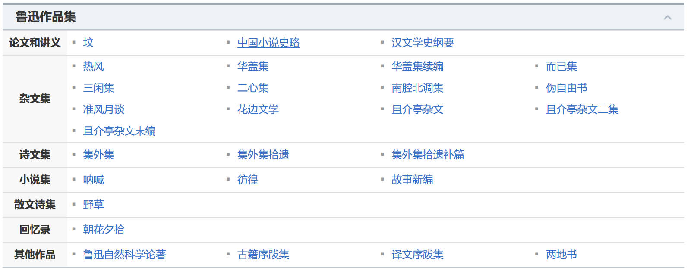

# 鲁迅文集 {docsify-ignore-all}

鲁迅（1881年9月25日—1936年10月19日），原名周樟寿，后改名周树人，字豫山，后改字豫才，浙江绍兴人。著名文学家、思想家、革命家、教育家、民主战士，新文化运动的重要参与者，中国现代文学的奠基人之一。

早年与厉绥之和钱均夫同赴日本公费留学，于日本仙台医科专门学校肄业。

“鲁迅”，1918年发表《狂人日记》时所用的笔名，也是最为广泛的笔名。

鲁迅一生在文学创作、文学批评、思想研究、文学史研究、翻译、美术理论引进、基础科学介绍和古籍校勘与研究等多个领域具有重大贡献。他对于五四运动以后的中国社会思想文化发展具有重大影响，蜚声世界文坛，尤其在韩国、日本思想文化领域有极其重要的地位和影响，被誉为“二十世纪东亚文化地图上占最大领土的作家”。

> 毛泽东曾评价：“鲁迅的方向，就是中华民族新文化的方向。”

## 目前更新内容

鲁迅作品

- [x] 卷01 - 卷02
- [ ] 卷03 - 卷10
- [ ] 卷10 - 卷20

已完成

- [坟](Page/Books/LX-Tomb "鲁迅文集 · 卷1-坟")
- [呐喊](Page/Books/LX-Call-to-Arms "鲁迅文集 · 卷1-呐喊")
- [野草](Page/Books/LX-Wild-Grass "鲁迅文集 · 卷1-野草")

## 待更新内容

剩余文集
