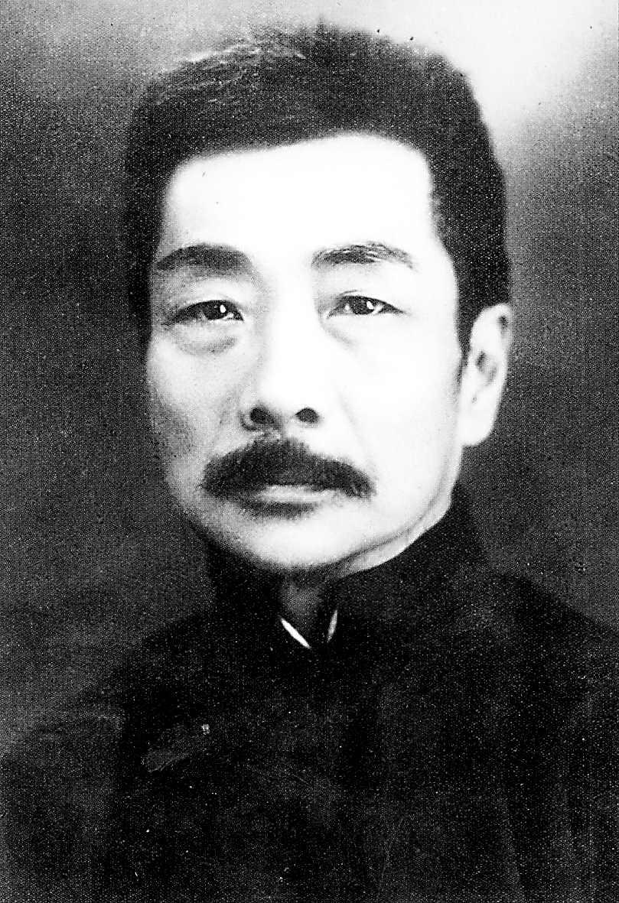
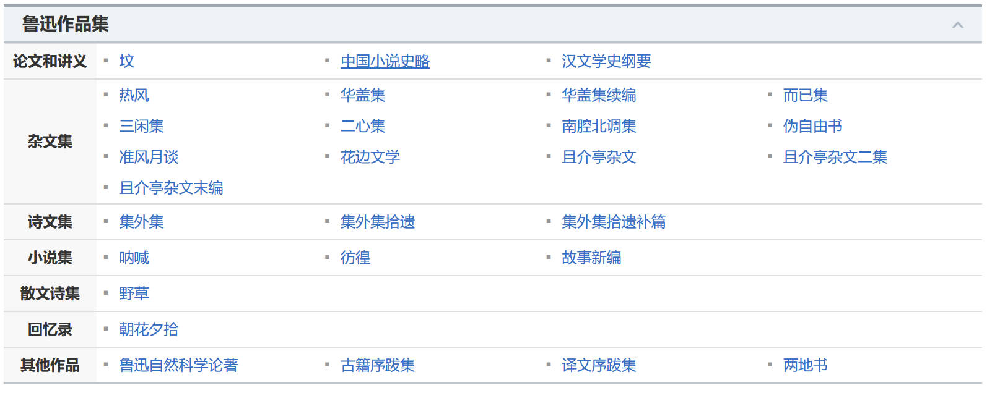

# 鲁迅文集 {docsify-ignore-all}

鲁迅（1881年9月25日—1936年10月19日），原名周樟寿，后改名周树人，字豫山，后改字豫才，浙江绍兴人。著名文学家、思想家、革命家、教育家、民主战士，新文化运动的重要参与者，中国现代文学的奠基人之一。

早年与厉绥之和钱均夫同赴日本公费留学，于日本仙台医科专门学校肄业。

“鲁迅”，1918年发表《狂人日记》时所用的笔名，也是最为广泛的笔名。

鲁迅一生在文学创作、文学批评、思想研究、文学史研究、翻译、美术理论引进、基础科学介绍和古籍校勘与研究等多个领域具有重大贡献。他对于五四运动以后的中国社会思想文化发展具有重大影响，蜚声世界文坛，尤其在韩国、日本思想文化领域有极其重要的地位和影响，被誉为“二十世纪东亚文化地图上占最大领土的作家”。

> 毛泽东曾评价：“鲁迅的方向，就是中华民族新文化的方向。”

## 目前更新内容

鲁迅作品

- [x] 卷01 - 卷03
- [ ] 卷04 - 卷10
- [ ] 卷10 - 卷20

已完成

- [坟](Page/Books/LX-Tomb "鲁迅文集 · 卷1-坟")
- [呐喊](Page/Books/LX-Call-to-Arms "鲁迅文集 · 卷1-呐喊")
- [野草](Page/Books/LX-Wild-Grass "鲁迅文集 · 卷1-野草")

## 出版说明

1936年10月，鲁迅先生在上海逝世。蔡元培任主席的鲁迅先生纪念委员会为“扩大鲁迅精神的影响，以唤醒国魂，争取光明”，耗时近两年，于1938年6月编辑出版了《鲁迅全集》（第一版），编辑委员包括蔡元培、马裕藻、沈兼士、茅盾、周作人诸先生。

该版《鲁迅全集》的总目录以鲁迅先生生前亲定的著述目录为基础，并增加了译作部分。内容大致分为创作、古籍校辑、译作三大部分，基本按时间先后排序。

全套书总计六百余万字，分二十卷出版，每卷字数大致相当。

此次出版的《鲁迅全集》，即以1938年版的《鲁迅全集》为底本进行了参考编辑，并在编辑过程中力求保持1938年版的内核风貌。在书稿内容和编排体例上，该版最大限度地追求与1938年版的统一，只个别调整了一些篇章的内容，如《集外集》中的诗作部分，根据最新的对鲁迅诗歌写作时间的考证，调整了几首诗的排版顺序；对于1938年版中并非鲁迅所作的作品，这一版均给予了清理。如本版中即未收入《小彼得》，因为《小彼得》的译者署名是许霞，鲁迅只是校改。

全书文字校订，除了将繁体竖排转为简体横排外，仅改正了1938年版中的一些文字和标点的误用。其中通假字和鲁迅习惯用字，仍完全按照1938年版保留。另有外国人名、地名等，亦均保留原有译法。

## 鲁迅先生全集序

“行山阴道上，千岩竞秀，万壑争流，令人应接不暇”；有这种环境，所以历代有著名的文学家美术家，其中如王逸少的书，陆放翁的诗，尤为永久流行的作品。最近时期，为旧文学殿军的，有李越缦先生，为新文学开山的，有周豫才先生，即鲁迅先生。

鲁迅先生本受清代学者的濡染，所以他杂集会稽郡故书，校嵇康集，辑谢承后汉书，编汉碑帖，六朝墓志目录，六朝造象目录等，完全用清儒家法。惟彼又深研科学，酷爱美术，故不为清儒所囿，而又有他方面的发展，例如科学小说的翻译，中国小说史略，小说旧闻钞，唐宋传奇集等，已打破清儒轻视小说之习惯；又金石学为自宋以来较发展之学，而未有注意于汉碑之图案者，鲁迅先生独注意于此项材料之搜罗；推而至于引玉集，木刻纪程，北平笺谱等等，均为旧时代的考据家赏鉴家所未曾著手。

先生阅世既深，有种种不忍见不忍闻的事实，而自己又有一种理想的世界，蕴积既久，非一吐不快。但彼既博览而又虚衷，对于世界文学家之作品，有所见略同者，尽量的迻译，理论的有卢那卡尔斯基，蒲力汗诺夫之艺术论等；写实的有阿尔志跋绥夫之工人绥惠略夫，果戈理之死魂灵等，描写理想的有爱罗先珂及其他作者之童话等，占全集之半，真是谦而勤了。

“借他人之酒杯，浇自己的块垒”，虽也痛快，但人心不同如其面，环境的触发，时间的经过，必有种种蕴积的思想，不能得到一种相当的译本，可以发舒的，于是有创作。鲁迅先生的创作，除坟，呐喊，野草数种外，均成于一九二五至一九三六年中，其文体除小说三种，散文诗一种，书信一种外，均为杂文与短评，以十二年光阴成此多许的作品，他的感想之丰富，观察之深刻，意境之隽永，字句之正确，他人所苦思力索而不易得当的，他就很自然的写出来，这是何等天才！又是何等学力！

综观鲁迅先生全集，虽亦有几种工作，与越缦先生相类似的；但方面较多，蹊径独辟，为后学开示无数法门，所以鄙人敢以新文学开山目之。然欤否欤，质诸读者。

> *民国二十七年六月一日*蔡元培
