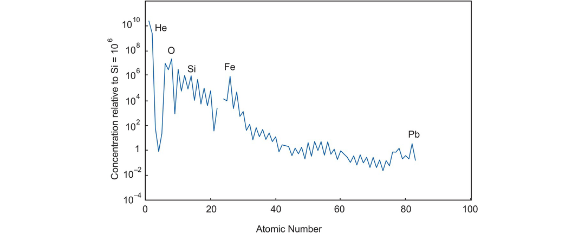

# Introduction | Using Geochemical Data

## Introduction

This book is about geochemical data and how they can be used to obtain information about geological processes. The major focus of this book is petrological, and the principal themes are the applications of geochemical data to igneous, sedimentary and metamorphic petrology. Minor themes include the application of geochemical data to cosmochemistry and the study of meteorites and to mineral exploration geochemistry. This book does not cover the topics of organic chemistry, hydro-geochemistry, solution chemistry or gas geochemistry and touches only briefly on the subject of environmental geochemistry. For a detailed discussion of these subdisciplines of geochemistry, the reader is referred elsewhere.

Conventionally geochemical data are subdivided into four main categories; these are the major elements, trace elements, radiogenic isotopes and stable isotopes and these four types of geochemical data each form a chapter in this book. Each chapter shows how the particular form of geochemical data can be used and how it provides clues to the processes operating in the suite of rocks in question. Different methods of data presentation are discussed and their relative merits evaluated.

The major elements (Chapter 3) are the elements which predominate in any rock analysis. In silicate rocks they are normally Si, Ti, Al, Fe, Mn, Mg, Ca, Na, K and P, and their concentrations are expressed as a weight percent (wt.%) of the oxide (Table 1.1). Major element determinations are usually made only for cations and it is assumed that they are accompanied by an appropriate amount of oxygen. Thus, the sum of the major element oxides will total to about 100% and the analysis total may be used as a rough guide to its reliability. Iron may be determined as FeO and/or $Fe_2O_3$, but is frequently expressed as ‘total Fe’ and given as $Fe_2O_3$(tot), $Fe_2O_3$(t) or $Fe_2O_{3T}$. Anions are not routinely determined.

Trace elements (Chapter 4) are defined as those elements which are present at less than the 0.1 wt.% level and their concentrations are expressed in parts per million (ppm) or more rarely in parts per billion ($10^{−9}$ = ppb) of the element (Table 1.1). Convention is not always followed, however, and trace element concentrations exceeding the 0.1 wt.% (1000 ppm) level are sometimes cited. The trace elements of importance in geochemistry are shown in Figure 4.1.

Some elements behave as major elements in one group of rocks and as a trace element in another group of rocks. An example is the element K, which is a major constituent of rhyolites, making up more than 4 wt.% of the rock and forming an essential structural part of minerals such as orthoclase and biotite. In some basalts, however, K concentrations are very low and there are no K-bearing phases. In this case K behaves as a trace element.

Volatiles such as $H_2O$ , $CO_2$ and S can be included in the major element analysis. Water combined within the lattice of silicate minerals and released above 110°C is described as $H_2O^+$ . Water present simply as dampness in the rock powder and driven off by heating to 110°C is quoted as $H_2O^-$ and is not an important constituent of the rock. Most frequently the total volatile content of the rock is determined by ignition at 1000°C and is expressed as loss on ignition (LOI) as in Table 1.1 (Lechler and Desilets, 1987).

Isotopes are subdivided into radiogenic and stable isotopes. Radiogenic isotopes (Chapter 6) include those isotopes which decay spontaneously due to their natural radioactivity and those which are the final daughter products of such a decay scheme. They include the parent-daughter element pairs K-Ar, Rb-Sr, Sm-Nd, Lu-Hf, U-Pb and Re-Os. They are expressed as ratios relative to a non-radiogenic isotope such as $^{87}Sr/^{86}Sr$ (Table 1.1) in which $^{87}Sr$ is the radiogenic isotope. Stable isotope studies in geochemistry (Chapter 7) concentrate on the naturally occurring isotopes of light elements such as H, O, C, S and N and a wide range of metallic elements (see Figure 7.29) which may be fractionated on the basis of mass differences between the isotopes of the element. For example, the isotope 18O is 12.5% heavier than the isotope 16O and the two are fractionated during the evaporation of water. Stable isotopes contribute significantly to an understanding of fluid and volatile species in geology. They are expressed as ratios relative to a standard using the δ-notation $\simeq$ (see Section 7.2.1.1).

An example of a typical geochemical dataset is given in Table 1.1 for a suite of peraluminous biotite monzogranites from the Chaidanuo batholith from the North Qilian suture zone in central China from the study by Chen et al. (2014). This dataset shows the major elements with Fe given as Fe2O3T and the volatiles as LOI (Section 3.1.1). The data are also recalculated dry, that is, volatile free. In this study the major elements were determined by inductively coupled plasma optical-emission spectroscopy (ICP-OES). The trace elements reported in Table 1.1 were measured by inductively coupled plasma mass spectrometry (ICP-MS) and this long list of trace elements shows the range of trace elements readily determined using this method. Where a particular element is not measured it is designated ‘nd’ (not determined) and where it cannot be determined because it is below the limits of detection of the analytical method used it may be reported as ‘bd’. The radiogenic isotopes of Sr and Nd were measured using thermal ionisation mass spectrometry (TIMS).

The major part of this book discusses the four main types of geochemical data outlined above and shows how they can be used to identify and understand geochemical processes. In addition, Chapter 5 shows the way in which trace and major element chemistry is used to determine the tectonic setting of some igneous and sedimentary rocks. Chapter 2 discusses some of the particular statistical problems which arise when analysing geochemical datasets and some recommendations are made about permissible and impermissible methods of data presentation.

In this introductory chapter we consider three topics:

  1. The geochemical processes which are likely to be encountered in nature and their geochemical signatures.

  2. The interaction between geological fieldwork and the interpretation of geochemical data.

  3. The different analytical methods currently used in modern geochemistry.

## Geological Processes and Their Geochemical Signatures

A major purpose of this text is to show how geochemical data can be used to identify and interpret geological processes. In this section, therefore, we review the main processes which have taken place during the formation and differentiation of our rocky planet and which have subsequently shaped it into the form that we recognise today.

It is conventional in geochemistry to distinguish between those processes which take place at high temperatures, deep in the Earth, from the low-temperature processes which operate at or near the Earth’s surface. We will follow this pattern here, and so first we review those processes which took place during the formation of the Earth and the subsequent magmatic processes which have led to its differentiation and its reworking during metamorphism. We then discuss those processes which operate at low temperatures at the Earth’s surface and in which there are interactions between rocks and the Earth’s atmosphere, hydrosphere and those living organisms that inhabit them and ultimately lead to the formation of sedimentary rocks. In each case our primary purpose is to seek to identify those geological processes which have a distinctive geochemical signature and which can be recognised through the collection and interpretation of geochemical data. We point the readers to those sections of this book where these processes are described in greater detail.

### Processes Which Control the Formation and Differentiation of Planetary Bodies

Any full understanding of our planet must address the question of its origin and its relationship to its planetary neighbours. The answer to this question comes primarily from a knowledge of the overall composition of the Earth, often expressed as the bulk Earth composition. Our principal source of the information on the composition of the Earth comes from the study of meteorites – in particular the most primitive meteorites, chondritic meteorites. Chondritic meteorites are thought to have formed during the condensation of the solar nebula, and so the study of meteorite chemistry takes us into the domain where fields of cosmochemistry and geochemistry overlap (see Section 4.1.1).

After the Big Bang the majority of the chemical elements were formed by the processes of stellar nucleosynthesis during star formation. The distribution of elements in our star – the Sun – as obtained from spectroscopy and the study of meteorites is shown in Figure 1.1 and their relative concentrations provides details about the processes of nucleosynthesis. Chondritic meteorites formed from the condensation of the gas and dust of the solar nebula, and their chemistry and mineralogy provide information about processes in the solar nebula. The cosmochemical processes operating during the condensation of a solar nebula are very different from those of geochemistry for they are largely controlled by the relative volatility of the elements and compounds in the solar nebula (see Table 4.10). In the later stages of condensation planetary bodies formed by the accretion of dust and rocky fragments and as these early planetary bodies grew they melted and differentiated into a metallic core and silicate mantle.

The chemical study of primitive meteorites illuminates our study of geochemistry in three important ways:

  1. Knowing the chemical composition of the materials from which the Earth formed provides a geochemical baseline for measuring the differentiation of the Earth and the fractionation process that take place on the Earth. Typically, trace elements and isotopes are expressed relative to the chondritic composition of the Earth (Sections 4.3.2.2 and 6.2.2) as a measure of the original bulk Earth composition (BE). Alternatively, trace element abundances and isotope ratios may be expressed relative to the Earth’s primordial or primitive mantle (PM) which is the composition of the Earth after the separation of the core and represents the bulk silicate Earth (BSE) (see Sections 3.1.3, 4.4.1.2 and 6.2.2).

  2. Some primitive meteorites contain information about processes in the solar nebula and more rarely about even earlier processes. Pre-solar grains of refractory minerals such as diamond and SiC can predate the solar nebula itself and stable isotope studies of elements such as Cr and Mn can provide information about the distribution of nucleosynthetic products in the early solar system (Section 7.4.4.3). Hydrogen isotope ratios are now available for a range of solar system objects and together with measurements made in meteorites are thought to indicate where in the solar system planets and other solar system objects formed (Section 7.3.2.2, Figure 7.7).

  3. Meteorites also provide information about the large-scale differentiation of the Earth and the process of core formation. A knowledge of the mantle concentrations of those trace elements which have a high affinity for metallic iron, the highly siderophile elements (Section 4.5), coupled with experimental studies on their metal silicate partition coefficients (Table 4.10), provides information on the process of core formation. In a similar way, it is thought that carbon was sequestered into the Earth’s core, and so the mass balance of carbon isotopes in the Earth’s mantle also contributes to our understanding of this process (Section 7.3.3.2).

### Processes Which Control the Chemical Composition of Igneous Rocks

The processes which control the composition of igneous rocks are summarised in Figure 1.2 and are illustrated for basaltic rocks.

#### Processes Which Take Place in the Mantle Source

Basaltic rocks may be extracted by partial melting from a range of mantle source compositions the most primitive of which – the primitive mantle – is the product of the very early differentiation of the Earth. This process involved the separation of the core and maybe formed during the magma-ocean stage of early Earth history. Subsequent partial melting and mixing events have created the modern upper mantle which is differentiated into domains that are chemically depleted and enriched. Two main processes control the enrichment and depletion of the mantle. These are the extraction, migration and recrystallisation of partial melts, formed at different depths and representing different degrees of partial melting, and the recycling into the mantle of crustal materials through the process of subduction. Modern lavas derived from a source that has escaped later modification and so represents the Earth’s primitive mantle are extremely rare. One example is the 61 Ma picrites from Baffin Island in north-eastern Canada which represent a relatively high melt fraction of deep mantle and have a primitive isotopic signature (McCoy-West et al., 2018).

Characterising the chemical composition of a mantle source region and thereby understanding those processes which take place in the source region is best achieved by measuring its radiogenic isotope composition (Section 6.2) and using selected trace element ratios, sometimes known as canonical trace element ratios, because these ratios are not modified during partial melting and subsequent magma chamber processes (Section 4.6.1.3).

#### Partial Melting Processes

Unmodified melts produced by the partial melting of the mantle are known as primary magmas. Their chemical composition is controlled by two main factors. The first controls are those of the chemical composition of the source and its mineralogy. The composition of the source will reflect whether or not it is chemically enriched or depleted, and the mineralogy of the source is a measure of the depth of melting. The second set of controls are the physical conditions of melting, that is, the temperature and depth of melting, the precise mechanism of melting and the degree of partial melting (Section 4.2.2.2). In some instances, the oxygen fugacity of the mantle is also an important control. After the initial melting stage, the primary magma may be modified as it migrates through the mantle through mixing with melts from other sources and through crystallisation and wall–rock reaction processes. The major element, trace element and radiogenic isotope chemistry are all important in unravelling the origins of primary magmas.

