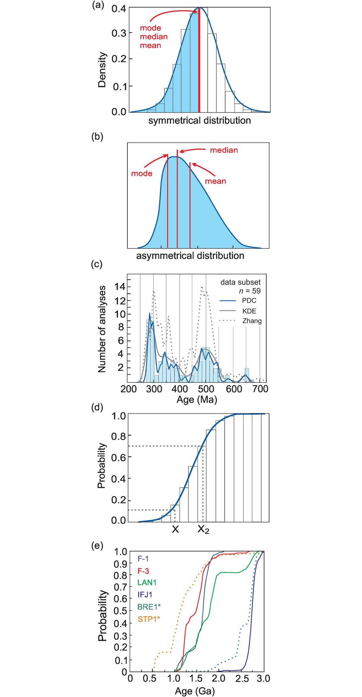
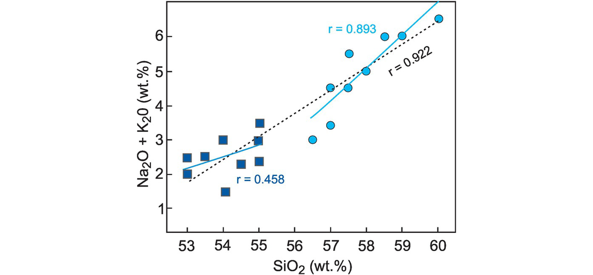
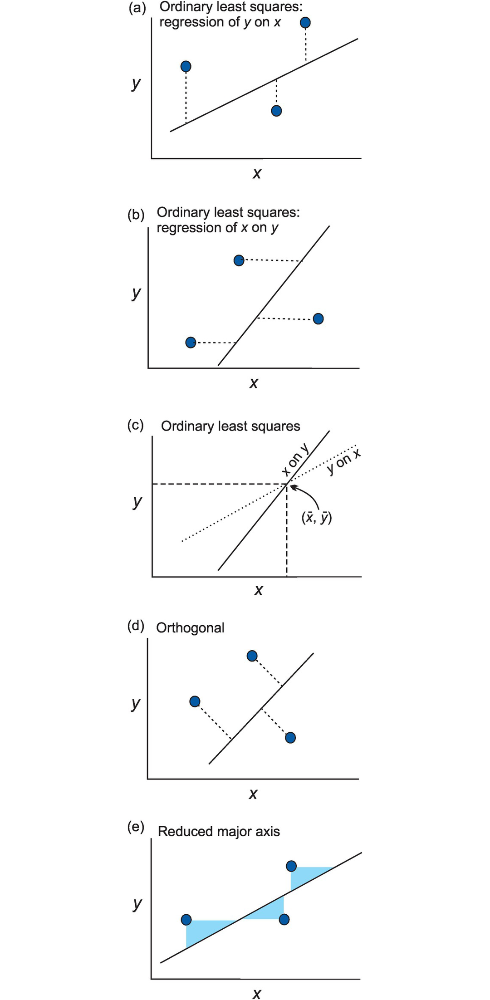
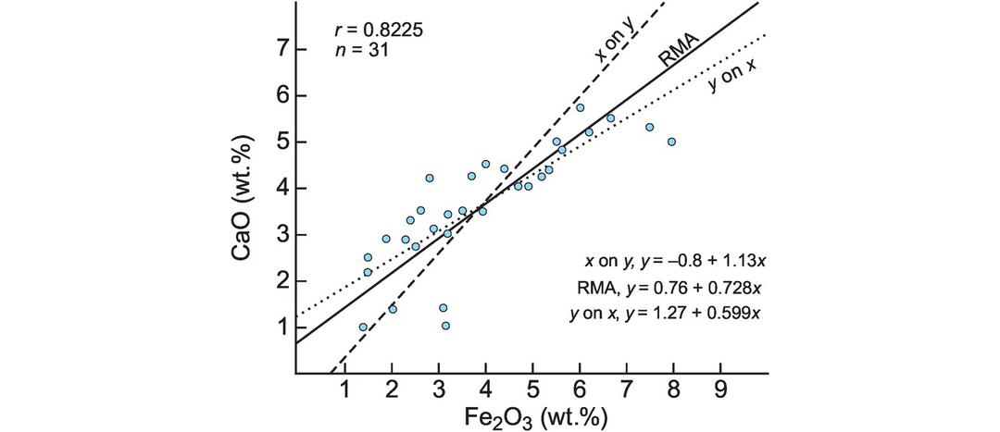
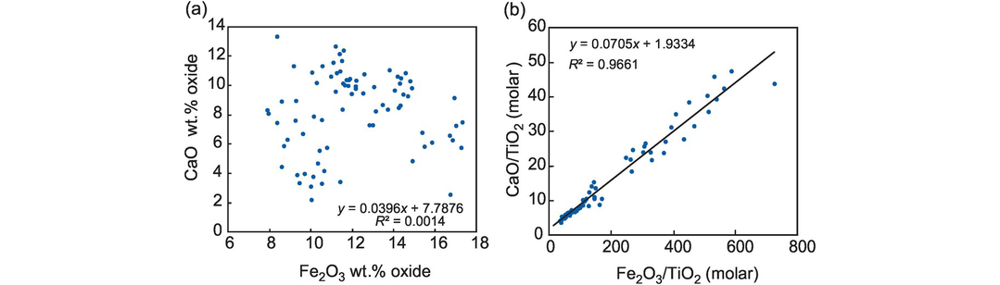
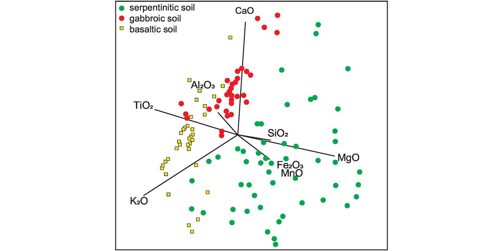
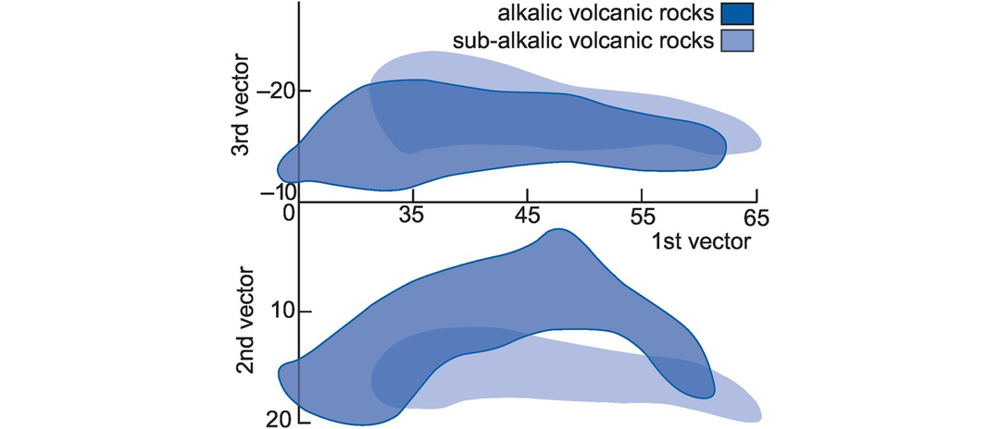
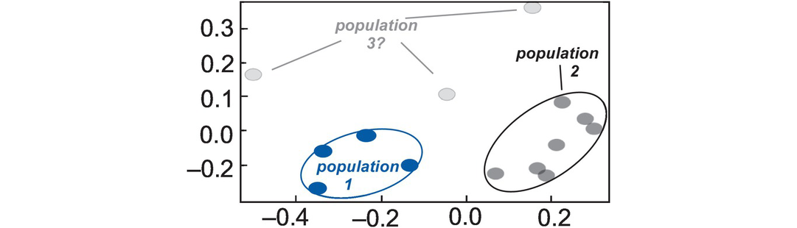

# _Ⅱ -_ Analysing Geochemical Data {docsify-ignore}

**_Using Geochemical Data_**

## Introduction

The last 50 years have seen the growth of a large body of literature on the statistical treatment of geochemical data. Some of this literature is in the form of warnings to the geochemical community that their practices are not sufficiently statistically rigorous. Other articles are concerned with improving the statistical techniques current amongst geochemists and provide methods which are more appropriate to some of the peculiar properties of geochemical data. Further aspects of geo-statistics are very specialised and apply particularly to the fields of ore reserve estimation and exploration geology (see, for example, Clark and Harper, 2007). These are not considered here.

However, many statisticians are not practising geochemists and, similarly, many geochemists are unfamiliar with the statistical literature. This may in part be because this literature is specific to mathematical geology and is written for other mathematicians rather than for geochemists. The net effect is that geo-statisticians have been advising geochemists in the practice of their art for many years and yet rarely have the two communities come together to fully address their common concerns.

The purpose of this chapter, therefore, is to draw the attention of geochemists to some of the issues which our statistician colleagues have raised and to evaluate these in the context of presenting and interpreting geochemical data. This is not intended as a review of statistics as applied to geochemistry. There are excellent books for that purpose; see, for example, Waltham (2000), Davis (2002) and Reimann et al. (2008), and as well as the web-based reference NIST/SEMATECH e-Handbook of Statistical Methods. Rather, this chapter presents a discussion of some areas of statistics which directly relate to geochemistry. We assume an introductory level of statistical knowledge. See Box 2.1 for brief definitions of the statistical terms used.

Many of the statistical calculations described in this text can be carried out in an Excel spreadsheet using the data analysis ‘Add-In’ and the Real Statistics Using Excel ‘Add-In’ (available at www.real-statistics.com/). There are also commercial statistical packages that run in Excel and shareware packages that run on other platforms such as the java-based Stacato. Alternatively, more sophisticated analyses can be carried out in bespoke statistical packages such as SPSS (statistical package for the social sciences, officially IBM SPSS Statistics); there are also applications in STATISTICA (by Dell), Python, Matlab and R (see Van den Boogaart and Tolosana-Delgado, 2013; Janousek et al., 2016).

The central problem which geochemists have to address when considering the analysis of geochemical data is the unusual nature of geochemical data. Composition is expressed as a part of a whole, either as a percentage or parts per million. This type of data is ‘constrained’ or ‘closed’ and is not amenable to standard statistical analysis, which is generally designed for unconstrained data. The particular nature of geochemical data raises all sorts of uncomfortable questions about the application of standard statistical methods in geochemistry. These issues are addressed in Sections 2.2 and 2.7. Geochemical data also has ‘outliers’ which geochemists typically exclude but which statistics can now address, for example, Pernet et al. (2013). In addition, geochemical data are often derived from samples collected from limited outcrop in specific locations over a limited amount of time and yet the statistical ‘validity’ of the sampling process is seldom considered.

With these caveats in mind, let us turn to the application of selected statistical techniques which are widely used in geochemistry. Typically, geochemical data are multivariate; that is, many measurements are made on each sample (e.g., wt.% oxide data, trace element data and isotopic data are all measured on the same sample). For this reason it is necessary to use multivariate statistical methods such as those discussed in Section 2.8; these include correlation matrices, covariance matrices, principal component and factor analysis, and discriminant analysis. Sometimes, however, it is necessary to use multiple bivariate comparisons where only two of the many variables are compared at any one time, as for example in the use of correlation coefficients (Section 2.4) or regression analysis (Section 2.5). Univariate statistics such as the mean, median, mode and standard deviation, as well as probability functions (Section 2.3), are also needed to describe the distribution of the data.

## A Statistical Approach?

### Geochemical Investigation versus Statistical Trials

It should be acknowledged at the outset that a geochemical investigation may be constrained by funding, location, time available at the study area, the number and types of samples that are collected, the limited spatial distribution of those samples and the type of geochemical analyses that can be performed, so that structuring a study as a proper ‘statistical trial’ is unlikely. Geochemists do not work from carefully controlled trials, but from their often limited observations. Consequently, from inception, geochemical investigations may be regarded as somewhat statistically handicapped because the project may be constrained by small sample numbers and limited sample diversity. This contributes to the statistical limitations associated with geochemical data described in Section 2.2.2.

### Statistical Limitations Associated with Geochemical Data

There are several important issues associated with geochemical data that complicate their statistical analysis. To varying degrees these apply to all geochemical studies and include the following:

- Constrained data

- Data with variable (non-uniform) errors

- Small datasets

- Outliers.

#### Constrained or Closed Data and the Constant Sum Problem

Data expressed as part of a whole (percentages or parts per million) are known as compositional data. Geochemists are used to expressing the major element compositions of rocks and minerals as percentages, so that the sum of the major elements will always be about 100% (a constant sum). This has to be in order to compare one chemical analysis with another. This standard form, which is universally used by geochemists for both rock and mineral analyses, is a source of concern to statisticians who for 60 years have been informing geochemists that they are working in a minefield of spurious correlations and that their interpretation of major and trace element chemistry is potentially unsound.

In brief, the problem with compositional data is as follows. Percentages are complex ratios containing variables in their denominators which represent all the constituents being examined. Thus, components of percentage data are not free to vary independently. As the proportion of one component increases, the proportion of one or more other components must decrease. These properties were more formally summarised by Pawlowsky-Glahn and Egozcue (2006), who showed that compositional data:

- convey only relative information

- are always positive, thus

- are not free to range between +/− infinity (in statistical terms they are constrained rather than unconstrained)

- are parts of a composition that sum to a constant (in statistical terms they form a closed dataset)

- are therefore not amenable to standard statistical tests which are generally devised for open datasets with unconstrained variables in the range +/− infinity.

The consequences of these properties for compositional data in geochemistry are the following:

- The summing of analyses to 100% forces a correlation between components of the dataset because the loss or gain of any component causes a change in the concentration of all the other components. The problem is illustrated by Meisch (1969), who demonstrated that an apparently significant correlation between two oxides may have arisen through the closure process from an actual correlation between two other oxides. These induced correlations may or may not conceal important geological correlations. In terms of correlation theory, the usual criterion of independent variables does not hold nor is variance and covariance within the dataset independent.

- There is a negative bias in correlations. If one component has a significantly higher value than all the other components – such as SiO2 in silicate rocks – then bivariate graphs of SiO2 and the other components will show a marked negative tendency. This attribute of percentage data is fully explored by Chayes (1960) and is illustrated in Figure 3.13.

- Data subsets or sub-compositions, as frequently used in triangular diagrams such as the AFM diagram (Section 3.3.3), do not reflect the variation present in the ‘parent’ dataset. Aitchison (1986, Table 3.1) showed that the correlation coefficient between pairs of variables changes substantially in data subsets and that there is no apparent pattern to the changes. In addition, data subsets can show different rank orderings from the parent dataset. For example, in the AFM data subset (Na2O + K2O, FeOT, MgO) the variance may be A > F > M, but in the parent dataset the variance may be F > A > M.

- The means of compositional datasets have little significance. Woronow (1990) and Woronow and Love (1990) have argued that because of the closure problem the means of percentage (and ppm) data have no interpretative value. They show that an infinite number of possible changes can explain an observed change in the mean of compositional data such that it is impossible to produce a meaningful statistical test to evaluate the similarities between means of compositional data. This observation has important implications for approaches frequently used in geochemistry such as discriminant analysis (Section 2.8.2).

It should be noted that the problem of closure is not eliminated when the data are transformed by some scaling process (Whitten, 1995), nor is it removed when the problem is presented in graphical rather than statistical form. Attempts to sidestep closure by relating all samples to a given reference curve as in the ‘sliding normalisation diagrams’ of Liegeois et al. (1998) or the ‘delta diagrams’ of Moyen et al. (2009) do not avoid the fundamental issues outlined above. Furthermore, the closure problem remains even when the constituents of an analysis do not sum exactly to 100%, due to analytical error or incomplete analysis, for there is always the category of ‘others’ (i.e., the missing data) which can be used to produce a sum of 100%. A more detailed discussion of how these problems have been approached in the geo-statistical community is given in Section 2.7.

#### Non-uniform Errors (Heteroscedasticity)

The statistical analysis of geochemical data depends on the errors associated with the variables (oxides and elements). In the context of geochemical analysis, error means the combined systematic and random error (the uncertainty) that is associated with an analytical measurement. All geochemical analyses have associated errors but these are not the same for all the components of a single analysis for the magnitude of the error depends upon what is being measured and the analytical method(s) used. For example, analytical errors associated with XRF analysis vary as a function of both the element mass and the concentration of the element and therefore different elements will have different associated errors. Further, in a comparison of data from one laboratory with another the errors associated with each lab will be different. In some instances data measured in different ways are used together, giving rise to different scales of error. An example would be the measurement of major elements by XRF and trace elements by mass spectrometry. This variability in the nature of the errors associated with geochemical data means that it is necessary to select the statistical approach which is most appropriate to the data.

#### Small n

Many statistical functions are dependent on the number (n) of variables involved because they assume a normal or Gaussian distribution. This often takes the form of the Student’s t-distribution, which is used, for example, when determining statistical significance of the difference between two means, the confidence interval of the difference between two means, and in linear regression analysis. In a statistical calculation the term degrees of freedom refers to the number of variables that are free to vary; for example, in bivariate plots there are two degrees of freedom because there are two variables. As the number of degrees of freedom increases, the t-distribution approaches a normal distribution. However, a specific variable in a small sample set (n) may not be normally distributed and so violates the assumption of many statistical approaches.

#### Outliers

Many geochemical datasets contain outliers, that is, single values completely outside the range of the other measured values. Outliers can occur by chance in any distribution, but they often indicate a measurement error, the combination of unrelated sub-populations, or that the population has a spurious (non-Gaussian) distribution.

### Can We Address These Limitations?

The following steps can be taken to address the limitations that geochemists face with their data. These are explored in detail in this chapter but are summarised here:

- Constrained geochemical data, in which the standard deviation of the error is not constant with respect to the variables involved, may be explored using weighting (Section 2.5) and data transformation (Section 2.7). Both methods work well and often provide similar results.

- Choosing a statistical method appropriate for the type of data involved requires knowledge of the types of errors associated with the data and whether these are variable or constant errors.

- Many statistical tests are designed for larger datasets. At a fundamental level statistical analysis generally works best above some nominal minimum number of samples or analyses, and so increasing n will increase the statistical options.

- All datasets need to be assessed for outliers and there are various tests that help to recognize them (Sections 2.3 and 2.4); once recognized, appropriate steps can be taken.

- Robust statistical methods are those which work even when the original assumptions of the test are not strictly fulfilled, such as non-Gaussian data, small n, variable errors and the presence of outliers, and these can be applied to minimise the effect of these assumptions.

## Histograms, Averages and Probability Functions

### Histograms

The histogram is a common way to show how data are distributed relative to the number of samples and shows the density of the data distribution. A histogram quickly and easily shows whether the data distribution is Gaussian or non-normal, symmetrical or skewed, uni-, bi- or multi-modal. However, this is in part a function of the way in which the data are allocated to intervals or ‘bins’ in the histogram. As general rule bin width = √n, where n is the number of samples in the dataset. It is clear that bin widths reduce in size the larger the dataset and as n increases the histogram ‘steps’ are eventually so small that the plot appears to have a smooth, step-free pattern. This is the density function shown as the blue line in Figure 2.1a and discussed in Section 2.3.3.

_(a) The density function (blue line) is defined by the observations shown in the histogram; the area under the curve is equal to 100%. The blue shaded region represents 50% of the density function. The mode, median and mean are identical for symmetrical normally distributed datasets, where the mode is the most frequent number; the median is the middle number in the data list, and the mean is the average of all numbers. (b) The mode, median and mean are different for asymmetrical, non-normally distributed data. (c) Histogram, probability density curves (PDCs) and kernel density estimate (KDE) for Permian sandstones from the New Siberian Islands of Russia (from Pease et al., 2015; with permission from the Geological Society of London). The histogram of detrital zircon U-Pb ages (light blue rectangles; bin sizes = 15 Ma, maximum 2σ from dating method) and the PDCs for these data (blue line). The KDE for the same data is shown by the solid grey line and should mimic the histogram. The PDC of Permian sandstone from Taimyr (grey dotted line; data from Zhang et al., 2013) shows a strong similarity to that of the New Siberian Island data. (d) The cumulative probability function sums each of the observations in all bins up to the value of the bin specified. If the histogram has a normal distribution, the cumulative probability function will have a typical symmetrical, sigmoidal shape (blue line). On this plot the probability of obtaining a value of ≤X is 0.1 (or 10%) and the probability for obtaining a value ≤X2 is 70%. (e) Cumulative probability curves (CPCs) for samples from different Caledonian Nappes showing similarity of samples (F-1 and F-3) within the Gaisa Nappe (after Zhang et al., 2016, with permission from Elsevier). Note the two datasets were generated at the same analytical facility using the same methods and have similar analytical errors._

### Averages

Geochemists frequently use ‘average values’ in order to present their data in summary form. Also, average rock compositions are sometimes used as a reference by which to assess the composition of other rock compositions. For example, the average values of mid-ocean ridge basalts or of chondritic meteorites are frequently used as normalising values in trace element studies (see, e.g., Table 4.7). Averages are also used in analytical geochemistry where a signal is measured several times and then an average of the measurements taken.

Rock (1987, 1988) has drawn attention to the way in which geochemists calculate average values and has shown that the methods most frequently used are inadequate. The most commonly used summary statistic is the arithmetic mean, with the standard deviation sometimes quoted as a measure of the spread of the data. The geometric mean, the median, the mode, and variance are less frequently used. These terms are defined in Box 2.1.

However, when averaging geochemical data the arithmetic mean is an inappropriate choice for three reasons. First, it assumes that the sample population is either normally or log-normally distributed (Figure 2.1a, b). For many geological datasets this is not the case, nor is there any a priori reason why it should be so. Therefore, the normality of geochemical data should never be assumed. Second, many geochemical datasets contain outliers that can cause extreme distortion to an arithmetic mean if not recognised and excluded. Furthermore, as argued by Woronow (1990) and Woronow and Love (1990), the arithmetic mean of compositional data has no interpretative value. Similar problems can occur with estimates of the standard deviation and with the geometric mean. Rock (1988) emphasised that in the statistical literature, of the various methods used to assess average values, the ‘mean and standard deviation consistently performed the worst’. For this reason the median is a more robust measure of the average (Figure 2.1b) and is to be preferred. Rock (1988) also showed that the calculation of several robust estimates can identify outliers in the dataset from the inconsistencies that arise from between the calculated values.

### Probability Functions and Kernel Density Estimates

Probability functions address either continuous or discrete random variables in a dataset and provide a means of assessing the likelihood of a certain random variable assuming a certain value. The probability density function (PDF) is for continuous random variables, where the area under the probability density curve or trace indicates the interval in which a variable will fall within the context of a set of continuous random variables. The probability density function can also be expressed as a cumulative probability or cumulative distribution (see Section 2.3.4). The p function is for discrete random variables and represents the relative probability of a (random) variable having a particular value; in this case the probability is measured at a single point.

The Kernel density estimate (KDE) is an approximation of the density function and its main advantage is that it is a continuous function that does not require binning. The KDE is calculated from the data using a specified bandwidth combined with a weighting (kernel) function. The KDE is a smoothed and continuous curve that is sensitive to bandwidth and the kernel function used (Gaussian, uniform or triangular). KDEs are well suited to comparing the data distribution of multiple samples because multiple KDEs are easily plotted on a single diagram. The KDE can be calculated in Excel using the NumXL add-in and most statistical software packages. Java-based freeware for plotting KDEs is also available (Vermeesch, 2012).

Probability functions and KDEs are commonly used in the presentation of detrital zircon U-Pb age data in sediment provenance analysis. Such data may be displayed as probability density curves (PDCs) (Figure 2.1c). PDCs are similar to PDFs, but they are not equivalent (see the discussion in Vermeesch, 2018a). PDCs represent the sum of a number of Gaussian distributions (one for each datum) whose means and standard deviations correspond to the individual ages and their analytical uncertainties. Consequently, a PDC graph favours precise data (sharp peaks) over imprecise data (smooth lows) as illustrated in Figure 2.1c.

Pease et al. (2015) compared PDC patterns of Permian sandstones from the New Siberian Islands and Taimyr, Arctic Russia, and used their similarity to suggest that both samples represented part of the same foreland basin of the Uralian Orogen in Arctic Russia (Figure 2.1c). The PDC and KDE for the New Siberian Island sample are similar and mimic the histogram of the detrital zircon U-Pb age data. We recommend that PDCs or KDEs are displayed with a histogram of the data as this validates the data handling and allows any irregularities in the dataset to be identified. However, it should be noted that PDCs lack a firm theoretical basis and that large or highly precise datasets can produce counter-intuitive results (Vermeesch, 2012).

### Cumulative Distribution Function

The probability density function (PDF) can also be expressed as a cumulative probability or cumulative distribution (Figure 2.1d). This makes it possible to determine the probability of a particular value occurring within a population. The cumulative distribution function (CDF) represents the probability that a random variable will have a value less than or equal to another value and can be used as a measure of the cumulation of probability up to a given value. It is useful, for example, to quantify the percentage of samples plotting above or below a certain value. In addition, multiple datasets can be combined on a single graph to allow a visual assessment of sample similarity. This method is commonly applied in sediment provenance analysis and was used by Zhang et al. (2016) to distinguish between different Caledonian Nappe complexes (Figure 2.1e).

### Chi-Square ( $χ^2$ ) ‘Goodness of Fit’ Test

The Pearson’s chi-square test assesses the ‘goodness of fit’ between a theoretical distribution (such as normal, binomial or Poisson) and the empirical data distribution. It can be applied to any univariate dataset for which the cumulative distribution function (Section 2.3.4) can be calculated. The chi-square test is applied to data separated into intervals, or ‘binned’. For non-binned data it is necessary first to calculate a histogram or frequency table before performing the chi-square test. In its simplified form the equation for χ2 is:

$$χ^2=\frac {\sum (O−E)^2} {E}$$

where $χ^2 =$ chi-squared, O = the observed value, and E = the expected value. The $χ^2$ test assumes that the data are a random sampling of binned data and it is sensitive to sample size. If the number of points in the bin interval is too small (<5) or the total number of observations is too small (<10), spurious results can be obtained (Koehler and Larnz, 1980).

$χ^2$ tests the null hypothesis against the alternative hypothesis with respect to an associated degree of freedom at some level of significance or probability (Table 2.1). The null hypothesis (H0) typically assumes that there is no significant difference between the observed and expected values (the alternative hypothesis would then be that there is a significant difference between the observed and expected values). The probability that H0 holds true may be estimated for different levels of significance, usually at the 5% (0.05) level or the 1% (0.01) level. Alternatively, these values may be expressed as confidence limits, in this case 95% or 99%, respectively. The probability values in Table ## 1 represent the minimum values needed to reject H0. When $χ^2$ is greater than the table value, H0 is rejected; when $χ^2$ is less than the table value, H0 is accepted; small values for $χ^2$ generally lead to acceptance of H0. The Pearson chi-square test is a standard function available in Excel and most statistical packages.

## Correlation

One of the most important tasks for the geochemist using geochemical data is to determine whether or not there are associations between the oxides or elements. For example, in the list of analyses of tonalitic and trondhjemitic gneisses in Table 2.2, do the oxides CaO and Al2O3 vary together? Is there a linear relationship between $K_2O$ and $Na_2O$ ? This type of question is traditionally answered using the statistical technique of correlation.

### The Pearson Linear Correlation Coefficient (r)

Correlation may be defined as a measure of the strength of association between two variables measured on a number of individuals and is quantified using the Pearson product-moment coefficient of linear correlation, usually known as the correlation coefficient (r). Thus, the calculation of the correlation coefficient between CaO and $Al_2O_3$ or $K_2O$ and $Na_2O$ can provide an answer to the questions asked above. When, as is normal in geochemistry, only a sample of the total population is measured, the sample correlation coefficient (r) is calculated using the expression:

$$r = \frac{covariance (x, y)}{\sqrt{variance (x) \times variance (y)}}$$

_where there are n values of variable x (x1 … xn) and of variable y (y1 … yn)._

#### The Significance of the Correlation Coefficient

The sample correlation coefficient (r) is an estimate of the population correlation coefficient (ρ), the correlation that exists in the total population of which only a sample has been measured. It is important to know whether a calculated value for r represents a statistically significant relationship between x and y. That is, does the relationship observed in the sample hold for the population? The probability that this is the case is made with reference to a table of r values (Table 2.3). For a given number of degrees of freedom (the number of samples minus the number of variables, which in the case of a bivariate plot = 2), r is tabulated for different significance levels. These r values represent the minimum value needed to reject the null hypothesis (H0). In this case, the null hypothesis is that the correlation coefficient of the population is zero (ρ = 0) at the specified level of significance.

| H P         |          Description |
| :---------- | -------------------: |
| H0:ρ=0      |      null hypothesis |
| H1:ρ≠0, or  | two–sided hypothesis |
| H1:ρ>0orρ<0 | one–sided hypothesis |

Two sets of tables are provided to account for both positive and negative r values. A one-sided test is used when the alternative hypothesis (H1) is either ρ > 0 or ρ < 0 (the region of rejection lies in a single direction). The two-sided test is used when the alternative hypothesis is ρ ≠ 0 (the region of rejection occurs in two directions). For example, the dataset in Table 2.2 contains 31 samples and the calculated correlation coefficient between CaO and Al2O3 is r = 0.568 (Table 2.4a). The tabulated values for r (assume a one-sided test) shows that at the 5% significance level and 29 degrees of freedom (n − 2), the tabulated value for r = 0.301 (Table 2.3a). Since the calculated value (0.568) is greater than the tabulated value (0.301), the correlation coefficient in the sample is statistically significant at the 5% level. That is, there is 95% chance that the relationship observed in the sample also applies to the population. Hence, the null hypothesis that ρ = 0 is rejected.

#### Assumptions Associated with the Correlation Coefficient

The Pearson product-moment coefficient of linear correlation is based upon the following assumptions:

1. The units of measurement are equidistant for both variables.

2. There is a linear relationship between the variables.

3. Both variables should be normally or nearly normally distributed.

The Pearson correlation coefficient is vulnerable to data outliers of any kind, high and low, as well as deviations from the main trend of the data array. Assumption (iii) is regarded as an important prerequisite for linear correlation. However, this is not always evaluated; it is the variation of y from the estimated value of y for each value of x that must be normally distributed and rarely is the sample population large enough for this criterion to be satisfactorily tested. This means that the use of Pearson’s method requires a careful study of the univariate distribution of each of the variables before determination of r. In addition, it is useful to routinely investigate a log-transformation of the data (Section ## 7) before calculating r.

A robust linear correlation in which data points far from the main body of data are down-weighted can be used to account for outliers. Nevertheless, when testing for the significance of r, the data should be normally distributed. In rank systems (Section 2.4.2) the ranking mitigates against outliers so data transformation is not needed. Otherwise a log-transformation of the data (Section 2.7) may be warranted.

### Rank Correlation Coefficients

Sometimes geochemical data cannot be used in product moment correlation of the type described above as they do not fulfil the requisite conditions of being normally distributed and excluding outliers. Under such circumstances, an alternative to the Pearson product-moment coefficient of linear correlation is the non-parametric rank correlation coefficient. Both the Spearman and Kendall rank correlation coefficients can be used to determine the strength of the relationship between two variables. In most situations, the interpretations of the Kendall’s tau and Spearman’s rank correlation coefficients are similar and lead to the same inferences, although the Spearman coefficient is more widely used. Both methods can be performed in Excel.

#### Spearman Rank Correlation

The Spearman rank coefficient of correlation is usually designated rs. This type of correlation is applicable to major or trace element data measured on a ranking scale rather than the equidistant scale used in Pearson’s product-moment correlation. The Spearman rank correlation coefficient is defined as:

$$
rs=1–[6 \sum \frac{D^2}{n(n^2−1)}]
$$

where D is the difference in ranking between the x-values and y-values and n is the number of pairs. In this case the only assumptions are that x and y are continuous random variables, which are at least ranked and are independent paired observations. If the rank orders are the same, then D = 0 and rs = +1.0. If the rank orders are the reverse of each other, rs = −1.0. The significance of rs can be assessed using significance tables for the Spearman rank coefficient of correlation (Table 2.3b) in a similar way to that described for product-moment correlation in Section 2.4.1. The Spearman rank coefficients of correlation for the major element data from the Limpopo Belt are shown in Table 2.3b. In this instance, the values do not differ greatly from the Pearson product moment coefficient of correlation. The particular advantages of the Spearman rank correlation coefficient are that they are applicable to ranked data and are superior to the product-moment correlation coefficient when applied to populations that are not normally distributed and/or include outliers. A further advantage is that the Spearman rank correlation coefficient (rS) is quickly and easily calculated and can be used as an approximation for the product-moment correlation coefficient (r).

#### Kendall Rank Correlation

The Kendall rank correlation coefficient (Greek letter τ, tau) is another measure of rank correlation that is used to assess the similarity of the orderings of data when ranked by two respective variables. When +1, the agreement between the two rankings is perfect and the two rankings are the same; if 0, the rankings are completely independent; if −1, the disagreement between the two rankings is perfect and one ranking is the reverse of the other. The general formula for Kendall’s correlation is:

$$
τ= \frac{n_c−n_d}{n(n−1)/2}
$$

where $n_c$ is the number of concordant pairs, $n_d$ is the number of discordant pairs in a ranking of two variables, and n is the number of ranked variables. Kendall’s correlation coefficient is generally smaller than Spearman’s, is less sensitive to the size of the deviation between the rank ordered pairs than Spearman’s, has better statistical properties (the sample estimate is close to the population variance so confidence levels are more reliable) and is better for small sample sizes (≲12). Significance levels associated with the Kendall rank coefficient of correlation for small datasets are calculated individually. Larger datasets tend to converge on a normal distribution and significance can be determined using the z-value:

$$
z= \frac{3 \times τ \sqrt{n(n−1)}}{\sqrt{2(2n+5)}}
$$

where n is the number of ranked variables. The critical significance table for Kendall’s tau is given in Table 2.5.

### The Strength of a Correlation

The correlation coefficient, r, estimates the strength and direction of a linear relationship between x and y. The reliability of the linear model, however, is also a function of the number of observed data points in the population such that the sample size (n) and r must be considered together. As shown in Section 2.4.1.1, when the calculated significance is greater than the critical value for the number of samples in the dataset (for bivariate data, n − 2), the correlation coefficient of the dataset is statistically significant. There is no single cut-off that defines a ‘strong’ linear correlation but values of r ≥ 0.7 and τ ≥ 0.5 are generally taken to indicate good to strong correlations. In geochemistry the significance of a correlation is usually assigned at the 5% level (or 95% confidence level). The coefficient of determination ( $R^2$ ) is the square of r. The usefulness of $R^2$ is that there is no distinction between positive and negative values (as with r) and it ranges in value from 0 to 1.0. It is therefore important to specify the significance or confidence level and n for all values of r or $R^2$ reported.

### Correlation and Non-homogeneous Data

Some statistical tests require or assume a homogeneous sample distribution and applying such a test to a non-homogeneous dataset can yield false correlations. For example, consider a dataset of nine basaltic andesites and nine andesites (Figure 2.2). When combined in a bivariate plot the two compositional groups are strongly correlated (r = 0.922), well above the 5% significance limit in Table 2.3a. However, when assessed independently the basaltic andesites are not significantly correlated with each other (r=0.458, below the 5% significance limit in Table 2.3a). In this case, the apparent correlation between the basaltic andesites and the andesites may reflect the incorrect combination of two distinct sub-populations into a single non-homogeneous group. Understanding the geological field relationships is critical therefore to identifying the correct statistical treatment of data.

_Nine basaltic andesites (squares) and nine andesites (circles) yield a strong linear correlation (r = 0.922 at >5% significance), whereas the basaltic andesites in the subgroup (r = 0.458) are not correlated at the 5% significance level._

Another consideration concerns outliers (Section 2.2.2.4). For normally distributed data, outliers can be defined by the ‘3σ rule’: the deviation from the mean by more than three times the standard deviation. This means that only one in 370 samples should deviate from the mean. Deletion of outlier data is controversial especially in small datasets or those in which a normal distribution cannot be assumed. Rejection of outliers is more acceptable when associated with instrument measurements and the distribution of measurement error is known. In the case of measurement error, outliers should either be discarded or a form of statistics used that is robust to outliers such as the ranked coefficient of correlation. In any case the exclusion of any data point(s) should be explicitly reported. Where a distribution is skewed, a non-Gaussian distribution is implied, and statistical tests suited for non-normal distributions should be applied.

### Correlation Matrices

Frequently, a geochemical dataset will have as many as 30 variables. This means that there are 435 possible bivariate diagrams (Section 3.3.2) for a single dataset. While simple bivariate plots provide information about the data, its structure and interrelationships, making more than 400 plots is not an efficient way to proceed. As an initial step, the creation of a correlation matrix allows significant correlations to be quickly and easily identified. This may be a prelude to making selected bivariate plots or to applying more sophisticated statistical analyses. A correlation matrix requires determining a correlation coefficient between variable pairs and presenting the results as a matrix as in Table 2.4. Rahimi et al. (2016) used a correlation matrix to identify correlated rare earth elements in their investigation of the Lakehsiya ore deposit and from the observed correlations were able to identify those accessory minerals which were the host to the REE identified. It should be noted, however, that (1) extreme outliers can perturb a correlation matrix; therefore, decisions regarding the handling of outliers are required before creating the matrix, and that (2) although the correlation matrix is useful and correlation coefficients are convenient statistical descriptors, caution is needed in their application to geochemical data because of their unusual ‘closed’ nature (see Section 2.2).

## Regression Analysis

Often in geochemistry the strength of an association, as defined by the correlation coefficient, is sufficient information from which petrological conclusions may be drawn. Sometimes, however, it is useful to quantify that association. This is traditionally done using regression analysis. For example, regarding the association between CaO and Al2O3 in the tonalites and trondhjemites of Table 2.2 the question ‘If the CaO concentration were 3.5 wt.%, what would be the concentration of Al2O3?’ can be answered with a linear regression of the two variables CaO and Al2O3. The quantification of this association is carried out by fitting a straight line through the data and finding the equation of its line. The equation for a straight line relating variables x and y is:

$$ y=a+bx $$

The constant a is the value of y given by the straight line at x = 0. The constant b is the slope of the line and shows the number of units in y (increase or decrease) that accompanies an increase in one unit of x. The constants a and b are determined by fitting the straight line to the data. The relation above is ideal and does not allow for any deviation from the line. In reality this is not the case, for most observations have associated error(s) and the data may form a cloud of points to which a straight line must be fitted. This introduces some uncertainty into line-fitting procedures resulting in a number of alternative approaches. Regression analysis is the subject of a number of statistical texts; see, for example, Bingham and Fry (2010) and Montgomery et al. (2012). Below some of the more common forms of regression are described.

### Ordinary Least Squares (OLS) Regression

Ordinary least squares (OLS) regression (also known as simple regression) is one of the most commonly used line-fitting techniques in geochemistry because it is simple to use and included in most spreadsheet software. It requires that the units for both variables are the same and are normally distributed. However, it is often inappropriate for geochemical data because there is the further assumption that one variable is independent and error-free. The least squares best-fit line is constructed so that the sum of the squares of the vertical deviations about the line is a minimum. In this case the variable x is the independent (non-random) variable and is assumed to be without error; y, on the other hand, is the dependent (random) variable with associated errors. In this case we say that y is regressed on x (Figure 2.3a). It is possible to regress x on y and in this case the best fit line minimises the sum of the squares of the horizontal deviations about the line (Figure 2.3b). Thus, there are two possible regression lines for the same data, a rather unsatisfactory situation for physical scientists who prefer a unique solution. The two lines intersect at the mean of the sample (Figure 2.3c) and approach each other as the value of the correlation coefficient (r) increases until they coincide at r = 1. In the case of ordinary least squares regression (y is regressed on x), the value of the intercept, a, may be computed from:

$$ a=y−bx $$

where x and y are the mean values for variables x and y, and b is the slope of the line computed from

$$ b=r(Sy/Sx) $$

where r is the Pearson product-moment correlation coefficient and Sx and Sy are the standard deviations of the samples of x and y values. Linear confidence intervals can be expressed in terms of standard deviations (Montgomery et al., 2012). Thus, confidence intervals on values of y for a number of values of x may be used to draw a confidence band on the regression line. The confidence band will be wider at the ends of the fitted line because there are more points near the mean values.

(a) Ordinary least squares regression of y on x; in this case the vertical distance between the point and the line is minimised. (b) Ordinary least squares regression of x on y; the horizontal distance between the point and the line is minimised. (c) Both ordinary least squares lines pass through the means (x̄, ȳ), the centroid of the data. (d) Orthogonal regression which minimises the orthogonal distance from the observed data points to the regression line. (e) Reduced major axis regression; the line is fitted to minimise the area of the shaded triangles.

Despite its wide use, OLS regression of geochemical data has some disadvantages. First, OLS regression is normally used in a predictive sense in which variable y is estimated from variable x. In geochemistry, however, regression is more commonly used to confirm the strength of association between variables and to calculate the slope and intercept of the linear correlation. Second, the OLS method yields two different lines, neither of which necessarily represents the actual relation between the variables. Finally, and most importantly, OLS regression assumes that error is restricted to the dependent variable. In geochemistry it is meaningless to define one variable as the dependent variable and the other as the independent variable since both variables have associated errors.

### Orthogonal Regression

Orthogonal (also known as bivariate, two-dimensional Euclidean, or Deming) regression uses an alternate approach and is useful if both variables have the same units and their errors are similar. It assumes that the errors for the two variables are independent and are normally distributed. Instead of minimizing the vertical or horizontal distance, it minimises the orthogonal distance from the observed data points to the regression line (Figure 2.3d).

### Reduced Major Axis Regression

Reduced major axis (RMA) (variously known as standardised principal component, standardised major axis, geometric mean, ordinary least products, diagonal, least areas line) regression is more appropriate for geochemical data because it is designed to deal with errors in both x and y as well as different units (scale variance). It also assumes that the data have a bivariate normal distribution, although it is more robust than other forms of regression to non-normal data distribution and non-random errors. Following the method of Kermack and Haldane (1950) the sum of the products of the vertical and horizontal distances of the x, y values from the line is minimized; that is, the areas of the triangles between points and the best fit line are minimised (Figure 2.3e). The slope b of the reduced major axis line is given by:

$$ b = ± (S_y/S_x) $$

where $S_x$ and $S_y$ are the standard deviations of sample values x and y and the sign is taken from the correlation coefficient. Unlike OLS and least normal squares regression, the slope of the RMA line is independent of the correlation coefficient r. The intercept a is taken from Eq. 2.7. Standard errors can be calculated for the slope and intercept, and from these the confidence intervals on the slope and intercept can be calculated using n − 2 degrees of freedom (see Ludbrook, 1997). An example of the different forms of regression line is given in Figure 2.4 for the variables $Fe_2O_3$ and CaO from Table 2.2. This diagram shows how both types of OLS regression (x on y and y on x) and RMA regression are used to fit straight lines to the data. The equations for each of the lines are also given. As in Figure 2.4 the RMA regression line usually lies between the two OLS lines. Tofallis (2015) has recently extended RMA regression to handle multiple variables.

The regression lines are: ordinary least squares regression of x on y (x on y), slope and intercept calculated from Eqs. 2.7 and 2.8; reduced major axis (RMA), slope and intercept calculated from Eqs. (2.9) and (2.7); ordinary least squares regression of y on x (y on x), slope and intercept calculated from Eqs. 2.7 and 2.8.

### Weighted Least Squares Regression

Weighted least squares (WLS) or weighted linear regression is an appropriate line-fitting method for those types of geochemical data in which some data points are more reliable than others. WLS regression assumes that the errors between the variables are uncorrelated and that the variance between the two variables differs. This is known as heteroscedasticity; see Section 2.2.2.2.

In such cases each data point is weighted before line fitting following the method of York (1966) and York et al. (2004). Observations are inversely weighted proportional to the error variance or the standard deviation(s), this means that an observation with small standard deviation has a large weight (more influence) and an observation with large standard deviation has a small weight (less influence). The weighting often takes the form of ${1}/{s^2}$ and is given relative to the weights of the other observations. If the error variance or standard deviation is not known, an OLS regression can be performed and the square of the residual can be used to estimate $s^2$ .

The biggest limitations to WLS regression include (1) estimated weighting and (2) outliers. Where the weighting is estimated from a small number of replicated observations this can have an adverse effect on the result. Outliers (Section 2.2) need to be recognized and dealt with appropriately, otherwise they may also negatively impact WLS analysis.

An example of the WLS method is its application in geochronology for the construction of isochrons (York, 1967, 1969). In detail the different isotopic methods require slightly different approaches. For example, Brooks et al. (1972) showed that in Rb/Sr geochronology the errors in the isotope ratios are normally distributed and for $^{86}Sr/ ^{87}Sr$ ratios are less than 1.0 (the usual situation in whole rock analysis) and that the errors are not correlated. In Pb isotope geochronology, however, the errors between the lead isotope ratios are highly correlated and require a slightly different approach (see York, 1969).

### Robust Regression

Robust linear regression is another weighted least-squares line-fitting technique which minimises the effect of a single data point such as an outlier from exerting a disproportionate influence on the computed value of the slope and intercept (Reimann et al., 2008). This is important because conventional OLS regression can be highly distorted by one or two outlying values. Consequently, before carrying out regression analysis the data should be inspected for outliers. Although no data point should be discarded simply because it is an outlier, outlying observations should be examined to see if they are in error (see Sections 2.3 and 2.4). Inspection for outliers may be carried out visually using a bivariate plot or a data analysis computer program. Zhou (1987) gives an example of the use of this technique in geochemical exploration where outliers (often anomalies and in this particular case the object of such an exercise) may hamper their own identification by distorting the results of statistical analysis.

### Some Problems with Traditional Approaches to Correlation and Regression

In the introduction to this section we enquired about the association between pairs of elements in a geochemical dataset and asked the question: To what degree are the oxides CaO and Al2O3 associated in the dataset represented in Table 2.2? A more disturbing question and one that is not usually asked is: To what extent is the association between CaO and Al2O3 is controlled by other associations in the dataset? For example, does the fact that CaO correlates well with SiO2 affect in any way its correlation with Al2O3? Traditionally, geochemists have looked at the relationships between pairs of elements in isolation from the other members of the dataset by plotting a large number of bivariate diagrams or by constructing a correlation matrix of the types described above. Yet the nature of geochemical data is that they are multivariate, with many variables measured in multiple samples. In other words, geochemists have tended to use a bivariate approach to solve a multivariate problem. This is not to say that bivariate analysis of geochemical data is useless and that parameters such as the correlation coefficient should not be used as sample descriptors. Nevertheless our purpose here is to argue that there are more appropriate methodologies for multivariate analysis, many of which are described in some detail for the petrologist by Le Maitre (1982). Even so, the more fundamental problem of geochemical data – the constant sum problem – is not resolved directly by the application of multivariate techniques, and the statistical difficulties resulting from this aspect of geochemical data are formidable, as discussed in Section 2.2.2.1.

## Ratio Correlation

One specialised application of correlation and regression is in ratio correlation. The correlation of ratios can lead the user into a great deal of trouble and should normally be avoided. The exception is in geochronology, as discussed in Section 2.6.3. The dangers of ratio correlation in geochemistry have been documented by Butler (1981, 1986) and Rollinson and Roberts (1986) and are the subject of a text by Chayes (1971). A summary of the arguments is presented below.

Given a set of variables $X_1, X_2, X_3$ , … which show no correlation, ratios formed from these pairs which have parts in common such as $X_1/X_2$ versus $X_3/X_2$ , $X_1/X_2$ versus $X_1/X_3$ , or $X_1$ versus $X_1/X_2$ will be highly correlated. This was first recognised by Pearson (1896) in the context of simple anatomical measurements and brought to the attention of geologists by Chayes (1949). For the case where the $X_1/X_2$ is plotted against $X_3/X_2$ , Pearson (1896) showed that a first-order approximation for the correlation coefficient r is given by the expression:

$$
r = r_{13}C_1C_3 − r_{12}C_1C_2 − r_{23}C_2C_3 + \frac{C_2^2}{\sqrt{(C_1^2 + C_2^2 − 2r_{12}C_1C_2) \times (C_3^2 + C_2^2 − 2r_{23}C_3C_2)}}
$$

where $r_{12}$ is the correlation coefficient between variables $X_1$ and $X_2$ and $C_3$ is the coefficient of variation (the standard deviation divided by the mean) of variable $X_3$ , etc. This expression holds for small values of C (< 0.3), when the relative variance of $X_2$ is not large, and when the absolute measurements are normally distributed. The more general form of this equation for $X_1/X_2$ versus $X_3/X_4$ is given by Chayes (1971, p. 11).

If the variables $X_1, X_2, X_3$ are uncorrelated (i.e., $r_{12} = r_{23} = r_{13} = 0$ ) and the coefficients of variation are all the same (i.e., $C_1 = C_2 = C_3$ ), then the expression reduces to 0.5. Thus, even though the variables $X_1, X_2, X_3$ are uncorrelated, the correlation coefficient between the ratios $X_1/X_2$ and $X_3/X_2$ is 0.5. In the case where $X_1, X_2 and X_3$ are uncorrelated, and $C_1$ and $C_3$ are equal and $C_2$ is three times their value, then the expression reduces to 0.9. These correlation coefficients are spurious correlations for they appear to indicate a correlation between the original variables where none exists. An example of the effects of ratio correlation is given in Figure 2.5, which uses data from a suite of meta-komatiites and meta-basalts from an Archaean greenstone belt (Rollinson, 1999). A plot of oxide wt.% data for CaO versus Fe as $Fe_2O_3$ shows scattered uncorrelated data ( $R^2$ = 0.0014, Figure 2.5a) whereas a molar ratio plot of the same data using $TiO_2$ as the ratioing or ‘conserved’ element shows a highly correlated ‘trend’ ( $R^2$ = 0.9661, Figure 2.5b).

(a) CaO wt.% versus $Fe_2O_3$ wt.% for meta-basalts and meta-komatiites from the Sula Mountains greenstone belt, Sierra Leone (data from Rollinson, 1999). The data are uncorrelated as indicated by the equation for a ‘best fit’ line through the data and the R2 value. (b) $CaO/TiO_2$ versus $Fe_2O_3/TiO_2$ as molar values using the same data as in (a). In this case the molar ratios are highly correlated as indicated by the best fit line and the $R_2$ value. This is an example of a spurious correlation resulting from the use of a common denominator.

Given these observations, Butler (1986) argued that in the case of ratio correlation the assessment of the strength of a linear association cannot be tested in the usual way, against a probabiity of zero. Rather, the null value must be the value computed for the spurious correlation (i.e., r in Eq. 2.8) and will therefore vary for every diagram plotted. An even more complex null hypothesis proposed by Nicholls (1988) is that the correlation coefficient of the dataset is compared with that of a set of random numbers with a similar range of values, means and variances as the data under investigation. This is not, however, a fruitful approach (see Aitchison, 2005).

### The Improper Use of Ratio Correlation: Pearce Element Ratio Diagrams

An example of the misuse of ratio correlation can be seen in the molecular proportion diagrams of T.H. Pearce, also known as ‘Pearce element ratio’ (PER) diagrams. These diagrams require the plotting of ratios of oxides recast as molar quantities (the wt.% oxide divided by the formula weight) on an x–y graph. The ratios have an element in common, which is termed the conserved element, and which is usually a common denominator (Pearce, 1968, 1970). Pearce diagrams were originally developed to solve two particular problems: (1) to avoid the effects of closure inherent in plotting percentages, discussed in Section 2.2.2.1, and the conventional method of displaying major element geochemical data and (2) to use the slope and intercept of a best-fit line between the data points on a bivariate oxide plot to provide a better way of discriminating between rival petrological hypotheses and in particular to discriminate between different models of crystal fractionation (Pearce, 1968, 1970).

Pearce element ratios have enjoyed limited use in petrology. There was some activity in the late 1980s and early 1990s (e.g., Russell and Nicholls, 1988; Stanley and Russell, 1989; Pearce and Stanley, 1991) and a recent resurgence in interest some 20-plus years later (see the review by Nicholls and Russell, 2016). The most popular applications have been in identifying the fractionating phase(s) in igneous suites and in identifying mobile elements in altered volcanic rocks, particularly in altered basalts and komatiites. They have also been used in petrogenetic studies to aid in the identification of mantle phases influencing the chemistry of partial melts, in identifying participating phases in crystal fractionation and in investigating mixing between crystals and melt. Pearce element ratio diagrams have also been used in mineralogy to identify atomic substitutions in mineral lattices.

Pearce element ratio diagrams should not be used for the following three reasons:

1.  Pearce element ratio diagrams are based upon the correlation of ratios with a common denominator, which as discussed above leads to statistically spurious correlations. In other words, the diagrams generate apparent correlations where none exist and therefore the conclusions drawn from these diagrams are at least doubtful and at worst incorrect. This flaw in the application of Pearce element ratio diagrams was pointed out by Butler (1982, 1986) and Rollinson and Roberts (1986) following the earlier work of Chayes (1971). The problems arising out of spurious correlations have been acknowledged (see, e.g., Pearce and Stanley, 1991) and a number of mitigating solutions have been proposed. These include using two different conserved elements in the ratio process. While this circumvents the common denominator problem, in practice it is complex to apply (Pearce and Stanley, 1991). The calculation of ‘non-intuitive’ numerators and/or denominators as advocated by Nicholls and Russell (2016) is both cumbersome and does not avoid the problem of ratio correlation.

2.  A particular claim for Pearce element ratio diagrams is that the slope of a trend on a ratio plot is of significance in discriminating between rival hypotheses. For example, it is claimed that it is possible to discriminate between olivine and orthopyroxene fractionation in a basaltic magma from the slope of the regression line on a ratio plot. In other words, the slope is a function of the stoichiometry of the mass transfer process and different slopes identify different mass transfer processes. However, this argument too is flawed, for regression lines drawn through the data will have incorrect slopes because in the case of ordinary least squares regression, the slope of the line is directly related to the correlation coefficient (Eq. 2.8), which in this case is spurious. Some authors have sought to circumvent the problems of ratio correlation by transforming their data into logarithmic form. Unfortunately, this approach does not provide a solution, for the problems are preserved even as log-ratios (see Kenney, 1982; Rollinson and Roberts, 1986).

3.  Pearce element diagrams require the identification of a conserved element, essential in the construction of the molar ratio plots. The conserved element is defined as one which is excluded from the differentiation process and remains sequestered in the melt (Nicholls and Russell, 2016), and is otherwise known as an incompatible element. In the case of olivine fractionation in a basaltic melt, the conserved element might be the oxide of Al since Al is not structurally accommodated by olivine. Although acceptable in principle, the identification of a conserved element is applicable only to modelling the simplest of geological processes such as olivine fractionation in mafic and ultramafic rocks as in the example of magnesian basalts from Hawai‘i cited in Pearce and Stanley (1991). Even then, olivine is usually joined on the liquidus by a spinel phase which will contain Al. More advanced fractionation of such rocks frequently involves the addition of a pyroxene and or plagioclase by which stage there are few conserved elements left to select, maybe P or K. In felsic rocks it is even harder to identify a conserved element given the fractionation of ferromagnesian phases and one or more feldspars. Furthermore, the conserved elements identified even in mafic rocks are almost always elements whose concentration in the rock is low. Thus, there is concern about the accuracy of the analysis, possible element mobility, and the amplifying effect of small numbers in the denominator (see Stanley, 1993).

In summary, there are several problems with the statistical validity of major element oxide ratio plots. In contrast to the ongoing advocacy that ‘Pearce element ratios and diagrams faithfully depict the chemical variations in geochemical datasets’ (Nicholls and Russell, 2016), we note their limited use in the wider the geochemical community since the early 1990s and recommend that they no longer be used.

### Application to Trace Element Diagrams

A number of elemental plots of trace elements are presented as ratio plots of the form X1/X2 versus X3/X2, X1 versus X1/X2 or X1 versus X2/X1 and all are subject to the constraints of ratio correlation discussed in Section 2.6.1. In some cases, the trace element diagrams are designed only for classification purposes, but where linear trends are important for petrogenetic interpretation, then the problem of spurious correlation applies. In this case the trace element ratio plots should be considered carefully and ideas tested on alternative plots which are not based on ratios before any petrological conclusions are drawn from the data.

### Ratio Correlation in Isotope Geology

Ratios with a common denominator are the staple diet of much of geochronology and isotope geology, and the statistical validity of Rb-Sr isochron diagrams was questioned by Chayes (1977) and was discussed more fully by Butler (1982) and Dodson (1982). Butler (1982) pointed out that in the case of Rb-Sr isochron diagrams where the isotope ratio 87Sr/86Sr is plotted against 87Rb/86Sr the presence of a common denominator (86Sr) ‘should raise the suspicion that some or all of the observed variation on a scatter diagram may be due to the effects of having formed ratios with a common denominator’. Dodson (1982) responded to this argument by showing that, unlike ratios formed from major element oxide pairs, isotopic ratios such as 87Sr/86Sr are never calculated from independent measurements. Rather, they are a directly measured property of the element under consideration, are unrelated to the amount sampled, and can only be altered in a limited number of ways, the most important of which is radioactive decay. Dodson proposed the null hypothesis for isotope geochemistry that ‘variations in the measured isotopic composition of an element are unrelated to its concentration or to any other petrochemical property of the materials sampled’. He showed that if the null hypothesis is true, then the expected value of the ratio correlation coefficient is zero and that isochron diagrams are not subject to the common denominator effect.

## Compositional Data Analysis

As previously noted, a severe problem with major element geochemical data is the problem of closure (Section 2.2.2.1). Over the past four decades this problem has been addressed at length by the geostatistical community under the more general theme of compositional data analysis and data transformation. A very particular aspect of compositional data analysis is in the use of bivariate plots, and this is discussed separately in Chapter 3 in Sections 3.3.2.1 and 3.3.2.2.

### Aitchison’s Approach to Constrained Compositional Data

The first major step forward in finding a solution to the closure problem and its implications in geochemistry was in the work of John Aitchison, who addressed the constant sum effect in a series of detailed papers (Aitchison 1981, 1982, 1984, 1986, 2003). Subsequent developments led by research groups in Girona and Florence are outlined in the works of Pawlowsky-Glahn and Olea (2004) and Buccianti et al. (2006). This field of statistical research is still evolving, as summarised in recent reviews (Buccianti and Grunsky, 2014; Pawlowsky-Glahn and Egozcue, 2016; Buccianti et al., 2018).

Aitchison‘s fundamental premise was that ‘the study of compositions is essentially concerned with the relative magnitudes of the ingredients rather than their absolute values’ (Aitchison, 1986, p. 65). This frees percentage data from its restricted region (the ‘simplex’ in the terminology of Aitchison) to spread more freely though sample space and transforms ‘constrained’ data to ‘unconstrained’ data. Consequently, when formulating questions about associations between variables in a geochemical dataset, our thinking should be based on ratios rather than percentages. Aitchison’s method involves the construction of a log-ratio covariance matrix which expresses compositional data as the covariance of (natural) log-ratios of the compositional variables (Aitchison, 1986, 2003). The calculation of log-ratios has the advantage of freeing compositional data from their restricted range and allowing them to vary between +/− infinity.

In his 1986 and 2003 texts Aitchison proves (for the mathematically literate) that the covariance structure of log-ratios is superior to the covariance structure of a percentage array. The covariance structure of log-ratios is free from the problems of negative bias and of data sub-compositions which bedevil percentage data. Aitchison (1986, 2003) proposed that three types of matrix might be usefully constructed:

1. A variation matrix in which the log-ratio variance is plotted for every variable ratioed to every other variable. This matrix provides a measure of the relative variation of every pair of variables and can be used in a descriptive sense to identify relationships within the data array and in a comparative mode between data arrays.

2. An additive log-ratio covariance matrix in which every variable is ratioed against a common denominator. The choice of variable as the denominator is immaterial because it is the structure of the matrix that is important.

3. A centred log-ratio covariance matrix in which the single denominator of the log-ratio covariance matrix is replaced by the geometric mean of all the components. This has the conceptual advantage for the geochemist over the log-ratio covariance form that no one element is singled out as the denominator.

The additive log-ratio (ALR) and centred log-ratio (CLR) data transformations are fairly common in sedimentology, soil science and ore geology (see Delbari et al., 2011; Ward et al., 2012; Sun et al., 2014). Egozcue et al. (2003) presented cogent arguments in favour of the isometric log-ratio (ILR) transformation which has good mathematical and geometric properties. ALR-transformed data allow correlation coefficients to be calculated and other multivariate statistical analyses to be performed for all elements excluding the selected divisor element. CLR-transformed data are singular so multivariate statistics cannot be applied; on the other hand, no variables are excluded in a CLR transformation and so if a direct relationship between all of the variables is needed, CLR may be preferred. ILR overcomes the singularity issue of the CLR transformation so covariance can be determined for all variables, and by inverting the ILR-transformation, the data can be transformed back to the original data space.

The early formulations of Aitchison‘s work were to transform compositional data from its restrictive sample space (the ‘simplex’) into a more workable (‘unconstrained’) sample space in which standard statistical methods could be applied. More recently, Aitchison and Egozcue (2005) have proposed that an alternative approach is to work with compositional data within the simplex and to investigate problems within this space with its specific algebraic–geometric structure. This staying-in-the-simplex approach ‘proposes to represent compositions by their coordinates, as they live in a Euclidean space, and to interpret them and their relationships from their representation in the simplex’. This requires the internal simplicial operation of perturbation and the external operation of powering. Perturbation is a differential scaling operator and is computed by multiplying compositions component to component, and afterwards dividing each component by the sum of all of them to attain a unit sum. Powering, the analogue of scalar multiplication in real space, consists of raising each component to a constant and then applying closure to the result (see Aitchison and Egozcue, 2005). In current practice many workers adopt a bilateral approach and attempt to interpret compositional data from both the log-ratio and the staying-in-the-simplex approach. It should always be explicitly stated if parameters are determined from a transformed dataset and which transformation has been used.

### The Biplot

In the context of compositional data analysis, a biplot is a means of displaying a data matrix graphically (Gabriel, 1971). In geochemistry it is a means of displaying a matrix of major element oxide data in which the samples comprise the rows and the oxide variables the columns. The purpose of the biplot is to show the entire compositional variation of the dataset within a single figure rather than the alternative, which is multiple plots of oxide pairs. An excellent text on the use of biplots is Greenacre (2010).

In most applications the raw data matrix is transformed to obtain a new matrix and this transformed matrix is shown in the biplot. The most common transformation is that of ‘centring of the data’ with respect to column means (oxide variables) using the centred log-ratio transformation. The matrix is then transformed again using singular value decomposition (Aitchison and Greenacre, 2002; Daunis-I-Estadella et al., 2006).

The key components of a biplot applied to geochemical data include:

- an origin, which is the centre of the compositional dataset

- the rays, which represent the relative variability of the different oxide compositions

- data points, which are the individual sample compositions.

This means that both the row points (samples) and column points (oxide variables) are centred at the origin of the biplot. Rays provide information about relative variability in a compositional dataset. Both their length and direction are important. A join between two rays is known as a link. Cosines of the angles between links estimate the correlation between log-ratios such that links at right angles to each other signify zero correlation and links that are co-linear have a high degree of correlation.

There are few examples in the literature of the application of the biplot approach to the exploration of major element oxide data. Daunis-I-Estadella et al. (2006) describe the major element chemistry of soil samples collected from serpentinites, gabbros and basalts in ophiolitic terrains in Tuscany. Their biplot (Figure 2.6) shows rays meeting at the origin for eight major element oxides. The authors note that ‘the serpentinitic soil samples show high dispersion when compared with the others but that the three groups of soils maintain good separation’. They also note that the grouping of the basalt and gabbro samples offers the prospect of good sample discrimination. The opposition of the co-linear Al2O3 and Fe2O3 + MnO rays may indicate processes related to clay mineral formation, although the co-linear opposition of TiO2 and MgO + SiO2 is not discussed.

### Some Geochemical Applications of the Log-Ratio Approach

One area in which geochemists agree with statisticians, probably without realising it, is in the use of log-normalised trace element diagrams in which rare earth elements (REE) are referenced to the composition of chondritic meteorites. In such plots a selected suite of incompatible elements is referenced to the composition of the Earth’s primitive mantle, and these are effectively log-ratio plots. However, since Aitchison‘s initial work in the 1980s, and apart from the application to the REE, the impact of the log-ratio approach in geochemistry and petrology has been small and there are only a few examples of the application of this approach in the literature.

One application of an early formulation of Aitchison’s method was that of Rollinson (1992), who tested the log-ratio approach on a suite of basalts from Kīlauea Iki lava lake, Hawai‘i, whose compositional variability was well understood and thought to be related to olivine fractionation (Richter and Moore, 1966). The data are presented in Table 3.6 and a bivariate diagram displaying these data is given Figure 3.12. The percentage data matrix was recalculated in three ways: as a variation matrix, a covariance matrix, and a centred covariance matrix. The results of this analysis indicated that in all three variation matrices, the greatest relative variation was between those elements included in the fractionating phase olivine (Mg, Fe, Mn) and those elements which were excluded (K, Ti, P, Na, Ca and Al) and concentrated in the melt. Hence the log-ratio approach supports the model initially proposed on the basis of field observations.

A similar study of a suite of over 3000 samples of Cenozoic volcanic rocks from the Carpatho-Pannonian region of Hungary (Kovacs et al., 2006) showed three discrete groups of samples on a biplot. One group was identified as alkaline basalts and is separated along the TiO2 and P2O5 rays from a group identified as calc-alkaline basaltic-andesites (andesites and dacites aligned along the CaO and Fe2O3T rays), and a third more dispersed group which is rhyolitic in composition. The rhyolites scatter around the co-linear rays for Al2O3, SiO2, Na2O and K2O, implying some alkali feldspar control. What is novel about this study is that the results of the log-ratio analysis are directly compared with the results of a traditional bivariate oxide diagram in which the same three groups are evident. The authors concluded that the ‘compositional geometry shows … good agreement with geological models based on scientific methods which do not include a strict statistical approach’.

Log-ratio analysis has also been used to discriminate between limestone types as an aid to lithostratigraphy and correlation in the Scottish Dalradian (Thomas and Aitchison, 2006). Using a log-ratio plot of Fe2O3/CaO versus MgO/CaO the authors created a discrimination diagram which allows the different limestone groups to be differentiated and similar limestone types to then be correlated in what is otherwise a structurally complex region.

Perhaps the most helpful example of analysing compositional data is the work of Daunis-I-Estadella et al. (2006). These authors describe in some detail the process of exploratory compositional data analysis as applied to major and trace elements, and the concepts are accompanied with a worked example. They identify three essential processes which are important in this analysis: (1) fundamental descriptive statistics which are required for compositional data analysis, (2) the graphical biplot approach (Section 2.7.2) and (3) the importance of data sub-composition analysis. They propose that a compositional data matrix can be described by the calculation of the centre (the geometric mean), the variation matrix and the total variance. They graphically display their results in a biplot. A key test of compositional data analysis is that any selected sub-composition should have the same statistical properties as the larger data matrix from which it has been taken (Section 2.9).

## Multivariate Data Analysis

After data transformation, additional statistical methods can be applied. These are intended to reduce multivariate data to two dimensions for easy visualisation. In addition to the biplot (Section 2.7.2) these include principal component and factor analysis, discriminant analysis and multidimensional scaling; these are discussed in the sections below.

### Principal Component and Factor Analysis

Given that a typical geochemical analysis may include up to 30 different elements, principal component analysis (PCA) is a useful technique to reduce a large number of variables (elements or oxides) to a smaller number of uncorrelated variables and is often the first step in any multivariate analysis. Although PCA will generate as many components as there are variables, the bulk of the information is usually contained within the first few components, thus allowing a single variation diagram to contain information about a large number of variables (see Section 3.3). On the other hand, there are two obvious disadvantages to this approach: (1) the complex plotting parameters on variation diagrams are difficult to comprehend and (2) the art of geochemical detective work is to identify the role that each element plays in elucidating a geochemical process. This cannot be done when a number of variables are combined into a single component.

The method is well described in most statistical textbooks; see, for example, Reimann et al. (2008). Data presented in different units, such as major element oxides in wt.% and trace elements in ppm, should not be treated together, since the most abundant variable will control the absolute magnitude of variance. Compositional data should be transformed (ALR, CLR, ILR) and the original, transformed, set of variables converted into a new set of variably scaled principal component coordinates called eigenvectors (or latent vectors). The first eigenvector is the direction of maximum spread of the data in terms of n-dimensional space. It is a ‘best fit’ line in n-dimensional space and the original data can be projected onto this vector using the first set of principal component coordinates. The variance of these coordinates is the first eigenvalue (or latent root) and is a measure of the spread in the direction of the first eigenvector. Thus eigenvector 1 may be expressed as:

$$Eigenvector 1 = x_1SiO_2 + x_2TiO_2 + x_3Al_2O_3$$

where x1, x2, x3, etc., define the principal component coordinates. The method then defines a second eigenvector which has maximum spread at right angles to the first eigenvector, and so on. The eigenvalues are used to measure the proportion of data used in each eigenvector. By definition the first eigenvector will contain the most information and succeeding eigenvectors will contain progressively less information. Therefore, it is often the case that the majority of information is contained in the first two or three eigenvectors. Eigenvectors and eigenvalues may be calculated from a covariance matrix if the variables are measures in the same units, or a correlation matrix if the variables are expressed in different units. The three eigenvectors are plotted as a two-dimensional graph in Figure 2.7. Aitchison (1984, 1986, 2003) describes how log-ratio transformed data may be used in principal component analysis in preference to percentage data.

The new variables represent a convenient way of expressing variations in multivariate data. The first two components express the main variability in the dataset and additional components are identified as needed until the majority of the variability is accounted for. Typically, these principal components will account for >70% of the variance in the data.

The application of PCA is widespread in the geosciences. Demšar et al. (2013) present an overview on the application of PCA to spatial data. Soesoo (1997) used PCA to distinguish between pressure and temperature environments of basaltic magmas on the basis of clinopyroxene compositions. The PCA of geochemical data by Thy and Esbensen (1993) allowed them to clearly distinguish between the sheeted dike complex and the upper lava suite of the Troodos ophiolite complex.

Factor analysis (FA), an approach which is closely related to PCA, also seeks to minimize the variation in multivariate data to as few ‘factors’ as possible. It differs from PCA in that the number of axes does not equal the number of variables (as in PCA). Instead, FA defines a small number of ‘factors’ which explain the greatest proportion of the data. FA is performed using the standardised correlation matrix, weighting all the variables equally, and converting principal component vectors into several ‘factors’. It is widely used in sedimentology (Hofer et al., 2013), the environmental sciences (Rezaei et al., 2017) and economic geology (Zhao et al., 2017).

### Discriminant Analysis

Discriminant analysis (discriminant function analysis) is similar to principal component analysis inasmuch as it is aimed at reducing dimensionality of multivariate datasets. In geochemistry linear discriminant analysis has been applied particularly fruitfully in the investigation of relationships between the major and trace element chemistry of igneous and sedimentary rocks. This section, therefore, serves as a theoretical introduction to the discussion of petrological discrimination diagrams which is given in Chapter 5.

Samples are arranged into groups on the basis of multiple variables by maximising the ratio of between-group variance and within-group variance in order to achieve maximum separation. The method requires the initial calculation of means and standard deviation of the individual variables in order to provide some idea of differences and overlaps between the groups. If the separation of variables between groups is good, then the variance between groups is compared to that within the groups.

In discriminant analysis a set of samples is nominated as belonging to two or more groups. From the distributions of these groups it is possible to calculate one or more linear functions of the variables measured which will achieve the greatest possible discrimination between the groups. The functions have the form:

$$F_i = a_ix_1 + b_ix_2 + c_ix_3 + … + p_ix_p$$

where x1, x2, … , xp are the discriminating variables (major elements or trace elements), ai, bi, … , pi are the discriminating function coefficients and Fi is the discriminant score. The magnitudes of the discriminating function coefficients associated with the variables show the relative importance of the variables in separating the groups along the discriminant function. The data are then plotted on a diagram in which the axes are defined by the discriminant functions, and in linear discriminant analysis linear boundaries between groups are fitted by eye.

A classic example of the application of discriminant analysis in igneous petrology is found in the papers of J.A. Pearce (1976) and Pearce and Cann (1971, 1973), who employed discriminant analysis in an attempt to classify basalts on the basis of their major and trace element chemistry (see also Chapter 5). The Pearce (1976) study was based upon a collection of geologically recent basalts taken from six different tectonic environments: ocean-floor basalts, island arc tholeiites, calc-alkaline basalts, shoshonites, ocean-island basalts and continental basalts. The objective of the study was to see if there is a relationship between major element chemistry and tectonic setting.

The initial part of the investigation was an analysis of the within-group and between-group variation. In this way the parameters which are most likely to contribute to the separation of groups were identified, and those likely to be the least effective were discarded. This was then followed by the quantitative step: the discriminant analysis, which determined the characteristics of the dataset which contribute most to the separation of the groups. These characteristics are expressed as the following parameters (see Table 2.6; data from Pearce, 1976):

- eigenvectors: These are the coefficients (ai, bi, … , pi) of the discriminant function equations (see Eq. 2.11).

- eigenvalues (for each discriminant function): These show the contribution made by the function to the total discriminating power. In the case of F1 it can be seen from Table 2.6 that it contributes to 49.7% of the discrimination and that F1 and F2 together contribute to 76.1% of the total discrimination.

- scaled eigenvectors: These show the relative contributions of each variable to the discriminant function. In the case of F1 the variables TiO2 (−0.85) and SiO2 (+0.34) show the largest scores and will dominate this particular discriminant function.

A convenient way of visually examining the group separation may be obtained by plotting the discriminating functions F1 and F2 as the axes of an x–y graph as illustrated in Figure 5.5 (DF1 and DF2). Individual analyses are plotted as their F1 and F2 discriminant function scores. The only disadvantage of this plot is that the discriminating functions are less easy to visualise than the original oxide variables. The value of a discriminant function diagram is measured by its success rate in correctly classifying the data as expressed as the percentage of correct classifications. This may use part of the data as a ‘training set’ for which the discriminating functions are derived; the remainder of the data is then used as a ‘testing set’ with which the calculated functions may be optimised so as to minimise the number of misclassifications.

#### Limitations of Discriminant Analysis

One of the criticisms of discriminant analysis is its relatively low accuracy, which in part is due to the dependence upon boundaries drawn by eye and the relatively small number of variables incorporated into the discriminant functions. An alternative approach based upon Bayesian probability theory was discussed by Pearce (1976, 1987) and developed more recently by Agrawal et al. (2004) and Shragge and Snow (2006).

Shragge and Snow (2006) proposed a multi-dimensional geochemical discrimination technique based upon probability density functions that quantify the likelihood of a sample formed in a specified tectonic setting given a particular chemical composition. The compositions of samples of unknown origin are then used to assess the probability of their being formed in a particular tectonic setting. The results of this methodology are plotted as probability functions, that is, the probability that a given sample formed at a mid-ocean ridge, an island arc, or an ocean-island hotspot, on a ternary diagram. The probability functions are based upon seven relatively immobile trace elements – Ni, Sr, Zr, Nb, Ti, Pb and Ta – and of 471 samples more than 90% of each of the three categories were correctly classified. However, despite the increased accuracy of the method, the use of probability functions is not intuitive. Further, Shragge and Snow (2006) caution against a purely geochemical approach to discrimination and emphasise the importance of additional petrological inference. For example, they argue that samples with 70% SiO2 may be correctly geochemically classified by their methodology whereas a petrological understanding would strongly suggest that an island arc origin is more likely than a MORB origin.

Chapter 5 includes a detailed discussion of the application of discrimination diagrams in geochemistry. However, it is important to note that the methodology of discriminant analysis as applied to the separation of rocks from different tectonic settings has been subject to some criticism. The early work of Pearce and Cann (1971, 1973) was criticised by Butler and Woronow (1986) for their use of a ternary diagram. This is because the formation of ternary percentages induces closure into the dataset resulting in an unknown amount of the depicted variability being an artefact of closure (see Section 2.2.2.1). Instead, they propose a diagram based upon principal component analysis (Section 2.8.1) in which the first two principal components are used as the axes of a ‘discrimination’ diagram.

More recently, Vermeesch (2006a) proposed that the additive log-ratio approach could be adopted in the use of discrimination diagrams to circumvent the problems of closure inherent in ternary plots. In addition, he argued that the traditional approach in which the arithmetic mean is used to identify the discrete populations in the early stages of discriminant analysis is not the best measure of the average value (as discussed in Section 2.3.2). Vermeesch (2006a), Sheth (2008) and Verma et al. (2013) have proposed a number of new discrimination diagrams using a wide range of trace or major elements, all of which successfully use the log-ratio approach. These diagrams are discussed more fully in Chapter 5. An alternative to conventional discriminant analysis is the use of classification trees (Vermeesch, 2006b), although this laborious and non-intuitive approach has not been widely adopted.

### Multidimensional Scaling (MDS)

Multidimensional scaling (MDS), or proximity analysis, is a visual representation of dissimilarity between sets of variables in which those variables that are more similar plot closer together and those variables that are less similar plot farther apart. MDS can also be used to reduce high-dimensional data to a lower dimensionality, making the data more amenable to interpretation. MDS generally uses a matrix of relational data and follows these steps:

1. Assigns data points to coordinates in n-dimensional space.

2. Calculates the Euclidean distances for all pairs of points.

3. Compares the similarity matrix with the original input matrix.

4. Adjusts the coordinates to improve the ‘goodness-of-fit’.

Although there can be errors associated with small datasets, MDS analysis is useful when dealing with large amounts of multivariate data. The method requires computer code in languages such as Matlab or R. However, given the increased amount of geochemical data being generated, such methods are likely to be increasingly used. Robinson et al. (2019) applied MDS analysis to a provenance study in the Brooks Range fold and thrust belt of Alaska (Figure 2.8) in which they identified two similar detrital zircon U-Pb age populations. Studies utilising small sample sets do not usually require MDS and, as the Robinson et al. (2019) study showed, similar results were obtained from the same dataset using cumulative distribution functions analysis. Nonetheless, when sediment provenance studies using detrital zircon U-Pb geochronology have large numbers of samples and there is a large volume of data per sample (hundreds to thousands of analyses) they lend themselves to MDS analysis.

The axes are unitless and show the K-S measure of dissimilarity (Vermeesch, 2013). Similar populations plot close together (populations 1 and 2) and dissimilar populations plot far apart (population 3).

## Statistics and Ternary Plots

The use of ternary diagrams is a common way of presenting geochemical data in geochemistry (see also Section 3.3.3). Geochemical compositional data plotted onto triangular diagrams are frequently used in rock classification, for comparing measured rock compositions with those determined experimentally or empirically, for demonstrating compositional variation in geochemical data (see Chapter 3), and for discriminating between superficially similar rocks formed in different tectonic environments (see Chapter 5). Here we consider the statistical particularities of ternary diagrams.

Compositional data used in ternary diagrams are an example of a ‘sub-composition’. That is to say they represent a subset of the larger parent dataset recast in proportions of 100%. For example, the A-F-M diagram (Section 3.3.3) is a ternary plot of the oxides (Na2O + K2O)–FeOT–MgO in which the oxide values are re-normalised to 100% and their relative proportions plotted on a triangular graph (Figure 3.18). This procedure is of particular concern to the geostatistical community for two reasons. First, sub-compositions should represent the statistical variation of the parent dataset from which they are drawn, although the process described above does not allow this to be assessed. Aitchison (1986, Table 3.1) and Butler (1979, tables 1 and 2) showed that sub-compositions may have different rank orderings from the parent dataset. For example, in the AFM data subset the variance may be A > F > M, but in the parent dataset the variance may be F > A > M. Hence Butler (1979) comments that ‘given the fact that major reversals of variance can occur simply as the result of ternary percentage formation it should be reasonable to expect that at least part of any trend is artificial’. Second, the effect of re-normalising a sub-composition of the main dataset which is already summed to 100% further magnifies the effects of closure – although in the case where trace elements such as Ti-Zr-Y are plotted on a ternary diagram, the fact that they make up only a small proportion of the whole means the impact of the constant sum is greatly reduced (Vermeesch, 2006a).

There are multiple examples in the geostatistical literature where the interpretation of triangular diagrams is heavily criticised, for example, Aitchison and Egozcue (2005). In order to minimise this problem, Vermeesch (2006a) applied the Aitchison log-ratio technique in which the ternary compositional data are first transformed into log-ratios, then a ‘standard’ statistical procedure is applied, and then finally the data are back-transformed and plotted on the ternary diagram. With this approach Vermeesch (2006a) showed that a smaller percentage of data are misclassified. Although this type of discriminant analysis is more robust, the fact that it is not more widely applied suggests that it is not readily implemented.

On the basis of the concerns mentioned here, we suggest that only those ternary diagrams tested for statistical rigour should be used. Ternary diagrams should be treated with caution, and if tested for statistical ‘robustness’ can be used in the following ways:

- as a descriptive tool for the identification of distinct clusters of data or trends in data

- to compare rock compositional data with mineral chemical data and/or the results of experimental and/or empirical studies

- in discriminating between rock types

- to formulate petrological hypotheses.

## Geochemical Data and Statistical Analysis

Much of the discussion in this chapter has been about the correct use of statistics given the rather unusual nature of geochemical data. We have sought to steer a path between the ‘pure’ approach of geo-statisticians and those using geochemical data to obtain petrological or geological ‘meaning’. In this context it is helpful to stand back from the detail and survey the full breadth of geochemistry in all its different expressions, for over the past few decades there has been an explosion in the amount of data generated. This has been captured in the creation of some very large databases, such as GEOROCK and PetDB. Clearly, the era of scientific ‘big data’ has come to geochemistry; see, for example, Vermeesch and Garzanti (2015) and Zhang and Liu (2019 ). This rapid increase in the volume of data coupled with advances in computer software lends itself to increasingly sophisticated ways of manipulating such data. Nonetheless, it is important to return to one of the basic premises of this book, that geochemical data are most meaningfully interpreted within a geological context, not in the abstract.

Currently, there are two contrasting approaches being applied to the analysis of geochemical datasets. The first approach extracts large datasets from databases through ‘data mining’ and these are manipulated by means of statistical analysis to produce useful results, as illustrated by the work of Grunsky and de Caritat (2019) in exploration geochemistry. Even here, however, geological intelligence based upon the context of the samples must be applied to the interpretation of the data. The second and, in our view, better approach is to test geological hypotheses using carefully selected data. That is to say, large datasets are screened so that only the highest quality data and the best constrained samples are used for data analysis. An example is found in the work of Herzberg et al. (2010) in their study of mantle potential temperatures through geological time. This work was based upon the geochemistry of komatiites and magnesian basalts, thought to be primary magmas, and from which their compositions were used to calculate mantle potential temperatures. In this study the initial data base contained 1500 samples of magnesian basalt, but after careful screening only 33 samples were regarded as suitable candidates for primary magmas from which the mantle potential temperatures could be calculated. A further example comes from the study of mantle trondhjemites in the Oman ophiolite (Rollinson, 2014). In this case a small suite of 12 samples was carefully selected in the field for geochemical analysis to examine whether or not felsic melts interact with the shallow mantle during their ascent. Despite their small number, geochemical data from these deliberately selected samples displayed patterns that clarified the hypothesis in a way that randomly collected material could not have done. This was possible only because of a knowledge of the geological context coupled with careful sampling.
