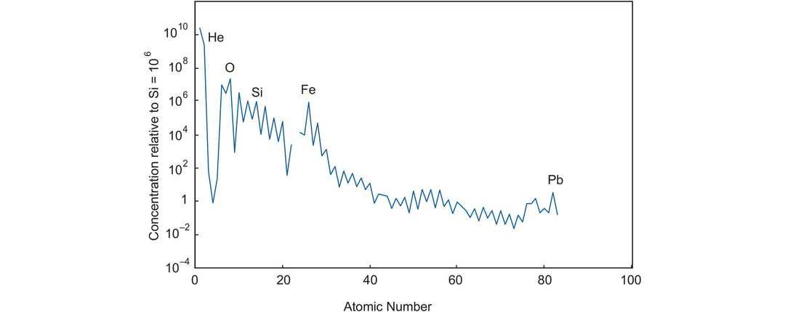

# 第 1 章 | 地球化学数据 {docsify-ignore}

> 原文： [**_Using Geochemical Data To Understand Geological Processes_**](https://doi.org/10.1017/9781108777834 "利用地化数据原文链接")

## 简介

本书为如何使用地球化学数据来获取相关地质过程的部分。

传统的地球化学数据分为四大类；即主量元素、微量元素、放射性同位素和稳定同位素。它们分别构成本书的一个章节。

每一章都展示了如何使用特定形式的地球化学数据，以及它如何为相关岩石中的过程提供线索。讨论了不同的数据表示方法并评估了它们间的相对优缺点。

> 主量元素（第 3 章）是在任何岩石分析中占主导地位的元素。

在硅酸盐岩石中，它们通常是 $Si、Ti、Al、Fe、Mn、Mg、Ca、Na、K 和 P$ ，它们的浓度表示为氧化物的重量百分比（wt.%）。

主量元素的测定通常只针对**阳离子**，并假定它们伴随着适量的氧，**阴离子通常是不测定的**。

因此，主量元素氧化物的总和将达到近 100%，分析它们的总数可用作粗略的可靠性指南。

铁以 $FeO$ 或 $Fe_2O_3$ 的形式确定，通常表示为“总铁”并以 $Fe_2O_3(tot)、Fe_2O_3(t) 或 Fe_2O_{3T}$ 的形式给出。

> 微量元素（第 4 章）定义为含量低于 $0.1 wt.\%$ 且其浓度以百万分之几 (**ppm**) 表示，或**ppb** ( $10^{-9}$ ) 表示的元素。

有时也会引用浓度超过 $0.1 wt.\%$ (1000 ppm) 水平的微量元素。

地球化学中重要的微量元素如图 4.1 所示。

**有些元素在一类岩石中表现为主要元素，在另一类岩石中表现为微量元素。**

如元素 $K$ ，它是流纹岩的主要成分，占岩石重量的 4% 以上，是正长石和黑云母等矿物的重要结构部分。然而，在一些玄武岩中，$K$ 浓度非常低，并且没有含 $K$ 相。在这种情况下，$K$ 表现为微量元素。

**可以将 $H_2O、CO_2 和 S$ 等挥发物包括在主要元素分析中。**

结合在硅酸盐矿物晶格中并在 110°C 以上释放的水称为 **H2O+** 。

在岩石粉末中仅以湿气的形式存在（加热到 110°C 被排出）的水，称为 **H2O-** ，它不是岩石的重要成分。

岩石的总挥发物含量通常是在 1000°C 下点火加热确定下来的，表示为烧失量 ：**LOI（ loss on ignition）**。

> 同位素分为**放射性同位素**和**稳定同位素**。

**放射性同位素**（第 6 章）包括那些由于其天然放射性而自发衰变的同位素以及作为这种衰变方案的最终子产物的那些同位素。

它们包括父子元素对 $K-Ar、Rb-Sr、Sm-Nd、Lu-Hf、U-Pb 和 Re-Os$ 。它们表示为相对于非放射性同位素的比率，例如 $^{87}Sr/^{86}Sr$ ，其中 $^{87}Sr$ 是放射性同位素。

地球化学中的稳定同位素研究（第 7 章）集中于 $H、O、C、S 和 N$ 等轻元素的天然同位素以及可以根据质量进行分馏的各种金属元素（见图 7.29）元素同位素之间的差异。

例如，同位素 $^{18}O$ 比同位素 $^{16}O$ 重 12.5%，两者在水的蒸发过程中被分馏。

稳定同位素有助于理解地质学中的流体和挥发性物质。它们使用 δ( $\delta$ )符号表示为相对于标准的比率（参见第 7.2.1.1 节）。

某数据集中 $Fe$ 以 $Fe_2O_{3T}$ 形式给出，挥发物以 **LOI** 形式给出（第 3.1.1 节）。数据也在干燥后重新计算。

主量元素是通过电感耦合等离子体光学发射光谱 ( **ICP-OES** ) 测定的。
痕量元素是通过电感耦合等离子体质谱仪 ( **ICP-MS** ) 测量的，这一长长的痕量元素列表显示了使用该方法可以轻松确定的痕量元素范围。

如果特定元素未测量，则将其指定为“nd”（未确定），如果由于低于所用分析方法的检测限而无法确定，则可将其报告为“bd”。使用热电离质谱 ( **TIMS** ) 测量 $Sr 和 Nd$ 的放射性同位素。

本书主要讨论了上述四种主要类型的地球化学数据，并展示了如何使用它们来识别和理解地球化学过程。

此外，第 5 章介绍了如何使用微量元素和主量元素化学来确定一些火成岩和沉积岩的构造背景。

第 2 章讨论了在分析地球化学数据集时出现的一些特殊统计问题，并就是否允许的数据表示方法提出了一些建议。

本章节中，我们主要围绕三个主题：

1. 自然界中可能遇到的地球化学过程及其地球化学特征。
2. 野外地质工作与地球化学资料解释的相互作用。
3. 现代地球化学目前使用的不同分析方法。

## 地质过程及其地球化学特征

本节回顾地球岩石形成和分化中的主要过程，了解它们如何塑造现在我们熟知的地球。

通常，在地球化学领域，会将地球深处发生的高温过程与在地球表面或附近的低温过程区分开。

遵循此模式：

首先回顾地球形成中发生的过程，及其变质作用过程中造成后续分化和再加工的岩浆过程。

然后，在地球表面的低温下，岩石与地球大气、水圈及生物体间的相互作用下，最终导致沉积岩的形成。

通过探讨，最终可以通过地球化学数据的收集和解释来识别具有独特地球化学特征的那些地质过程。

### 控制行星体形成和分化的过程

想全面了解我们的星球，就得从其自身起源和邻近的行星着手。答案通常来自对地球整体构成的了解，而这些目前都是由地球的部分知识拼凑而成。

目前地球组成的主要信息来源是陨石的研究，尤其是对最原始的陨石：**球粒陨石**(Chondritic meteorites)的研究。在太阳星云的冷凝期间形成的球粒陨石，其研究将走向宇宙化学和地球化学重叠的领域（参见第 4.1.1 节）。

大爆炸之后，大多数化学元素由**恒星核合成**(stellar nucleosynthesis)过程形成。

从光谱中获得太阳的元素分布和陨石的研究如图 1.1 所示，它们的相对浓度提供了有关恒星核合成的细节。球粒陨石由太阳星云的气体和灰尘冷凝而成，它们的化学和矿物学信息提供了太阳星云中的信息。

与地球化学过程完全不同，星云冷凝中的宇宙化学过程主要为其中元素和化合物的相对挥发性控制。在灰尘和岩石碎片的缩聚形成的冷凝行星体后期，伴随着早期行星体的增长，融化并分化成金属核心和硅酸盐外壳。

球粒陨石的化学研究从三个重要方面阐明了我们对地球化学的研究：

1. 根据形成地球的化学物质组成，可以提供地球化学基线量化地球的分化，分馏过程。以相对于球粒陨石成分的微量元素和同位素值，作为原始地球成分 **BE** ( _bulk Earth composition_ ) 的量度。或以相对于原始地球或原始地幔 **PM** ( _primitive mantle_ ) 的微量元素丰度及同位素比率表示。PM 是地核分离后的大块硅酸盐 **BSE** ( _bulk silicate Earth_ ) 地球成分。

2. 一些球粒陨石中包含有太阳星云形成过程的信息，少量含有更早过程的信息。通过金刚石和 SiC 等早于太阳星云形成的难熔矿物中的 Cr 和 Mn 等元素的稳定同位素研究可以指示早期恒星核合成产物分布的信息。氢同位素比率现在可用于一系列太阳系物体，结合陨石中的测量可以指示太阳系行星和其他太阳系物体的形成。

3. 陨石中有地球大尺度分化及其核心形成过程的信息。依据地幔中亲铁微量元素的浓度，以及对其金属硅酸盐分配系数的实验研究（表 4.10），可指示出地核的形成过程。同理，研究地幔中碳同位素的质量平衡有助于了解目前认为被隔离在地核中的碳。

### 火成岩成岩的化学因素

以玄武岩为例，图 1-2 总结了控制火成岩成分的过程。

#### 在地幔源中发生的过程

原始地幔是地球早期分化的产物，玄武岩很可能就是从这一系列幔源成分部分熔融后萃取出来的。这个过程涉及到地心的分离，且可能是在地球早期的岩浆海洋阶段形成的。随后的部分熔融和混合过程逐渐形成了现在的上地幔部分，并分化出贫化和富集的区域。
两个因素控制着地幔的富集和贫化。

1. 不同的深度，不同熔融程度的熔体的萃取、迁移和再结晶
2. 俯冲过程中再循环到地幔中的地壳物质

现代熔岩中可能有少部分来自于未受到后续地质作用影响的幔源部分，可以代表地球的原始地幔。

因为放射性同位素组成和选定的微量元素比率（标准微量元素比率）在部分熔化和随后的岩浆过程中不会改变，所以通过测量这些比率来表征地幔源区的化学成分，以便了解发生在源区的过程，

#### 部分熔化过程

未受到后期影响改变的由地幔部分熔融产生的熔体称为原生岩浆。它们的化学成分受两个主要因素控制。

1. 源区的化学成分及其矿物学特征。源的成分反映元素富集或贫化的情况，矿物学特征可以反应熔融深度。
2. 熔化的物理条件。熔融的温度和深度，熔化的精确机制和部分熔化的程度。

在某些情况下，地幔的氧逸度也是一个重要的控制因素。在初始熔融阶段之后，原生岩浆迁移中与其他来源的熔体混合发生结晶和围岩反应。主量元素、微量元素和放射性同位素化学对于揭示原生岩浆的起源起重要作用。

#### 岩浆房过程

大多数玄武岩在进入或接近地表前会通过岩浆房的过滤过程。这些岩浆房可能位于地壳底部或地壳内的不同高度。
它们可能由与原始岩浆不同的源区岩浆孕育。各种各样的岩浆房过程改变了母岩浆的化学成分，包括分级结晶、围岩同化及相应的分级结晶、多源岩浆混合、通过液体不混溶分离熔体或其中几种过程的动态混合。岩浆房最好被认为是动态系统，熔体被送入并被分化，在其中形成堆积岩，熔体从中喷发。解决这些不同过程的化学影响需要全方位的地球化学工具：主要和微量元素研究，以及放射性和稳定同位素组成的测量。

> 未完待续

#### 固相线

### 变质岩成岩的化学因素

### 地球表层环境中的低温过程

#### 大气

#### 风化

#### 水化学

#### 人类活动影响

### 沉积岩成岩的化学因素

#### 物源

#### 风化

#### 沉积环境

### 生物地球化学过程

#### 地球上的早期生命

## 地球化学数据的地质控制

### 样品采集

## 地球化学中的分析方法

### 样品制备

### 样品溶解

### X 射线荧光 (XRF)

#### 波长色散 X 射线荧光光谱法 (WDXRF)

#### 能量色散 X 射线荧光 (EDXRF)

### 仪器中子活化分析 (INAA)

### 原子吸收分光光度法 (AAS)

### 质谱

#### 热电离质谱 (TIMS)

#### 气源质谱

#### 激光氟化气源质谱

#### 同位素稀释质谱

### 电感耦合等离子体 (ICP) 光谱法

#### ICP-光学发射光谱法 (ICP-OES)

#### ICP-质谱 (ICP-MS)

#### 激光烧蚀 ICP 质谱 (LA-ICP-MS)

### 电子探针显微分析 (EPMA)

### 离子微探针 (SIMS)

### 同步加速器 X 射线光谱分析

## 选择合适的分析技术

## 地球化学分析误差来源

### 污染

### 校准

### 重叠峰值

### 检测错误
