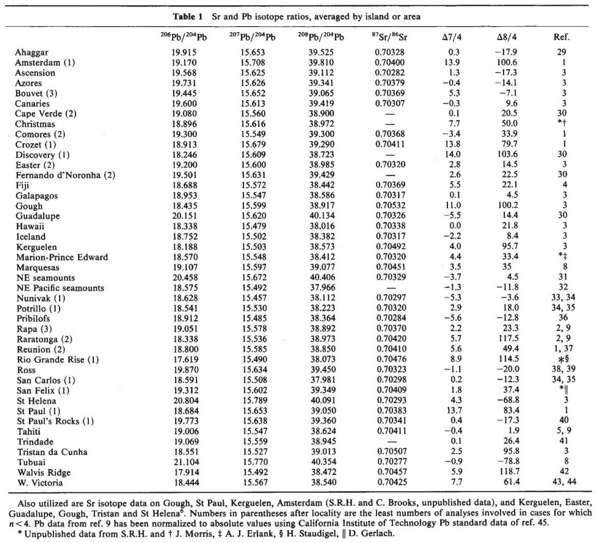
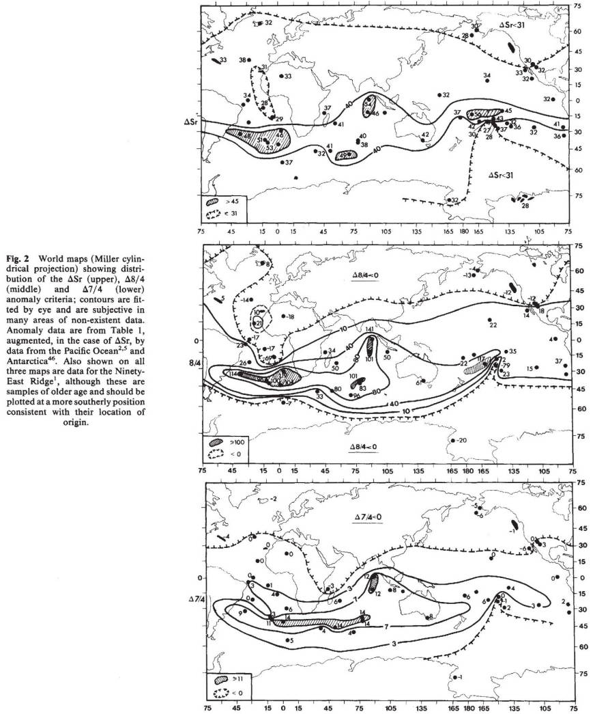

# Dupal 介绍

## Dupal 异常是什么

Dupal 异常最早由 Dupré and Allègre (1983)研究印度洋的洋岛和洋中脊玄武岩 Pb-Sr 同位素时发现，经 Hart(1984)进一步研究正式提出，并以两位发现者的姓氏命名。

Dupal 异常具体指：在南半球赤道至 60°S 区域，如南大西洋和印度洋区，其玄武岩具有相对北大西洋和东太平洋海隆更高的 $^{87}$ Sr/ $^{86}$ Sr(>0.7035), 以及在相同 $^{206}$ Pb/ $^{204}$ Pb 比值条件下更高的 $^{207}$ Pb/ $^{204}$ Pb 和 $^{208}$ Pb/ $^{204}$ Pb 比值特征。

因此，Dupal 异常本质上是一种地幔不均一性，而围绕地幔不均一性及成因问题的研究一直是地学关注的热点。

Dupal 异常是全球最大尺度的地幔地球化学异常，其分布面积约 1 亿 $km^2$ 。Castillo(1988)、Wen(2006)和 White(2015)等认为 Dupal 异常的核心区有两个：印度洋-南大西洋区和中太平洋区，分别对应下地幔中的两个超大型地震波低速区(即 LLSVPs)，同时对应全球两个最主要的活动热点聚集区。由此，为 Dupal 异常赋予了新的物理内涵，其形成和分布可能与地幔深部的地质作用密切相关。

通过 Dupal 异常的研究，将有助于理解大尺度地幔不均一性、壳幔相互作用、板块运动规律、地球深部结构和动力学过程。

**Dupal 异常:**
在南半球赤道至 60°S 区域，如南大西洋和印度洋区，其玄武岩具有相对北大西洋和东太平洋海隆更高的
$^{87} Sr/ ^{86}Sr (>0.7035)$，以及在相同 $^{206} Pb/ ^{204} Pb$ 比值条件下更高的 $^{207} Pb/ ^{204} Pb$ 和 $^{208} Pb/ ^{204} Pb$ 比值特征（相应缩写指标 $\Delta 7/4$ 、$\Delta 8/4$ 和 $\Delta Sr$ 异常判别指标）。

> $\Delta 7/4=[(^{207} Pb/ ^{204} Pb)_{DS}-0.1084×(^{206} Pb/ ^{204} Pb)_{DS}-13.491]×100$
>
> $\Delta 8/4=[(^{208} Pb/ ^{204} Pb)_{DS}-1.209×(^{206} Pb/ ^{204} Pb)_{DS}-15.627]×100$
>
> $\Delta Sr=[(^{87} Sr/ ^{86} Sr)_{DS}-0.7]×10^4$

**注：** $\Delta 7/4$ 和 $\Delta 8/4$ 表示样品 $^{207} Pb/ ^{204} Pb$ 、 $^{208} Pb/ ^{204} Pb$ 比值与北半球参考线（NHRL）的相对偏差，$\Delta Sr$ 表示样品 $^{87} Sr/ ^{86} Sr$ 比值的绝对偏差

## 北半球参考线（NHRL）

NHRL：根据Tatsumoto（1978）北半球大洋玄武岩趋势线做出

$$ ^{207}Pb / ^{204}Pb = 0.1084(^{206}Pb / ^{204}Pb) + 13.491 $$
$$ ^{208}Pb / ^{204}Pb = 1.209(^{206}Pb / ^{204}Pb) + 15.627 $$

在 $^{207}Pb / ^{204}Pb$ 或 $^{208}Pb / ^{204}Pb$ 两个尺度上可以给任何数据集（Data Set - DS）的同位素异常的大小表示为与参考线的垂直偏差

$$\Delta 7/4=[(^{207} Pb/ ^{204} Pb)_{DS}-(^{207} Pb/ ^{204} Pb)_{NHRL}]×100$$
$$\Delta 8/4=[(^{208} Pb/ ^{204} Pb)_{DS}-(^{208} Pb/ ^{204} Pb)_{NHRL}]×100$$

对于 $^{87} Sr/ ^{86}Sr$ 同位素：

$$\Delta Sr=[(^{87} Sr/ ^{86} Sr)_{DS}-0.7]×10^4$$

### 印度洋或许可用的Dupal指标

> $\Delta Sr>30, \Delta 7/4>3, \Delta 8/4>50$ ,
>
> $^{206} Pb/ ^{204} Pb$ > ~~18.2？~~,
>
> $^{207} Pb/ ^{204} Pb$ > 15.5？,
>
> $^{208} Pb/ ^{204} Pb$ > ~~38.5？~~。

?> 📥 未完待续，🚢 施工中 🚧 📤

**部分参考文献：**

- [Dupré, B., & Allègre, C. J. (1983). Pb–Sr isotope variation in Indian Ocean basalts and mixing phenomena. Nature, 303(5913), 142–146.](https://doi.org/10.1038/303142a0)
- [Hart, S. R. (1984). A large-scale isotope anomaly in the Southern Hemisphere mantle. Nature, 309(5971), 753–757.](https://doi.org/10.1038/309753a0)
- [邢光福.Dupal 同位素异常的概念,成因及其地质意义[J].火山地质与矿产,1997,18(4):281-281.](../Page/Brief/Dupal/Dupal同位素异常的概念、成因及其地质意义.pdf ":ignore")
- [张旗, 周德进, 沈丽璞. Dupal 异常研究的现状与趋势[J]. 地球物理学进展, 1992, 7(4):63-71.](../Page/Brief/Dupal/Dupal异常研究的现状与趋势.pdf ":ignore")

## 南半球地幔的大规模同位素异常

> **作者**：Stanley R. Hart；**期刊**：Nature
>
> **简介**：南半球许多地区的玄武岩具有锶(Sr)和铅(Pb)同位素异常特征。本文认为同位素地幔异常以南纬 30° 为中心并环绕地球。此地幔异常已存在数十亿年的论点将严格约束地幔对流模型。

最近，Dupré和Allègre对以印度洋为中心的一块由具有Sr、Nd和Pb同位素异常特征的洋岛和洋壳玄武岩划定的区域（ $10^8 km^2$ ）进行了重要观察。现有的年轻玄武岩同位素数据表明，这个同位素地幔域，这里称为 Dupal 异常，可以在赤道和 60° S 之间的南半球周围几乎连续地追踪。该异常的一部分先前在太平洋中部划定，这是迄今为止划定的最大的地幔地球化学域。我认为这个同位素域是在地球历史早期由核-幔-壳分化过程产生的。这种异常的存在强力地限制了地幔对流模型。

### 同位素标准

使用三个标准来量化 Dupal 异常：（1） $^{207}Pb / ^{204}Pb$ 和（2） $^{208}Pb / ^{204}Pb$ 与北半球参考线（NHRL）的偏差，（3） $^{87} Sr/ ^{86}Sr$ 的绝对值。北半球 Pb 参考线的选择是任意的，但方便，因为 Pb-Pb 图上的大洋中脊玄武岩 (MORB) 和大洋岛玄武岩 (OIB) 数据具有丰富的数据和基本的共线性。绘制的参考线包括 MORB（N 型和 E 型）、夏威夷群岛、冰岛、亚速尔群岛、加那利岛和佛得角以及东北太平洋海山。采用的参考线方程（NHRL）是：

$$ ^{207}Pb / ^{204}Pb = 0.1084(^{206}Pb / ^{204}Pb) + 13.491 $$
$$ ^{208}Pb / ^{204}Pb = 1.209(^{206}Pb / ^{204}Pb) + 15.627 $$

在 $^{207}Pb / ^{204}Pb$ 或 $^{208}Pb / ^{204}Pb$ 两个尺度上可以给任何数据集（Data Set - DS）的同位素异常的大小表示为与参考线的垂直偏差：

$$\Delta 7/4=[(^{207} Pb/ ^{204} Pb)_{DS}-(^{207} Pb/ ^{204} Pb)_{NHRL}]×100$$
$$\Delta 8/4=[(^{208} Pb/ ^{204} Pb)_{DS}-(^{208} Pb/ ^{204} Pb)_{NHRL}]×100$$

对于 $^{87} Sr/ ^{86}Sr$ 同位素，使用比值的绝对大小：

$$\Delta Sr=[(^{87} Sr/ ^{86} Sr)_{DS}-0.7]×10^4$$

三个异常标准之间的一致性相当好。图1显示了Δ7/4、Δ8/4和ΔSr之间的相关性。这些标准的限制精度来自同位素测量本身，并且对于Δ7/4是最大的，因为相对于Δ7/4的总变化而言，质谱仪的分馏效应很大（±2个单位的测量精度是总共20个单位的Δ7/4变化值的10%）并且分馏矢量急剧倾斜于参考线。Δ8/4标准更稳健，因为分馏矢量与参考线半平行，并且Δ8/4中的总分布很大（±5个单位的测量精度是总共190个单位的Δ8/4变化值的3%）。同样，ΔSr的测量精度相对于观察到的扩散很小。当然，有重要且不受限制的来源由于“地质分散”造成的不确定性——使用平均岛屿数据集的事实可能会在内部显示出较大的同位素变化。对于涉及许多样本（冰岛、夏威夷、加拉帕戈斯）的数据集，这种分散可以有效地平均化；然而，对于某些数据集，只有一两个分析可用，代表性问题可能非常严重。然而，请注意，给定岛屿玄武岩组内Pb同位素比率的变化通常与参考线亚平行，因此计算出的Δ值对这种岛内同位素异质性不敏感。

,r=0.85；Δ7/4=-0.86+0.127(Δ8/4),r=0.69。")

### 数据

使用的基本数据集由Zindler等人编制的。这些数据已经用其他研究的数据进行了扩充，包括来自大陆环境的一些玄武岩。基本标准是将数据集限制在玄武岩中，对于大陆环境，我只使用了存在Pb数据且携带超镁铁质地幔包体的玄武岩（作为防止地壳污染的预防措施）。这些大陆玄武岩被包括在内，因为它们似乎符合图片，并填补了几个重要的地理空白。一些玄武岩组可能与俯冲带有关（普里比洛夫(Pribilof's)和斐济(Fiji)）；就斐济而言，仅使用了年轻的碱性玄武岩套件，因为据称这是在俯冲参与之后几个套件的年龄高达85Myr（Walvis Ridge、Rio Grande Rise、东经九十度海岭(Ninety-East Ridge)、新英格兰海山(New England seamounts)）;虽然年龄校正不会显著影响异常标准，但它确实会影响这些套房的地理位置。（形成时，东经九十度海岭样本位于其当前位置以南约 40°-50°。）包含这些较旧的套件表明，Dupal异常至少在 $10^8$ 年以来一直是地幔的持久特征。表1总结了使用的数据套件，不包括Hedge和Duncan和Compston的太平洋Sr数据。

如图2所示的这些数据的世界地图，为三个异常标准绘制的轮廓。虽然Dupal异常的配置在三个不同的异常标准之间有所不同，但它是所有三个地图上的一个显著特征，占据了以30°-40°S为中心的约60°纬度带。所有三个标准的异常中最大值从大西洋中脊南部延伸到印度洋中部；第二个最大值出现在太平洋中部的ΔSr和Δ8/4图上。该地区的铅数据很少。根据可用的同位素数据（Pb 和 Sr），似乎存在类似于大西洋特里斯坦岛（Tristan）、高夫岛（Gough）和圣赫勒拿岛（St Helena）之间陡峭梯度的配置，萨摩亚岛（Samoa）、拉拉汤加岛（Raratonga）和马克萨斯岛（Marquesas）反映Dupal特征的岛屿和Tubuai群岛和南部Tuamoto群岛显示出低异常值，类似于圣赫勒拿岛（St Helena）。请注意，这两个区域几乎彼此对映，近赤道的两倍对称轴位于~100°E。

除了中太平洋，其他数据覆盖较少的地区是高纬度地区；这些地区是显然以异常低的ΔSr和负值Δ7/4和Δ8/4为特征。图2的同位素异常模式的特征与地球大地水准面的2度特征之间存在良好的相关性。大地水准面显示极地地区的负“帽”和以赤道为中心的几乎连续的正值带。Busse将2度大地水准面与地幔中的四极对流状态联系起来，下地幔上升流以赤道对称轴为中心。同位素异常数据也表明了一种简单的四极模式，但与地球的自转轴更接近轴对称。同位素异常模式的更高程度特征，例如对映圣赫勒拿型低点，在大地水准面中没有明显的对应物。

请注意，夏威夷(Hawaii)和亚速尔群岛(Azores)的同位素数据中存在一些复杂性，这些数据在此处使用平均数据被掩盖了。Koolau系列，Oahu和Sao Miguel的东端，亚速尔群岛表现出相当突出的Dupal指标，分别为ΔSr=41和53，Δ8/4=51和44。

### 影响

在评估这种异常起源的模型时，需要考虑几个特征：(1)OIB和MORB数据中都存在异常（至少在印度洋）；(2)三个异常标准的近似一致性；(3)异常标准的正值需要源中父/子比率的高时间积分值（在Δ7/4的情况下，此外，所需的高U/Pb值必须追溯到早期在地球历史上），以及（4）过去地质记录中Dupal签名的证据。这些点将被单独考虑。

1. Dupré和Allègre提出MORB储层（上地幔）被OIB储层（下地幔）的物质污染，从而将异常特征从下地幔转移到上地幔，且没有产生两者之间的一种同位素类型。人们也可以设想一种非层状地幔情景，其中 OIB 储层是分布在 MORB 储层中的斑点，并且在部分熔融和随后的高级岩浆过程中发生部分交叉污染。

  另一种解释是通过共同的血统将这两个水库联系起来。如果耗尽的MORB储层是通过提取大陆地壳形成的，并且如果Dupal异常特征早于MORB储层的形成，那么MORB储层中异常特征的存在可以简单地继承自其地幔前体。为了可行，这种机制将要求各种MORB和OIB的储层在很长一段时间内保持其相对横向位置，鉴于上层的MORB储层快速对流运动，这似乎不太可能。我更喜欢Dupré和Allègre提出的“污染”解释。

1. 如图1所示，三个异常标准是合理的，但不是完全一致的（r范围从0.69到0.85）。每个异常标准主要取决于储层中时间积分的父/子比率；因此，它们的相关性表明Dupal储层的Rb/Sr(ΔSr)、Th/Pb(Δ8/4)和 $^{235}U/Pb$ (Δ7/4)的时间积分值高于参考储层。由于 $^{208}Pb / ^{204}Pb$ - $^{206}Pb / ^{204}Pb$ 图中 U/Pb 和 Th/Pb 的耦合，高Δ8/4也需要高Th/U比。换言之，Dupal源的特点是相对较高的Rb/Sr、 $^{235}U/Pb$ 和Th/U；在大多数岩石成因过程中，观察到这些比率中的分子元素比分母元素表现得更不相容，因此三个异常标准的近似一致性也就不足为奇了。

1. Dupal储层具有较高的Rb/Sr、 $^{235}U/Pb$ 和Th/U时间积分值。这对Dupal储层的开发意味着什么？高Rb/Sr、U/Pb和Th/U物质的一个明显来源是大陆地壳，事实上，Dupré和Allègre倾向于将沉积物俯冲到地幔中来解释印度的异常同位素特征海洋Dupal岛域。其他作者则主张重新注入的洋壳或沉积物提供许多或所有的OIB组成成分。

  最近（<500 Myr）注入的地壳物质并不能令人满意的作为生产Dupal同位素特征的工厂机制，因为这将产生高角度的Pb同位素阵列，其明显起源于北半球参考阵列的某处。除了Tristan，intra-suite Dupal趋势似乎与参考数组不平行（例如，Gough、Walvis、Bouvet、Kerguelen）。此外，显示最明显的Dupal特征套件定义了一个套件间的Pb-Pb阵列，该阵列与参考阵列平行，但转移到更高的 $^{207}Pb / ^{204}Pb$ 和 $^{208}Pb / ^{204}Pb$ 值。该阵列由 90° E-ridge-Discovery Seamount、Gough、St Paul、Crozet 和 Amsterdam 涵盖了 $^{206}Pb / ^{204}Pb$ (17.9-19.2) 的大部分范围，并且不能由生成地壳物质沿参考阵列分布的储层污染，即使它们是异质的。包含 Sr 同位素数据只会增强这种机制的不可信性，因为 $^{87} Sr/ ^{86}Sr$ 与沿该“上限”阵列的位置没有显着相关性。

  如果很久以前将地壳污染物重新注入地幔，则可以避免这个问题，在随后沿明显的 1700-Myr 等时线产生参考套件的“线条”的过程之前，这些过程也导致了亚平行Dupal套件的线条。事实上，几个回注模型提出，许多OIB组的同位素特征是由古老的海洋岩石圈造成的，尽管尚未证明这些材料将具有必要的高U/Pb和Th/U比率。此外，蚀变洋壳中U/Pb比值的提高应该伴随着 $U/^3He$ 比值的提高，这将导致数十亿年的 $^4He/^3He$ 比值显着提高；而Dupal岛和非Dupal岛之间的He同位素比率没有明显差异。

  也有人提出，古代次大陆岩石圈可能分层并提供必要的“富集”储层。由于上述原因，这种混合必须在地球历史早期发生。在任何情况下，这些回注模型都需要解决Dupal异常是一个连贯的地理域，而不是随机分散在各个OIB位置的事实。

  我对Dupal异常的再注入模型提出以下替代假设，作为进一步的刺激调查。首先，该异常与Dupal源地幔相对于参考地幔中U/Pb、Rb/Sr和Th/U富集的早期（>3000 Myr）发展有关。其次，这种相对富集要么直接源于地球初始的构造异质性，要么与大陆地壳开采早期阶段形成的异质性有关。（从参考地幔储层中提取了更多地壳，导致它比Dupal地幔储层更加枯竭。）第三，与大多数其他海洋铅模型相同，需要一些方法来产生在岛内玄武岩套件和整个参考储层套件中观察到的明显次生等时Pb-Pb阵列。这需要一个平均年龄为~2000 Myr的过程，这将增加所有海洋地幔源的U+Th/Pb比率。其中，提倡对Pb进行岩心抽吸，并将Pb浓缩到下地壳与古代高U/Pb洋壳（目前圣赫勒拿岛的 $^{206}Pb / ^{204}Pb$ ；我对铅悖论的问题几乎没有什么可补充的，除了我的偏见认为Dupal异常早于，甚至可能与造成海洋铅悖论的事件无关。

1. 如前所述，Dupal异常是环绕地球的，并且仅限于南半球。我在上面已经论证过，这种异常可能已经作为地幔实体存在了数十亿年。

  Sinha对所有年龄的大陆岩石和矿石的Pb同位素数据支持了这种异常的古老，并表明来自南半球的样本沿着比北半球更高的μ增长曲线（封闭系统μS分别为9.3和8.9）。即使在考虑的最古老的岩石（> 3000 Myr）中也存在这种区别。这种半球区别在来自适形矿床的 Pb 数据中并不明显，但许多这些铅似乎是在岛弧环境中产生的，并且可能涉及到在沉积环境中相当广泛的混合。 Sinha 没有编译 $^{208}Pb / ^{204}Pb$ 数据，因此目前无法验证该大陆数据集中是否存在Δ8/4异常。

  请注意，Manhes等人编制的岩石Pb同位素数据集也显示了 Sinha 散度。8个南半球数据集的 $^{207}Pb / ^{204}Pb$ 截距平均值高于12个北半球数据集。这些数据集由不同分析质量的数据组成，代表了具有地壳和地幔亲和力的多种岩石类型。如果Sinha的半球Pb分歧经得起进一步的审视，则暗示了两个重要结论：1、如果这种分歧与 Dupal 异常在根源上有关，那么Dupal异常确实具有古老的构造2、大陆岩石中Dupal型异常的存在表明大洋岛地幔与大陆地壳之间存在成因联系。因为大陆地壳被推测来自地幔，所以它可能带有Dupal特征；另一方面，如果Dupal异常起源于古老的大陆物质回注，则该特征可能最初是在冈瓦纳地壳实体中孕育的，并在后来的地壳回注过程中被接种到下地幔中。

### 未来发展方向

Dupal异常是根据海洋岛屿和大陆的当前位置定义的。如果异常来自古代，这些大陆块和海洋储库过去在哪里？他们被锚定在南半球了吗？是否存在一种地幔对流机制，它“在数十亿年内不会破坏 Dupal 地幔的同位素特征，并且不会使 Dupal 大陆和地幔储层的地理位置脱钩？”

## 个人想法

### 铅同位素

- 玄武岩样品的同位素数据可能是局部均匀的结果，而不是源区均匀的体现。 **地方和区域** 与 矿物颗粒 尺度区别。

- 放射成因同位素铅的定义(对比铁陨石相)：

$$ \frac{^{208} Pb^*}{^{204} Pb^*} = \frac{^{208} Pb / ^{204} Pb - (^{208} Pb / ^{204} Pb)_{init} }{^{206} Pb / ^{204} Pb - (^{206} Pb / ^{204} Pb)_{init}} $$

- 产生MORB的地幔同位素在所有的空间尺度（厘米到公里）上都是不均匀的。
- 铅同位素重叠严重。

#### 铅悖论

几乎所有海洋玄武岩（MORBs和OIBs）的放射性铅含量都高于原始地幔，位于4.53 Ga geochron等时线右侧。

为什么大陆地壳和大洋玄武岩在铅同位素方面如此相似？

两个主要的非火成过程变得很重要：
（1）从大洋地壳向金属沉积物的热液转移
（2）从俯冲大洋地壳加沉积物向弧岩浆源的转移

为什么铅和铀在大陆地壳中的富集程度几乎相同，而在大洋地壳和大洋洲岛屿的形成过程中，它们的富集程度却非常显著。

#### 地幔端元

- HIMU、EM1、EM2、DMM等地幔端元的解释，或许更应该理解为，地幔随着时间混合分化，并无“固定”端元。极端同位素组分代表源岩极端化学分异
- HIMU (Cook-Austral Islands and St. Helena), EM-1 (Pitcairn-Gambier and Tristan),EM-2 (Society Islands, Samoa, Marquesas), and PREMA (Hawaiian Islands and Iceland).
- 地幔中存在着相当极端的同位素和化学不均一性，其规模比单个火山的熔融区小得多。（熔体包裹体研究）

### 其他

锇通常以低于ppb浓度的水平存在于海洋玄武岩中。且易受高Os的海水和地壳玄武岩的影响。且大洋玄武岩能否表示幔源存疑。

如果蜘蛛图使用原始地幔丰度标准，并元素顺序按照相容性增加的顺序，则能最有效地传达信息
