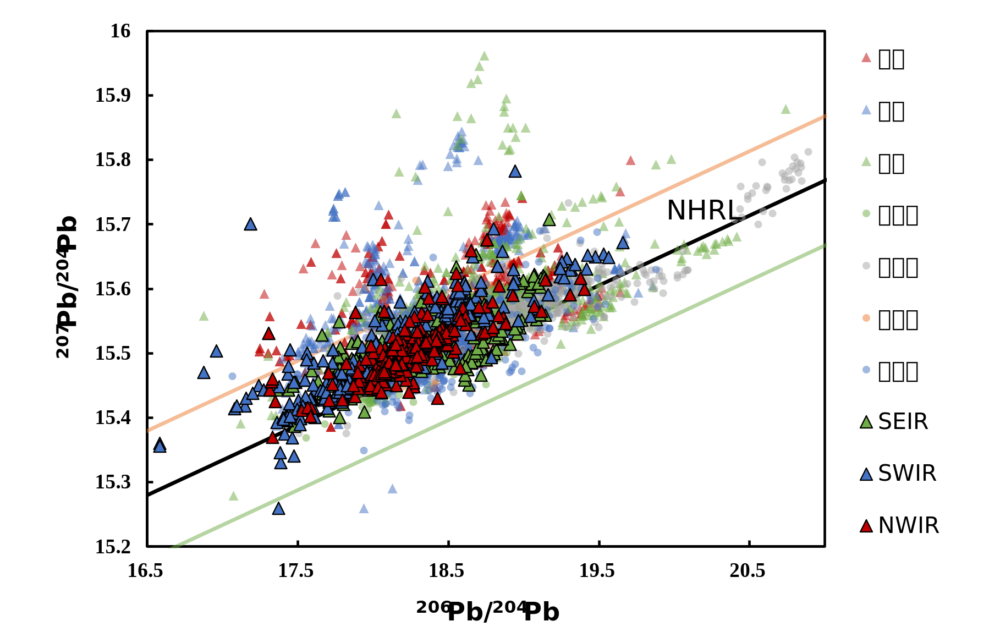
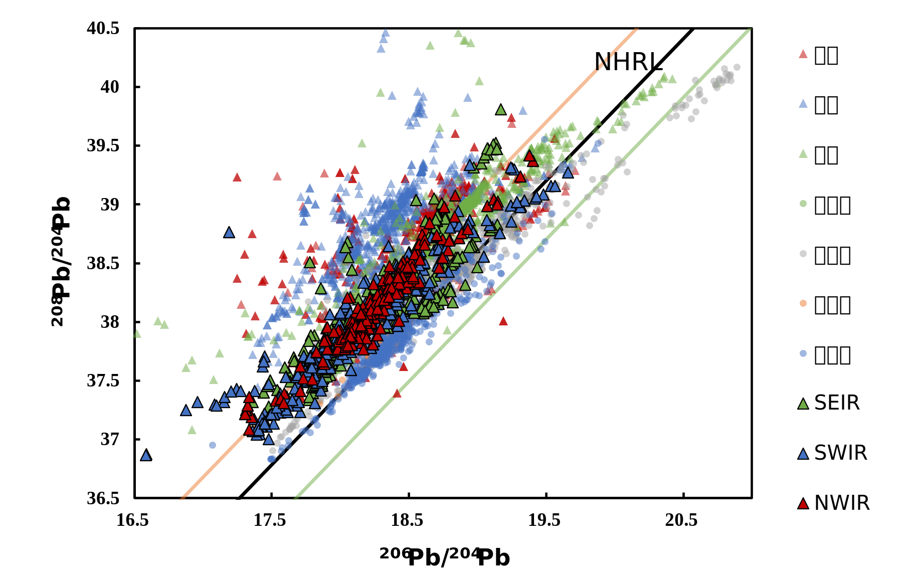
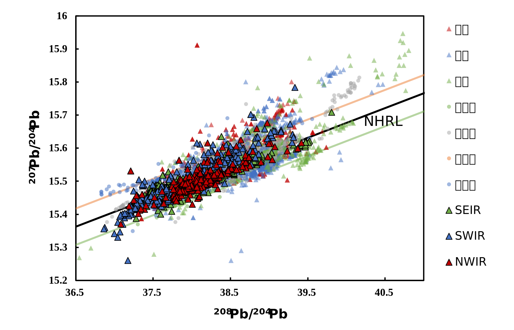
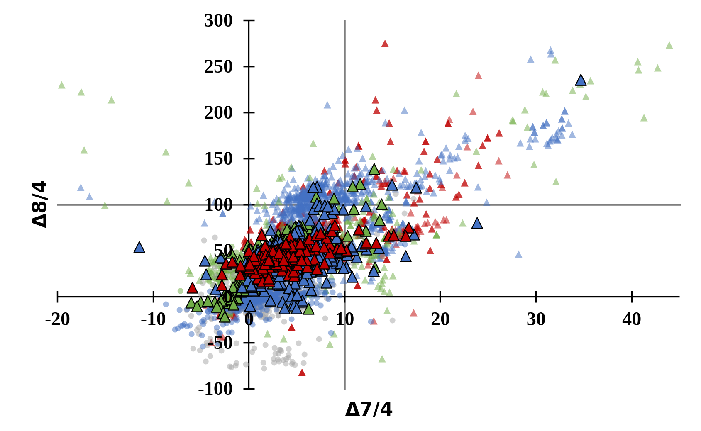
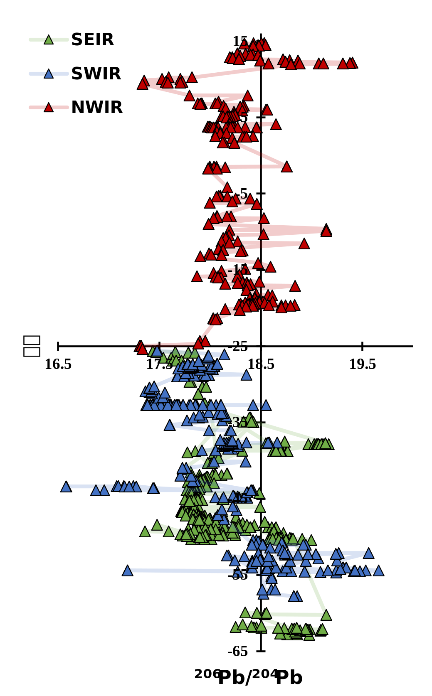
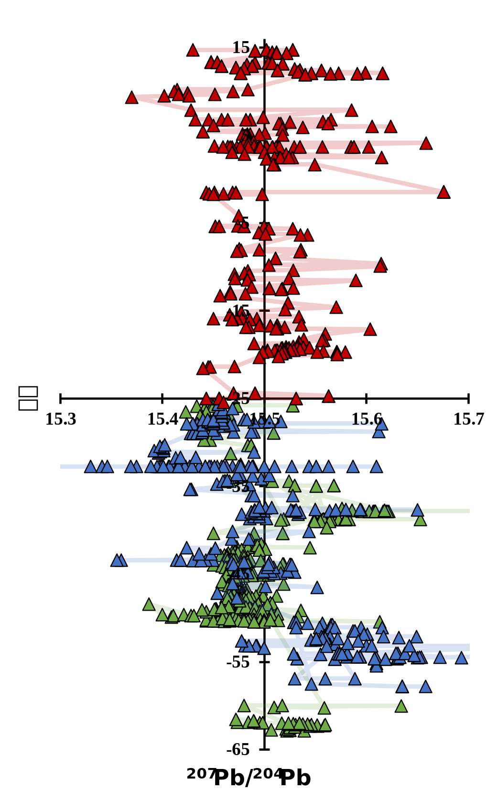
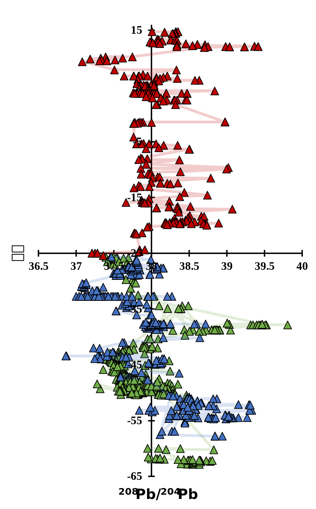
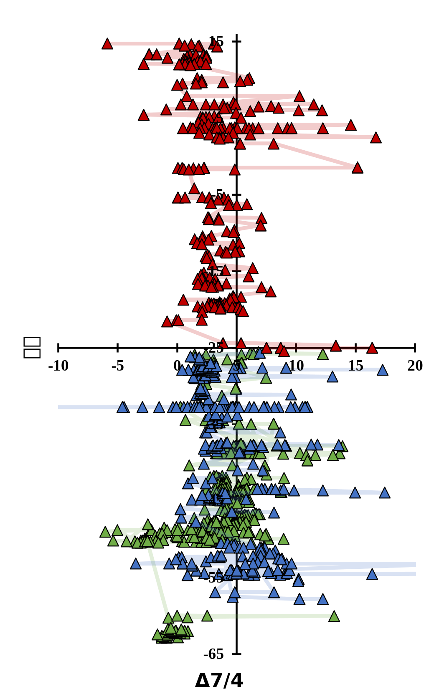
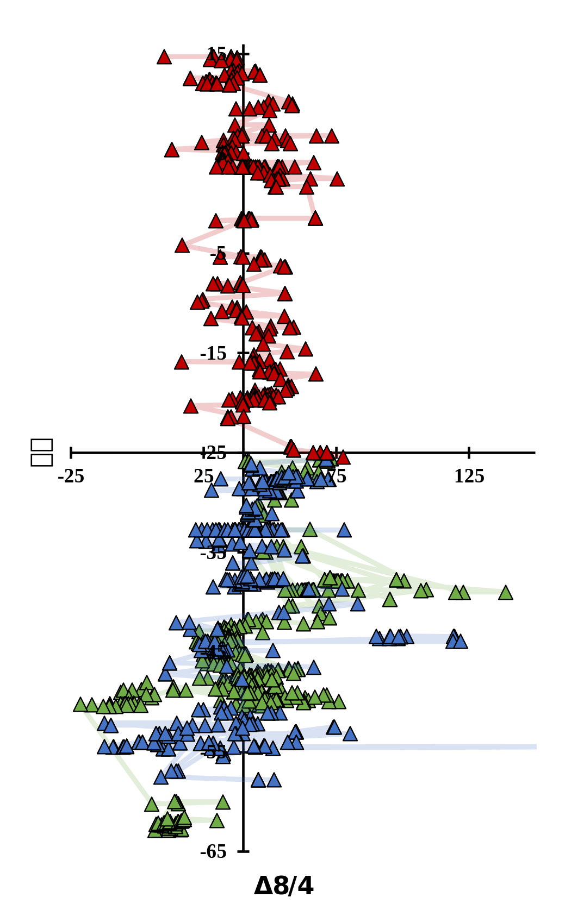

# 印度洋DUPAL异常范围厘定及成因初探

## 引言

### Dupal异常概念及意义

1983年，**Dupré 和 Allègre** 发现印度洋的洋岛玄武岩（OIB）和洋中脊玄武岩（MORB）的Pb-Sr同位素有不同于太平洋和大西洋的特征。

1984年，**Hart** 根据两人名字将这种同位素特征命名为Dupal，并设定Δ7/4，Δ8/4和ΔSr三个异常判别指标来量化此异常。

Hart依据北半球MORB和OIB的铅同位素数据设定了北半球参考线（NHRL），公式如下:

> $^{207}Pb/^{204}Pb = 0.1084 × (^{206}Pb/^{204}Pb) + 13.491$
>
> $^{208}Pb/^{204}Pb = 1.2090 × (^{206}Pb/^{204}Pb) + 15.627$

并定义了Δ7/4，Δ8/4和ΔSr三个异常判别指标：

Δ7/4和Δ8/4为样品（yp）的铅同位素比值 （ $^{207} Pb/ ^{204} Pb$ 、 $^{208} Pb/ ^{204} Pb$ 和 $^{206} Pb/ ^{204} Pb$ ） 相对NHRL的偏移程度。
ΔSr 为锶同位素（ $^{87}Sr/^{86}Sr$ ）比值的放大。

> $Δ7/4=[ (^{207} Pb/ ^{204} Pb)_{yp} - (^{207} Pb/ ^{204} Pb)_{NHRL}]×100$
>
> $Δ8/4 =[ (^{208} Pb/ ^{204} Pb)_{yp} - (^{208} Pb/ ^{204} Pb)_{NHRL}]×100$
>
> $ΔSr =[ (^{87}Sr/^{86}Sr)_{yp} - 0.7] ×10^4$

通过Δ7/4，Δ8/4和ΔSr三个判别指标在地球上各点位的数据分析，Hart认为Dupal异常为环绕南半球的同位素地幔域，可能是地球早期因核—幔—壳分化过程中产生的。

目前为止，Dupal异常是全球最大尺度的地幔地球化学异常，其有力的反应了**地幔的不均一**。

### Dupal异常研究现状与问题

Dupal异常至今没有统一的解释。
不同人的Δ7/4，Δ8/4和ΔSr边界值不同，所以圈定的异常分布范围也不同。
Dupal异常区与**地幔端元**、**核幔边界**、**LLSVP**的联系也未有定论。

**北半球Dupal异常特征**应如何理解，Dupal异常形成是否是古老的，**陆壳**在Dupal异常形成中的影响等问题，还需进一步进行探讨。

因此，本文从最初发现Dupal异常的印度洋入手，通过已有数据的分析处理及聚类插值等方法，在厘定印度洋Dupal异常范围后，力求对Dupal异常及背后意义做出合理的解释。

## 方法

### 印度洋数据来源

本文使用的大部分数据为 2022年6月30日 [EarthChem Portal](http://portal.earthchem.org/) 数据库下载的略大于印度洋区域的Pb、Sr、Nd同位素数据。额外补充卡尔斯伯格脊部分的数据为自然资源部第二海洋研究所，海底科学实验室报告数据。

数据经过处理后，获得同时含有Sr、Nd、Pb相关同位素比值的数据1878行，同时含有Pb三种同位素比值的数据3305行。
在此基础上，针对数据的不同构造位置做相应分析。

### 印度洋洋中脊

洋中脊上的年轻玄武岩，年龄上基本可以**认为是一致**的。以洋中脊部分的数据点分析，能不受年龄影响，直观地看出源区铅同位素的状况。

> 图1 印度洋洋中脊同位素组成
>
> 图1中 a、b、c中NHRL上下的两条线为NHRL的平行线，橙线为更高，绿线为更低，以此用作Dupal区域的参考。图a、b、c中可见许多印度洋离轴区域的Dupal特征更明显，大部分位于橙线上方。图d中也可明显发现高Dupal特征的数据主要为离轴部分。

由图1的四张图可知，印度洋三条洋脊的铅同位素比值基本在同一个区间，大部分在NHRL线上方，表面有一定Dupal特征，总体上不同于其他大洋的分布状况。
三条洋脊的Pb，*Sr，Nd*同位素数据分布无明显差异，这代表着印度洋洋脊的同位素来源应该是类似的。

单独对洋中脊分析，以罗德里格斯三联点为中心，在平面上对印度洋的三条洋脊做沿轴方向的对比。

> 图2 印度洋洋中脊纬度与铅同位素变化
>
> 见每条洋脊都有跳跃的变化

分别分析三条洋脊，可以发现每条洋脊在沿脊的分布上有类似的变化。

在平面上的变化可以看出。

### 印度洋板内火山洋岛

> 设置 $ΔNd =[ (^{143}Nd/^{144}Nd)_{yp} - 0.51] ×10^4$ 。

## 结果

### 印度洋数据总结

## 讨论

### U-Th-Pb同位素体系与Dupal

铅有四种同位素（ $^{208}Pb$ 、 $^{207}Pb$ 、 $^{206}Pb$ 、 $^{204}Pb$ ）。其中的三种放射性铅同位素是**U-Th-Pb同位素体系**下由 $^{238}U$ 、 $^{235}U$ 、 $^{232}Th$ 衰变而来。

> $^{238}U \to ^{206}Pb + 8 \alpha + 6 \beta ^{-} + E$
>
> $^{235}U \to ^{207}Pb + 7 \alpha + 4 \beta ^{-} + E$
>
> $^{232}Th \to ^{208}Pb + 6 \alpha + 4 \beta ^{-} + E$

考虑到铅同位素间的质量差相对较小，地质环境中因物理化学条件变化造成的铅同位素分馏影响应该可以忽略不计。
如果没有重新达到**封闭温度**，岩石中的 $^{204}Pb$ 会基本保持不变，放射性成因的 $^{208}Pb$ 、 $^{207}Pb$ 和 $^{206}Pb$ 则会随着放射性U和Th的衰变而增大。

所以，随着时间的演化 $^{207} Pb/ ^{204} Pb$ 、 $^{208} Pb/ ^{204} Pb$ 与 $^{206} Pb/ ^{204} Pb$ 的比值会逐渐增长。

Δ7/4，Δ8/4是相对于NHRL的偏移，三个放射性铅同位素的增大并不一定能让Dupal特征更加明显。
由NHRL的公式可知，在非放射性同位素 $^{204}Pb$ 基本不变的情况下，$^{208}Pb$ 和 $^{207}Pb$ 增大， $^{206}Pb$ 不变或者减小的情况下，Dupal异常特征才会显得更明显。换言之，源区 $^{238}U$ 含量低， $^{235}U$ 、 $^{232}Th$ 含量高的情况下，才能显现出高Dupal的特征。

U和Th同属锕系元素，电子构型相似，具有相似的地球化学性质。不同源区（U、Th、Pb丰度不同）的岩浆混合可以让Dupal特征有明显偏离NHRL的变化。

### 印度洋Dupal区域范围及内部分布区别

### 印度洋Dupal分布的潜在影响因素

#### 热点与Dupal特征的联系

#### 地震层析成像异常（LLSVP)与Dupal异常的关系

#### 冈瓦纳大陆与Dupal特征的因果关系

#### 陆壳与Dupal特征的联系

## 结论
