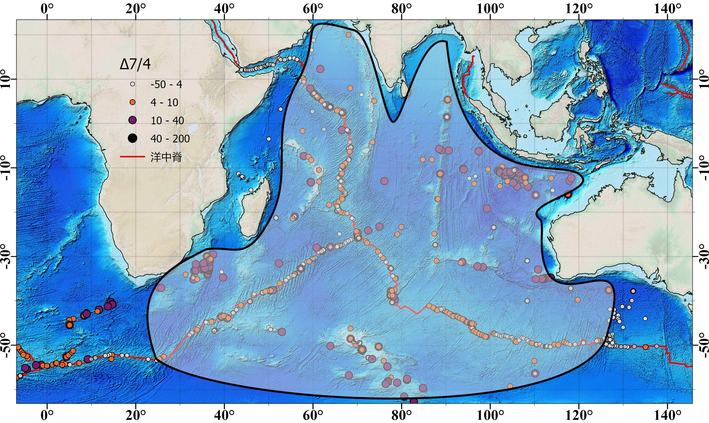

# 印度洋DUPAL异常范围厘定及成因初探

## 引言

### Dupal异常概念及意义

1983年， **Dupré 和 Allègre** 发现印度洋的洋岛玄武岩（OIB）和洋中脊玄武岩（MORB）的Pb-Sr同位素有不同于太平洋和大西洋的特征。

1984年， **Hart** 根据两人名字将这种同位素特征命名为Dupal，并设定Δ7/4，Δ8/4和ΔSr三个异常判别指标来量化此异常。

Hart依据北半球MORB和OIB的铅同位素数据设定了北半球参考线（NHRL），公式如下:

> $^{207}Pb/^{204}Pb = 0.1084 × (^{206}Pb/^{204}Pb) + 13.491$
>
> $^{208}Pb/^{204}Pb = 1.2090 × (^{206}Pb/^{204}Pb) + 15.627$

并定义了Δ7/4，Δ8/4和ΔSr三个异常判别指标：

Δ7/4和Δ8/4为样品（yp）的铅同位素比值 （ $^{207} Pb/ ^{204} Pb$ 、 $^{208} Pb/ ^{204} Pb$ 和 $^{206} Pb/ ^{204} Pb$ ） 相对NHRL的偏移程度。
ΔSr 为锶同位素比值（ $^{87}Sr/^{86}Sr$ ）的放大。

> $Δ7/4=[ (^{207} Pb/ ^{204} Pb)_{yp} - (^{207} Pb/ ^{204} Pb)_{NHRL}]×100$
>
> $Δ8/4 =[ (^{208} Pb/ ^{204} Pb)_{yp} - (^{208} Pb/ ^{204} Pb)_{NHRL}]×100$
>
> $ΔSr =[ (^{87}Sr/^{86}Sr)_{yp} - 0.7] ×10^4$

通过Δ7/4，Δ8/4和ΔSr三个判别指标在地球上各点位的数据分析，Hart认为Dupal异常为环绕南半球的同位素地幔域，可能是地球早期因核—幔—壳分化过程中产生的。

目前为止，Dupal异常是全球最大尺度的地幔地球化学异常，其有力的反应了 **地幔的不均一** 。

### Dupal异常研究现状与问题

Dupal异常至今没有统一的解释。
不同学者定义的Δ7/4，Δ8/4和ΔSr边界值不同，所以圈定的异常分布范围也不同。

Dupal异常区与 **地幔端元** 、 **核幔边界** 、 **LLSVP** 的联系也未有定论。

**北半球Dupal异常特征** 应如何理解，Dupal异常形成是否是 **古老** 的， **陆壳** 在Dupal异常形成中的影响等问题，还需进一步进行探讨。

因此，本文从发现Dupal异常的印度洋入手，通过已有数据的分析处理 ~及聚类插值等~ 方法，在厘定印度洋Dupal异常范围后，力求对Dupal异常及背后意义做出合理的解释。

## 方法

### 数据来源

本文使用的大部分数据为 2022年6月30日 [EarthChem Portal](http://portal.earthchem.org/) 数据库下载的略大于印度洋区域的Pb、Sr、Nd同位素数据。额外补充卡尔斯伯格脊（Carlsberg Ridge）部分的数据为自然资源部第二海洋研究所，海底科学实验室报告数据。

对下载下来的数据进行了三种限制处理：

1. 只使用大洋中的数据点，删除了高于水平面的洋岛区域，如马达加斯加群岛。
2. 只使用 $15 < ^{206} Pb/ ^{204} Pb < 25$ ， $14 < ^{207} Pb/ ^{204} Pb < 18$ ， $34 < ^{206} Pb/ ^{204} Pb < 42$ 范围内的数据，超出的数据点整行都不做参考。
3. 只保留同时拥有锶钕铅五种同位素比值或铅的三种同位素比值的数据点。

数据经过处理后，获得同时含有Sr、Nd、Pb五种同位素比值的数据1594行，同时含有Pb三种同位素比值的数据2607行。

很明显，需要Δ7/4、Δ8/4、ΔSr这些量化指标做一个基准参考，而对于不同的研究尺度，需要的参考程度也不一样，Dupal特征的判别值也一直是 **各有各的看法** 。
故本文针对印度洋数据特点，以Δ7/4>4，Δ8/4>40做Dupal特征边界参考。但除了量化的数值，还要看整体的数值特征趋势，以免因为极个别不合理数据而影响到整体的判断。

在此基础上，利用其他洋脊数据做对比，并针对印度洋中不同的构造位置做相应分析。

### 印度洋洋中脊

本次研究将以罗德里格斯（Rodrigues Triple Junction，RTJ）三联点为分割，将印度洋洋中脊分成NWIR，SWIR，SEIR三条：

**西北印度洋中脊（NWIR）** 包含卡尔斯伯格脊和中印度洋脊（Central Indian Ridge，CIR），北侧为与希贝海脊，亚丁湾相接的欧文断裂带（Owen Fracture），南侧为与西南印度洋中脊，东南印度洋中脊相接的罗德里格斯三联点；
**西南印度洋中脊（SWIR）** 西侧为与大西洋中脊（MAR），南美洲—南极洲洋中脊（SAAR）相接的布维（Bouvet，BTJ）三联点，东侧为与西北印度洋中脊，东南印度洋中脊相接的罗德里格斯三联点；
**东南印度洋中脊（SEIR）** 东侧为麦考瑞三联点（Macquarie，MTJ），西侧为与西北印度洋中脊，西南印度洋中脊相接的罗德里格斯三联点。

洋中脊上的玄武岩很年轻，年龄可以 **认为是一致** 的（0Ma）。对洋中脊部分的数据点分析，可以直观地看出洋中脊源区的铅同位素状况。

> 图1中Y轴处于Δ7/4=4或Δ8/4=40位置。
>
> 北纬10°以南至罗德里格斯三联点有明显Dupal特征。在北纬10°至南纬2°的卡尔斯伯格脊部分，有相对于中印度洋脊更明显的Dupal特征。而在NWIR的北纬10°以北，Dupal特征不明显，即欧文断裂带处可作为Dupal特征边界点。

> 图2中X轴处于Δ7/4=4或Δ8/4=40位置。
>
> 布维三联点附近的西经10°至东经10°区域，有较明显的Dupal特征。在SWIR和SEIR的东经25°至东经125°区间虽然数值起伏较大，但也都有明显的Dupal特征。而在SWIR的东经25°以西和SEIR的东经125°以东，Dupal特征不明显，即东经10°的沙卡断裂带（Shaka FZ，SH），东经25°的迪图瓦断裂带（DuToit FZ，DT），东经125°澳大利亚-南极错乱带（AAD）三处可作为Dupal特征边界点。

由图1、2可知，在印度洋的三条洋中脊上可以找到北纬10°，东经25°，东经125°三个地方来圈定印度洋Dupal特征的区域边界。边界点两侧可以明显地观察到Δ7/4，Δ8/4的数值跳动，说明两侧的MORB源区不同，有不一样的地质含义。
而想进一步圈定印度洋Dupal范围，则需要进一步扩大研究的数据范围做横向对比。

> 图3中A、B中NHRL上下的两条线为NHRL的平行线，橙线更高（ $^{207} Pb/ ^{204} Pb + 0.1$ ， $^{208} Pb/ ^{204} Pb + 0.8$ ），绿线更低（ $^{207} Pb/ ^{204} Pb - 0.1$ ， $^{208} Pb/ ^{204} Pb - 0.8$ ），可用作Dupal区域的范围参考。
> A图为 $^{207} Pb/ ^{204} Pb$ 比 $^{206} Pb/ ^{204} Pb$，B图为 $^{208} Pb/ ^{204} Pb$ 比 $^{206} Pb/ ^{204} Pb$。
> 可以发现，印度洋的三条洋脊和其他洋脊（大西洋，太平洋等洋脊）基本都处于橙线绿线范围，而印度洋离轴部分的数据点则可以远高于这个范围，Dupal特征更加明显。

> 图4中可见许多印度洋离轴区域的数据点Dupal特征更明显，且Δ7/4与Δ8/4基本呈现正相关性。
> 以Δ7/4=4，Δ8/4=40做参考，可见印度洋三条洋脊中有一部分有明显的Dupal特征，而其他洋脊中大部分都没有Dupal特征，不同大洋的洋脊间的特征也有明显不同。

<!-- > 设置 $ΔNd =[ (^{143}Nd/^{144}Nd)_{yp} - 0.51] ×10^4$ 。 -->

由图3、图4可知，在大洋尺度上，印度洋三条洋脊的铅同位素比值特征基本为同一区间，且大部分在NHRL线上方，有一定Dupal特征，总体上不同于其他大洋的分布状况。
三条洋脊的Pb同位素数据分布无明显差异，这代表着三条印度洋洋脊的同位素来源应该是类似的。

### 印度洋离轴数据特点

从图3、图4中可以明显发现印度洋离轴区域的数据点Dupal特征比洋中脊更加明显，自然让人联想到两者存在一定的关系。

> 图5中白色小点为Δ7/4低于4的数据点，为无Dupal特征点；橙色点为Δ7/4高于4小于10的、为有明显Dupal特征的点；紫色和黑色为Δ7/4大于10的数据点，为Dupal特征非常明显的点。
>
> 沿着洋脊的主要是橙色数据点，部分区域为白色数据点，所以可以根据图中的数据分布情况可以画出Dupal区域范围（图中白色半透明块）。
>
> 离轴部分的数据点则普遍为紫色或黑色数据点，Dupal特征十分明显。且在印度洋的西部、东部、南部三部分存在高Dupal特征点群。

结合图3、图4、图5来看，基本上可以圈定北纬10°，东经25°，东经125°三个边界，并且包含三部分离轴区域作为印度洋Dupal特征区。但显然这三部分Dupal特征区和洋中脊的状况又有所不同，两者间或许存在一定的联系。

## 讨论

### U-Th-Pb同位素体系与Dupal

铅有四种同位素（ $^{208}Pb$ 、 $^{207}Pb$ 、 $^{206}Pb$ 、 $^{204}Pb$ ）。其中三种放射性铅同位素是 **U-Th-Pb同位素体系** 下由 $^{238}U$ 、 $^{235}U$ 、 $^{232}Th$ 衰变而来。公式如下：

> $^{238}U \to ^{206}Pb + 8 \alpha + 6 \beta ^{-} + E$
>
> $^{235}U \to ^{207}Pb + 7 \alpha + 4 \beta ^{-} + E$
>
> $^{232}Th \to ^{208}Pb + 6 \alpha + 4 \beta ^{-} + E$

考虑到铅同位素间的质量差相对较小，地质环境中因物理化学条件变化造成的铅同位素分馏影响应该可以忽略不计。
如果没有重新达到 **封闭温度** ，岩石中的 $^{204}Pb$ 会基本保持不变，放射性成因的 $^{208}Pb$ 、 $^{207}Pb$ 和 $^{206}Pb$ 则会随着放射性U和Th的衰变而增大。

所以，随着时间的演化 $^{207} Pb/ ^{204} Pb$ 、 $^{208} Pb/ ^{204} Pb$ 与 $^{206} Pb/ ^{204} Pb$ 的比值会逐渐增长。

Dupal特征指标的Δ7/4，Δ8/4是相对于NHRL的偏移，而影响因素有多种。
由NHRL的公式可知，在非放射性同位素 $^{204}Pb$ 基本不变的情况下，$^{208}Pb$ 和 $^{207}Pb$ 增大， $^{206}Pb$ 不变或者减小的情况下，Dupal异常特征才会显得更明显。换言之，源区 $^{238}U$ 含量低， $^{235}U$ 、 $^{232}Th$ 含量高的情况下，能显现出高Dupal的特征。U和Th同属锕系元素，电子构型相似，具有相似的地球化学性质。不同源区（U、Th、Pb丰度不同）的岩浆混合也可以让Dupal特征有明显偏离NHRL的变化。

综上可得出结论：

1. Dupal特征所对应的U-Th-Pb体系成分存在多种可能。
2. 同一源区的铅同位素特征，应该会保持一致的。
3. 三种铅同位素比值会随着地质年龄的增长也表现出增大的趋势。

### 印度洋Dupal区域范围及内部分布区别

想要弄清楚印度洋Dupal区离轴的三部分与洋中脊的关系，或许我们得从其他方面入手。首先考虑地质年龄问题，将印度洋Dupal区放到磁条带年龄底图上得到图6。可以看出

> 图6中白色小点为Δ8/4低于40的数据点，为无Dupal特征点；橙色点为Δ8/4高于40小于60的、为有明显Dupal特征的点；紫色和黑色为Δ8/4大于60的数据点，为Dupal特征非常明显的点。
> 可见高Dupal特征的离轴三部分区域基本上处于相对较老区域，而洋中脊部分及对应的扩张部分基本上都相对年轻。且离轴三部分基本上都有海底高原存在，可能受板块扩张，残留陆块的影响。

图6中可见AAD区域（东经125°）的洋中脊北侧与洋中脊的分布特征一致，显然，北侧的Dupal特征为洋中脊扩张出来的，也就是相对年轻的区域中，如果没有受到其他外界因素影响，Dupal特征会与洋中脊基本一致。

### 印度洋Dupal分布的潜在影响因素

能影响Dupal特征的因素有很多，热点、幔源、陆壳等等，都有可能在Dupal特征形成中发挥作用。对此，我们就印度洋区域进行逐一讨论。

#### 热点、地震层析成像异常（LLSVP)与Dupal特征的联系

地幔中岩浆以柱状上升至地表形成热点，印度洋区域的热点有不少，其中最引人注目的是留尼汪热点和凯尔盖朗热点。刚好这两者都在离轴高Dupal特征区范围。

#### 冈瓦纳大陆、陆壳与Dupal特征的因果关系

本文中划定的印度洋Dupal特征区，刚好就是冈瓦纳大陆（Gondwanaland）裂解的中心部分。

## 结论

## 参考文献
