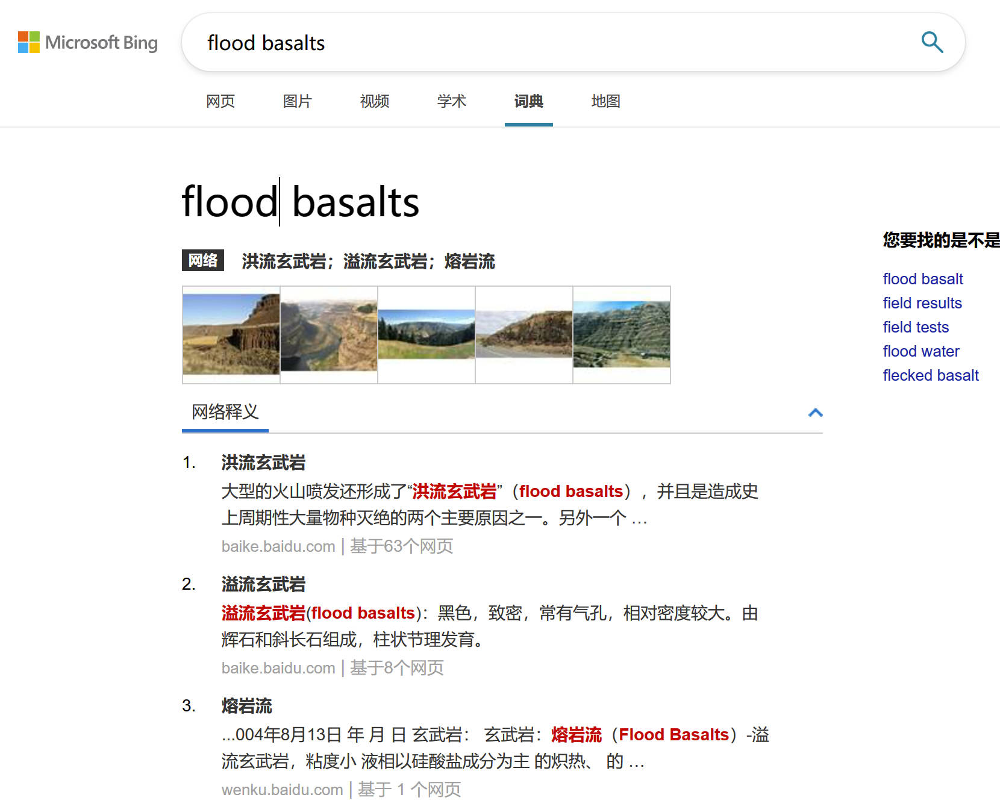
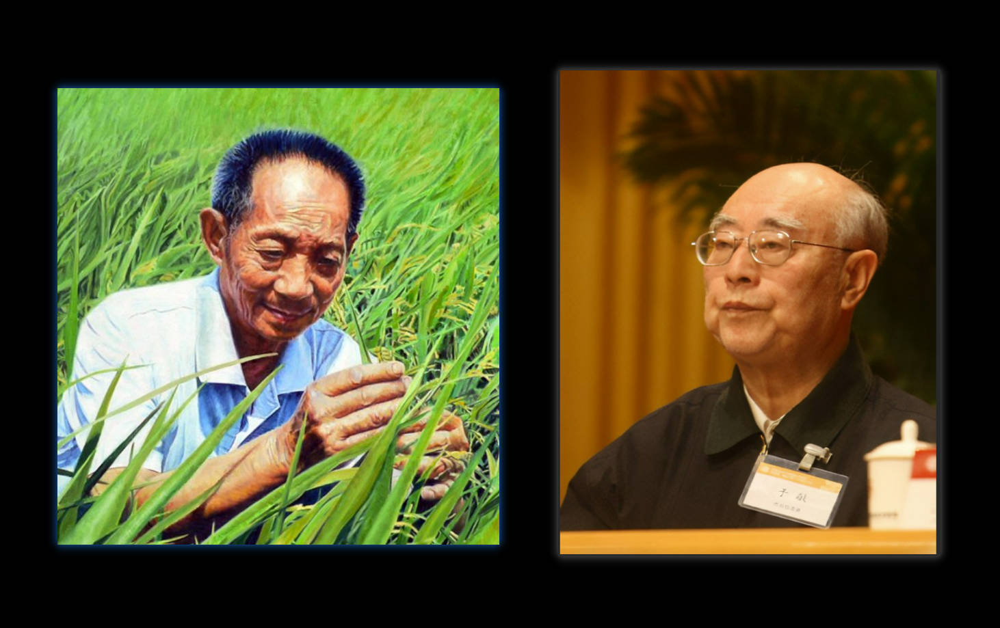

# 科研生活，还有未来

不知不觉已经硕士研究生快一年了，上半学期充实在各式各样的课程中，下半学期则开始Dupal异常的研究。

不得不说，上半学期，是我最忙碌且充实的时期。不仅是每周几乎充满了的课程，更有复垦压覆工作上的内容，还有对家庭的烦恼。

但还好，上半学期就这么过来了，毕竟这样的生活以前也面临着，有经济压力，学习压力，工作压力。这并 **不稀奇** ，只不过是生活较为充实。

然而，下学期开始，逐渐的就不适应了。

虽然工程工作基本已经结束，课程也没有，单纯的只需要完成关于Dupal异常的研究，却有许多头疼的点。

## 外文文献阅读与科研基础

其痛苦之处并不是看不懂，实际上现在的翻译工具下，“看懂”并不难，但看清楚并不容易。

以往本科也学习了许多的专业词汇，但凡中文有的，基本都能挺好理解，可很多时候就是对不上。

就比如，溢流玄武岩(**flood basalts**)，翻译软件翻译出 (洪水玄武岩)。我当然知道是有问题的，但是看见词汇依然不晓得意思。

甚至有些时候在搜索上也不能找到唯一的翻译。

当 flood basalts 翻译为熔岩流、溢流玄武岩的时候，自然是能了解含义的。当翻译成洪水玄武岩时，就不明所以了。

这种情况，便是一个约定俗成和机械翻译的问题了。但显然，这样的翻译问题在以后翻译的多了之后，自然会比较少出现。

还有就是如盒须图、箱线图（*box-and-whisker plot*）这样的没有那么明确的不同的问题。

> 当然，这样的问题在多多阅读后，自然也就烟消雨散。

可关于科研基础的问题，才是更让人头疼的！

## 理想科研与骨感生活

我本科属于地质，专业是资源勘查工程（固体矿产），虽说研究生本来很多就要自主学习，但仍然感觉到了本科基础的影响。

Dupal异常是属于地化方面的内容，恰好我本科《现代化学基础》和《地球化学》两门课都是60分的选手，属实是有些令人感叹。

终究是要走向最不行的方向？

其实这对我搞科研并无太大影响，毕竟我对地质和海洋没有太大的感受，当然，对其他学科也没有说有多大的兴趣。

所以我对科研的态度仅仅就是想为人类做出一丁点的贡献罢了。

我自知并没有特别高深的才能，也不是特别强势的才子。

不像数学韦神那般传奇，不及两弹一星的科研工作者那般刻苦。

我的偶像便是袁隆平，于敏这些为国为民做出大贡献者。

一如这些想法般，加之本人并没有太大的物质追求。做点小小的贡献，便是我的想法了。
