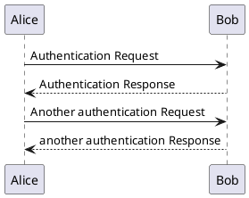

# 测试内容

## 测试加入其他类型文件

```python
print()
```

插入 html 动图

!> 暂未解决

[叠图](./Emoji.html ":include :type=iframe width=100% height=400px")

[cinwell website](https://cinwell.com ":include :type=iframe width=100% height=400px")

## Emoji 列表

### 小人

:bowtie:
:smile:
:laughing:
:blush:
:smiley:
:relaxed:
:smirk:
:heart_eyes:
:kissing_heart:
:kissing_closed_eyes:
:flushed:
:relieved:
:satisfied:
:grin:
:wink:
:stuck_out_tongue_winking_eye:
:stuck_out_tongue_closed_eyes:
:grinning:
:kissing:
:kissing_smiling_eyes:
:stuck_out_tongue:
:sleeping:
:worried:
:frowning:
:anguished:
:open_mouth:
:grimacing:
:confused:
:hushed:
:expressionless:
:unamused:
:sweat_smile:
:sweat:
:disappointed_relieved:
:weary:
:pensive:
:disappointed:
:confounded:
:fearful:
:cold_sweat:
:persevere:
:cry:
:sob:
:joy:
:astonished:
:scream:
:neckbeard:
:tired_face:
:angry:
:rage:
:triumph:
:sleepy:
:yum:
:mask:
:sunglasses:
:dizzy_face:
:imp:
:smiling_imp:
:neutral_face:
:no_mouth:
:innocent:
:alien:
:yellow_heart:
:blue_heart:
:purple_heart:
:heart:
:green_heart:
:broken_heart:
:heartbeat:
:heartpulse:
:two_hearts:
:revolving_hearts:
:cupid:
:sparkling_heart:
:sparkles:
:star:
:star2:
:dizzy:
:boom:
:collision:
:anger:
:exclamation:
:question:
:grey_exclamation:
:grey_question:
:zzz:
:dash:
:sweat_drops:
:ear:
:eyes:
:nose:
:tongue:
:love_letter:
:bust_in_silhouette:
:busts_in_silhouette:
:speech_balloon:
:thought_balloon:
:feelsgood:
:finnadie:
:goberserk:
:godmode:
:hurtrealbad:
:rage1:
:rage2:
:rage3:
:rage4:
:suspect:

### 自然

:sunny:
:umbrella:
:cloud:
:snowflake:
:snowman:
:zap:
:cyclone:
:foggy:
:ocean:
:cat:
:dog:
:mouse:
:hamster:
:rabbit:
:wolf:
:frog:
:tiger:
:koala:
:bear:

:octopus:
:tropical_fish:
:fish:

:bouquet:
:cherry_blossom:
:tulip:
:four_leaf_clover:
:rose:
:sunflower:
:hibiscus:
:maple_leaf:
:leaves:
:fallen_leaf:
:herb:
:mushroom:
:cactus:
:palm_tree:
:evergreen_tree:
:deciduous_tree:
:chestnut:
:seedling:
:blossom:
:ear_of_rice:
:shell:
:globe_with_meridians:
:sun_with_face:
:full_moon_with_face:
:new_moon_with_face:
:new_moon:
:waxing_crescent_moon:

:volcano:
:milky_way:
:partly_sunny:
:octocat:

### 物体

:bamboo:
:gift_heart:
:dolls:
:school_satchel:
:mortar_board:
:flags:
:fireworks:
:sparkler:
:wind_chime:
:rice_scene:
:jack_o_lantern:
:ghost:
:santa:
:christmas_tree:
:gift:

:minidisc:
:vhs:
:sound:
:speaker:

:bulb:
:flashlight:
:high_brightness:
:low_brightness:
:electric_plug:
:battery:
:calling:
:email:
:mailbox:
:postbox:
:bath:
:bathtub:
:shower:
:toilet:
:wrench:
:nut_and_bolt:
:hammer:
:seat:

:package:
:door:
:smoking:
:bomb:
:gun:
:hocho:
:open_file_folder:
:scissors:
:pushpin:
:paperclip:
:black_nib:
:pencil2:
:straight_ruler:
:triangular_ruler:
:closed_book:
:green_book:
:blue_book:
:orange_book:
:notebook:
:notebook_with_decorative_cover:
:ledger:
:books:
:bookmark:
:name_badge:
:microscope:
:telescope:

:trophy:
:musical_score:
:musical_keyboard:
:violin:
:space_invader:
:video_game:
:black_joker:

:boot:
:shirt:
:tshirt:
:necktie:
:womans_clothes:
:dress:
:running_shirt_with_sash:
:jeans:
:kimono:
:bikini:
:ribbon:
:tophat:
:crown:
:womans_hat:
:mans_shoe:
:closed_umbrella:
:briefcase:
:handbag:
:pouch:
:purse:

:curry:
:fried_shrimp:
:bento:

:birthday:
:cake:
:cookie:
:chocolate_bar:
:candy:
:lollipop:
:honey_pot:
:apple:
:green_apple:
:tangerine:
:lemon:
:cherries:
:grapes:
:watermelon:
:strawberry:
:peach:
:melon:
:banana:
:pear:
:pineapple:
:sweet_potato:
:eggplant:
:tomato:
:corn:

### 地点

:house:
:house_with_garden:
:school:
:office:
:post_office:
:ferris_wheel:
:fountain:
:roller_coaster:
:ship:
:speedboat:
:boat:
:sailboat:
:rowboat:
:anchor:
:rocket:
:airplane:
:helicopter:
:steam_locomotive:
:tram:
:mountain_railway:
:bike:
:aerial_tramway:
:suspension_railway:
:mountain_cableway:
:tractor:

:moyai:
:circus_tent:
:performing_arts:
:round_pushpin:
:triangular_flag_on_post:
:jp:
:kr:
:cn:
:us:
:fr:
:es:
:it:
:ru:
:gb:
:uk:
:de:

### 符号

:one:
:two:
:three:
:four:
:five:
:six:

:arrow_double_down:
:arrow_double_up:
:arrow_down_small:
:arrow_heading_down:
:arrow_heading_up:
:leftwards_arrow_with_hook:
:arrow_right_hook:
:left_right_arrow:
:arrow_up_down:
:arrow_up_small:
:arrows_clockwise:
:arrows_counterclockwise:
:rewind:
:fast_forward:
:information_source:

:u7a7a:
:u7981:

:ideograph_advantage:
:cl:
:sos:
:id:
:no_entry_sign:
:underage:
:no_mobile_phones:
:do_not_litter:
:no_bicycles:
:no_pedestrians:
:children_crossing:
:no_entry:
:eight_spoked_asterisk:

:clock430:
:clock5:
:clock530:
:clock6:
:clock630:
:clock7:
:clock730:
:clock8:

:heavy_check_mark:
:ballot_box_with_check:
:radio_button:
:link:
:curly_loop:
:wavy_dash:
:part_alternation_mark:
:trident:
:black_small_square:
:white_small_square:
:black_medium_small_square:
:white_medium_small_square:

:large_blue_diamond:
:large_orange_diamond:
:small_blue_diamond:
:small_orange_diamond:
:small_red_triangle:
:small_red_triangle_down:
:shipit:

### 国旗

:cn:
:checkered_flag:
:triangular_flag_on_post:
:black_flag:
:white_flag:
:rainbow_flag:
:rainbow:
:skull_and_crossbones:
🏴‍☠️
:unlock:
:closed_lock_with_key:
:lock:
:police_car:
:accept:
:x:
:negative_squared_cross_mark:

## plantuml 测试


