# 测试内容

## Emoji 列表

### 小人

:relaxed:
:smirk:
:stuck_out_tongue:
:sleeping:
:pensive:
:disappointed:
:confounded:
:rage:
:triumph:
:sleepy:
:yum:
:mask:
:cupid:
:dash:
:sweat_drops:
:ear:
:eyes:
:rage1:
:rage2:
:rage3:
:rage4:
:suspect:

### 自然

:sunny:
:umbrella:
:cloud:
:snowflake:
:tiger:
:koala:
:bear:
:octopus:
:tropical_fish:
:fish:
:fallen_leaf:
:herb:
:mushroom:
:cactus:
:palm_tree:
:waxing_crescent_moon:
:volcano:
:milky_way:
:partly_sunny:
:octocat:

### 物体

:bamboo:
:gift_heart:
:dolls:
:gift:
:minidisc:
:nut_and_bolt:
:hammer:
:seat:
:package:
:door:
:smoking:
:bomb:
:gun:
:hocho:
:microscope:
:telescope:
:trophy:
:black_joker:
:boot:
:shirt:
:tshirt:
:necktie:
:womans_clothes:
:dress:
:running_shirt_with_sash:
:pouch:
:purse:
:curry:
:fried_shrimp:
:bento:
:candy:
:lollipop:
:honey_pot:
:apple:
:green_apple:
:tangerine:
:eggplant:
:tomato:
:corn:

### 地点

:house:
:house_with_garden:
:ferris_wheel:
:fountain:
:suspension_railway:
:mountain_cableway:
:tractor:
:moyai:
:kr:
:cn:
:uk:
:de:

### 符号

:one:
:two:
:three:
:four:
:five:
:six:
:arrow_double_down:
:arrow_double_up:
:arrows_clockwise:
:arrows_counterclockwise:
:rewind:
:fast_forward:
:information_source:
:u7a7a:
:u7981:
:ideograph_advantage:
:no_pedestrians:
:children_crossing:
:no_entry:
:eight_spoked_asterisk:
:clock430:
:clock8:
:heavy_check_mark:
:large_blue_diamond:
:large_orange_diamond:

### 国旗

:cn:
:checkered_flag:
:triangular_flag_on_post:
:black_flag:
:white_flag:

## plantuml 测试

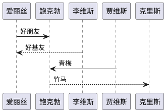

### 顺序图

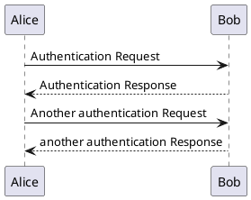

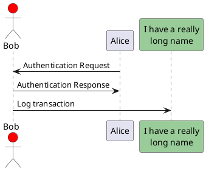

### 分割线

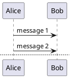

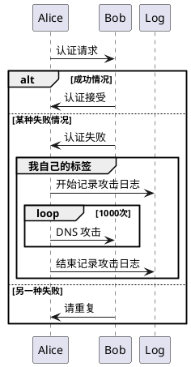

### 类图

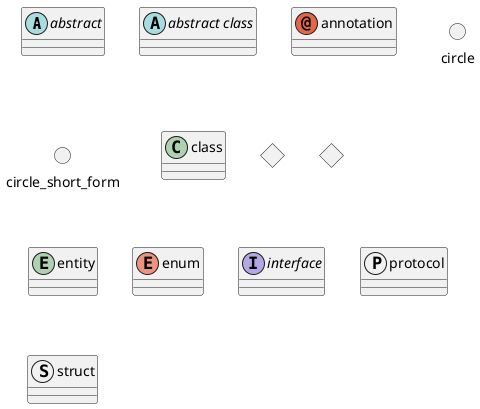

### 对象图

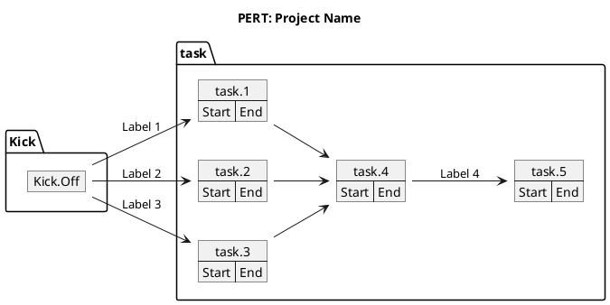

### 用例图

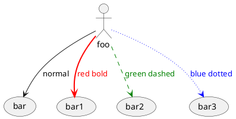

### 活动图

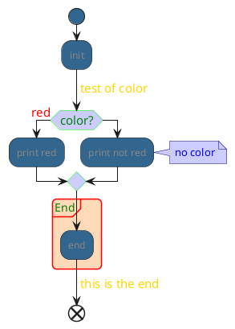

泳道

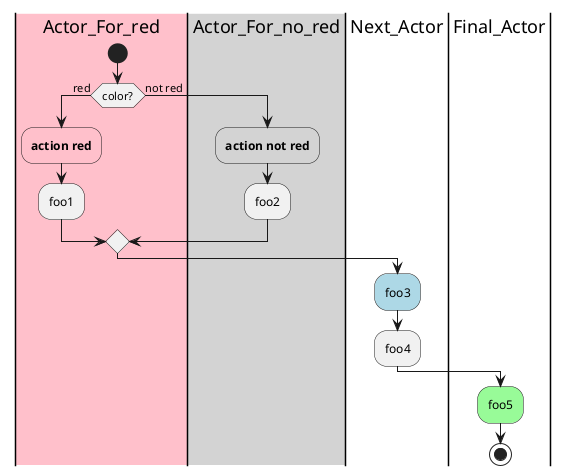

### 组件图

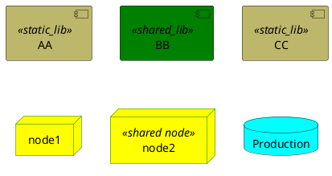

### 状态图

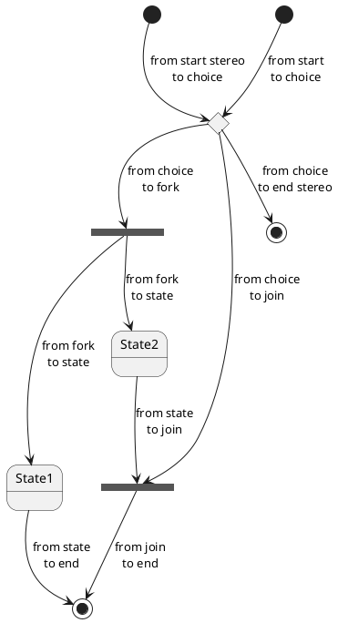

### 时序图

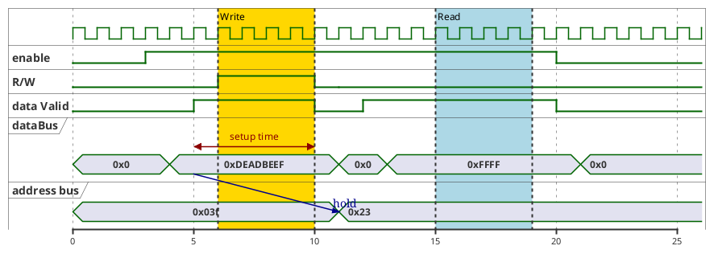

### 部署图

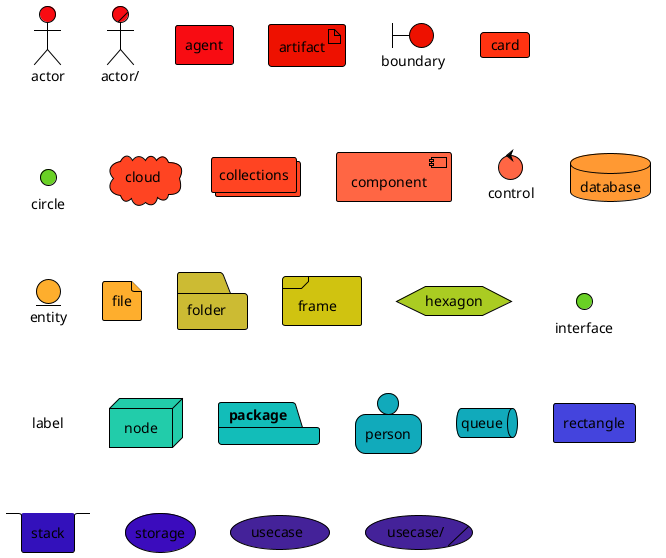

### 甘特图

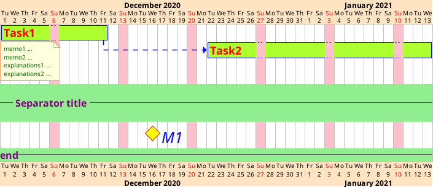

### 网络图GUI

树形外挂

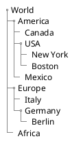

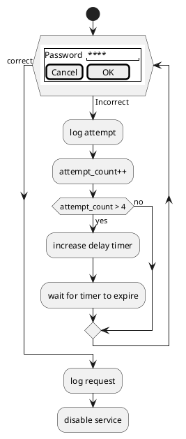

### 架构图

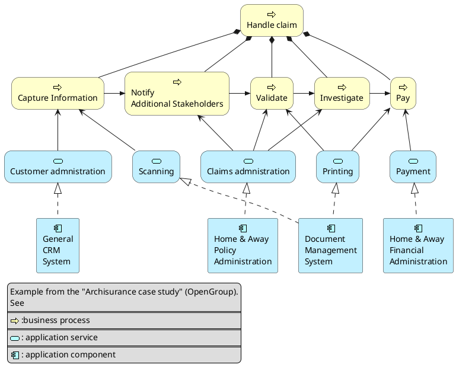

### 思维导图

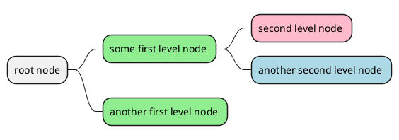

### 工作分解图

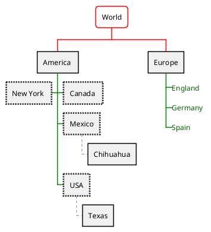

### 数学公式

需要AsciiMath，暂未完成。

```plantuml

@startuml
:<math>int_0^1f(x)dx</math>;
:<math>x^2+y_1+z_12^34</math>;
note right
Try also
<math>d/dxf(x)=lim_(h->0)(f(x+h)-f(x))/h</math>
<math>P(y|bb"x") or f(bb"x")+epsilon</math>
end note
@enduml

```

### 实体关系图

```plantuml

@startuml

' hide the spot
hide circle

' avoid problems with angled crows feet
skinparam linetype ortho

entity "Entity01" as e01 {
  *e1_id : number <<generated>>
  --
  *name : text
  description : text
}

entity "Entity02" as e02 {
  *e2_id : number <<generated>>
  --
  *e1_id : number <<FK>>
  other_details : text
}

entity "Entity03" as e03 {
  *e3_id : number <<generated>>
  --
  e1_id : number <<FK>>
  other_details : text
}

e01 ||..o{ e02
e01 |o..o{ e03

@enduml

```
