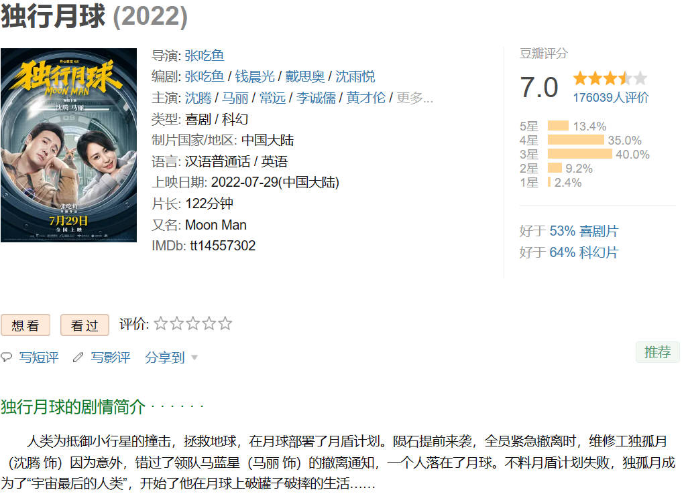
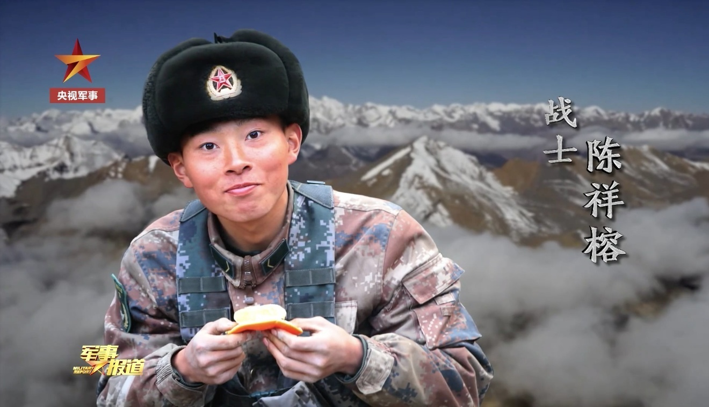
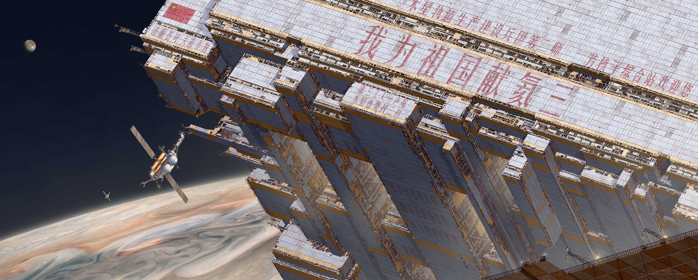
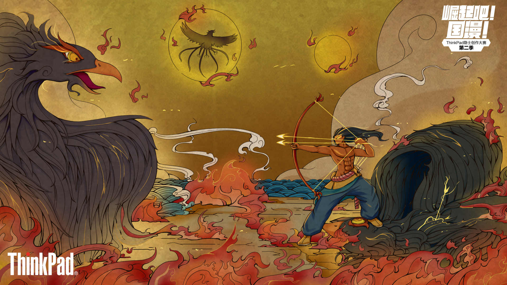
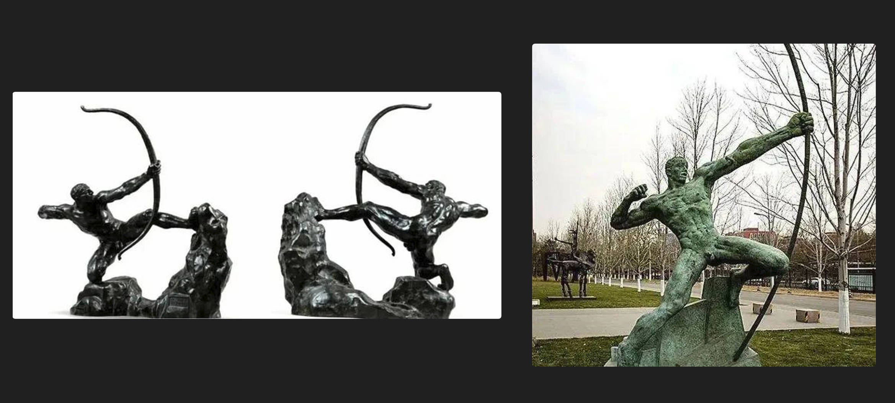
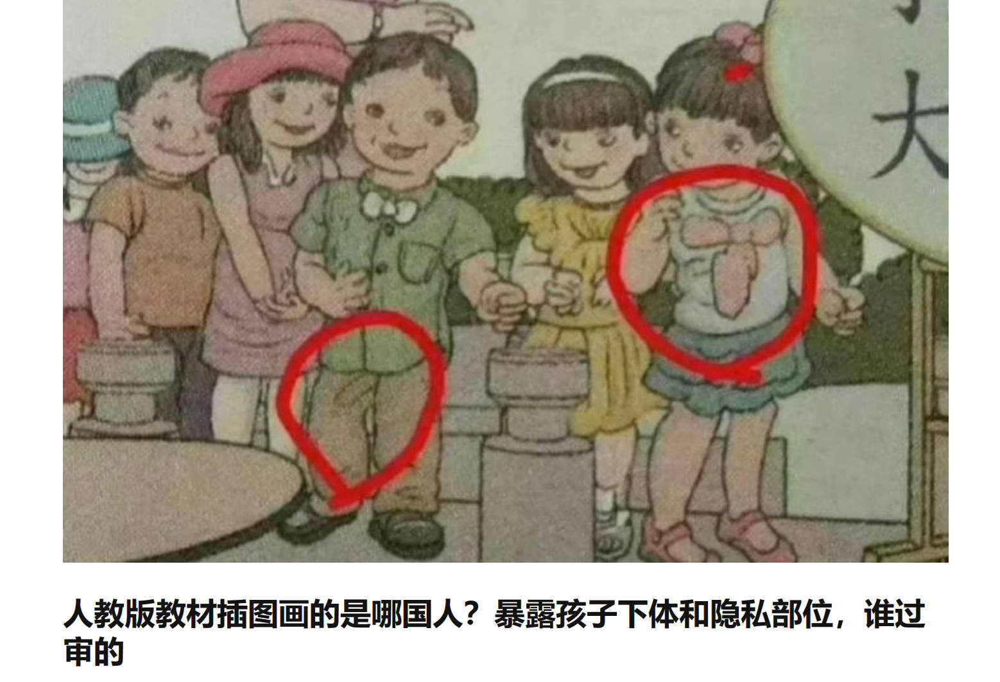
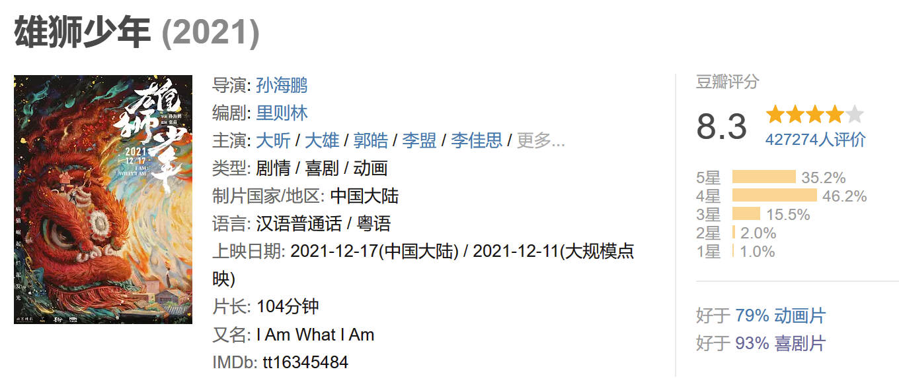
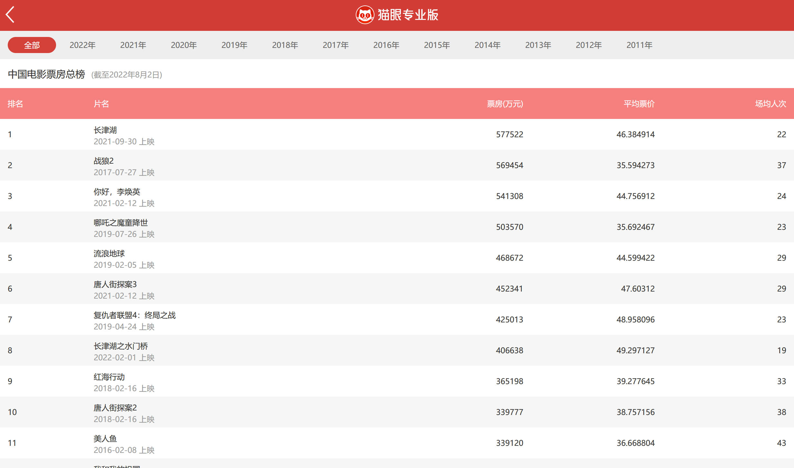
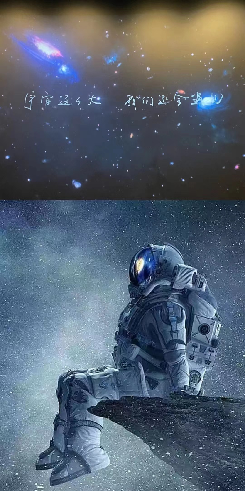

# 孤独的月亮

上周于影院观看了电影《独行月球》，是我目前一共四五场的电影院观影体验之一。

我一直觉得，在一些高潮音乐处，劲力挺足的影院音箱，可以将那种鼓舞人心不仅表现在精神上：或许就是物理共振😂。

## 独行月球

以我浅薄的观影经验来看，这部『喜剧』片，我感觉尚可。又或者作为『科幻』片，我亦觉得不错。

就豆瓣的评分来看，评分上属于是中等水平的喜剧片，及格线的科幻片。我是上映后一天（7月30日）看的，片场也就十余人，比较空。周末中午场，杭州的疫情管控不严，给我的感觉是票房可能会不佳。
看完下来，个人感觉这部片子挺好的，起码可以来个7、8分甚至9分。直到今天看到网上的评论，特别是打一星或者差评的评论，我又感觉他们说的缺点似乎也存在。

电影评论这事，我并不熟悉，也不是很懂。但我看电影，一般都能很清楚的感受到这部电影是否用心。
就像老版西游记里的特效，技术不如现在一些劣质电视剧的五毛特效，但却更能让人接受。哪怕拿到现在，也让人看的下去。这是我说的剧组用心。

独行月球在我看来，显然是用心了的。作为一个理科/工科男，对于航空器的特效，哪怕我不懂，我也看得出『用心』。或者说，这些飞行器，月盾基地，给了我科幻的感觉。是合格的。

喜剧部分：我有被娱乐到，我感觉行。情感部分：暗恋，我觉得挺真实，或者说，我身边就见过这样的人，甚至，我可能也曾是这样的暗恋者。

至于牺牲自我，保护地球这样的行为。我觉得，只要是在中国，任何一名航天员上天，面对这样的情况，应该都会毫无犹豫地做出牺牲。

> 2021年2月19日，《解放军报》发表长篇通讯《英雄屹立喀喇昆仑》，文章首次披露2020年6月份中印边境对峙事件详细过程。中央军委授予祁发宝『卫国戍边英雄团长』荣誉称号，追授陈红军『卫国戍边英雄』荣誉称号，给陈祥榕、肖思远、王焯冉追记一等功。烈士陈祥榕家乡在宁德屏南，18岁入伍时便写下值得我们此生铭记的战斗口号— **清澈的爱，只为中国** 。

不是一个人在拼命，而是一个民族在战斗。古往今来，民族英雄，数不胜数。或许这才是中国仍然是，也仍会是历史上最古老最长寿民族的理由。

> **陈母问勇** ：陈母姚氏闻儿绩，不悲不泣，傲然挺立，遂问：『戍边烽火，吾儿勇否？』众将答曰：『勇冠三军，青史留名』。

## 社会影响

最近显然是是多事之秋，疫情已经常态化，各种社会问题也层出不穷。唐山打人、郑州红码、小镇做题家，仅仅是浮出水面的这些事情，便让人慨叹。
不难让人怀疑，社会上各种不平等是真实存在且无人知晓的，就像那爆火的二舅，反内耗。

我不确定是疫情让现下的人，更加关注起了网络，亦或者疫情导致的工作生活问题。起码我的感觉里，这些社会问题的传播是十分广泛的。但后续的事情，总感觉是不了了之了。或者说，只能不了了之。毕竟这里面大部分都得有个责任人出来做担当。

这种『不大不小』的事情，谁又能来做这个担当呢？

但很明显，疫情导致的社会发展减缓，在社会上是有所体现的。旱涝保收的编制变得更热门，人口开始有负增的迹象。人在变多的同时，也在变少。但没有人，生活只会更加艰难。

人人都想躺平，可人人都躺平，人人都躺不平。
很简单的道理，你想在家吃送上门的快递，总要有人送。而要等到机器人能送餐，不知要到什么时候，那时候的人，又如何。

不止国内有疫情，国外也一样。但显然，国外也没有多好过，甚至那太平洋东岸的灯塔，也在制造各种笑话。

或许中国不是最好的，但显然是这个世界上很好的，独有的。

## 社会未来

说回电影，其实看到月盾啥的，我脑海里想到的是[范文南](https://weibo.com/u/7447891909 "范文南微博地址")创作的中国科幻画《中国2098》系列中的我为祖国献氦三。毕竟月球上的 $^3He$ (氦-3)是新时代的能源(核融合 发电燃料)。

不过电影还是比较保守的，要是人类科技真如画师想象的程度，估计这 π 来了也是送原料的。

但我觉得，独行月球和这张氦三海报，在宣传上有一定的相似处。都是是为祖国奉献自己，都是充满未来和希望的。

无疑中国的流浪地球，独行月球我们的选择都是保护地球，哪怕奉献自己。这显然是不同于星际穿越那种，放弃地球，另谋他路的侵略思想。

毕竟他们的国土也是抢的别人的，正如马克思的原话：『自从来到人间，资本的每一个毛孔都是肮脏的和血淋淋的，随时都要向外扩张。』

或者说得更直白点，我就喜欢 **中国人拯救地球** 的样子。而且不是国外那种个人英雄主义，而是中国自古以来的精神传承。

最简单的不同，从那些自古以来流传的故事里。

关于世界的来源，外国是神说要有光，然后他便是在外看着。而盘古力劈混沌，最后身化山岳湖海。

关于火的来源，外国的普罗米修斯挺身而出，不惧违抗天令，向人类送去火种。而在中国，有圣人钻燧取火，以化腥臊，而民安乐，号之曰燧人氏。

关于洪水肆虐，上帝使盖亚一人造一船，其他人都被洪水淹死。而在中国类似的神话中，是大禹治水，三过家门不入，以致开九州，通九道，陂九泽，度九山，化洪水为乐土。

这是一种本质上的差别，不仅仅体现在故事上神人的区别，更是神和人最后的关系。

混沌黑暗，有人开天而出。天生十日，有人引弓射天。大海溺死了人，她就愿意化为精卫，衔石子以填海。高山挡住了家门，他有誓搬大山，子孙不匮的豪言壮语。

活不下去，就要反抗，没有人生来高贵，也没有人就该受苦受难！

我们不是罪人，不信有什么事是不能成功的。不需要神仙，不需要拯救，因为我们自己就是自己的神灵！敬神却不信神。

> 我们的命运从来都掌握在自己的手里，我们正视未知的神秘力量，可是我们绝不畏惧！我们有自己的双手，我们不要神。因为，我们中国人，是自己的主宰，是这片土地，这个世界，这个未来的主宰！

## 艺术与自信

说到这，不禁让我想到最近翻出来清华美院的『后羿射日』雕像。在我的理解里，后羿射日的典故更像是下面这样的。

这种古风以及后羿的样子，很贴切。可清华美院的雕塑是这样的。

如果没说清华美院这个是后羿射日雕塑，我还没啥好说的，可这样的雕塑跟我们的后羿有关系么？

让我不禁想到鲁迅先生之文：[《中国人失掉自信力了吗》](/)，先生所言：『自信力的有无，状元宰相的文章是不足为据的，要自己去看地底下』。我想，这是先生对中国人仍有自信力的注明，更是『我们有并不失掉自信力的中国人在』的说明。

有人对这雕像提出质疑，便是有起码自信力的中国人。所以这状元宰相的雕塑并不足以做代表。自然，那 **毒教材的恶俗插画** 也不应该做代表！

而目前来看，这又是清华美院的『人才』参与的事件。之前也是有[眯眯眼](https://new.qq.com/omn/20210621/20210621A0DFXB00.html)的嫌疑在。

或许是林子大了傻鸟都有，又或许，这是敌人已经打进来了。

## 电影价值

说来说去，好像有点偏题了，但我对独行月球还是很喜欢的。他讲了个很现代，很老套甚至有些无厘头的故事，却在特效里认真，在人民团结里展示。这喜剧其实更加让我想到以前周星驰的电影，搞笑但内核是认真的。

又或者说，喜剧里包的是正剧。

独行月球里，牺牲的是一位伟大的同志。哪怕他本人在月球期间行为有些浮夸，但是仿佛天命一般，在大陨石来临的时候，他就这么上了毫无犹豫的，为人民服务！

整部电影看下来，基本上就是国产的特色，而不是像雄狮少年那奇怪的眼睛。

更不是获得舞狮冠军后，继续苦苦的打工挣钱，仿佛这舞狮天赋只是废物。

显然，雄狮少年才是真正的笑话。起码他的票房就是笑话。在不作假的情况下，票房显然就是大家对这电影的认可度。这显然就是鲁迅先生的『地底下』，人民百姓的反馈。

雄狮少年的画风很好，技术很好，但是故事不行，人物更不行。

我在此不作中国人和眯眯眼以及文化歧视的关系讨论，票房已经说明清楚了。但有一点我觉得可以说明，为什么老版的西游记，不高的特效却很好看？

文化，自信，是真真切切的反应在作品里，也能直观的反馈给作者。并不是政治正确，而是大众所想，大众所向。

或许那些认为眯眯眼是中国特征的，在自拍的时候应该不会专门睁大眼，让自己显得不那么『中国人』吧？

## 小结

小小的总结一下，古往今来，流传下来的故事，显然才是人民认同感最高的，是文化的底蕴所在。而中国的故事里，不信神，不信鬼，自力更生。

**中国人从来都是自信的！** 这点在电影票房前10可以看出，前五里，都是自信的，战斗的自信，我命由我不由天的自信，时代中有爱的子女父母，都是典型的中国故事。反倒是只有个第七的复仇者联盟4是外来的。这和之前基本外国片子主导票房的情况完全不同了。

《独行月球》，我觉得这是一部合格的国产电影，不是在外国价值扭曲下，不自信的、奇怪的电影。能在浮躁的年代，给与快乐，树立正确的价值观，十分不错。

自信的中国人，未来肯定是星辰大海，而不是地面上的赛博朋克。

> 2022年8月2日17点18分
