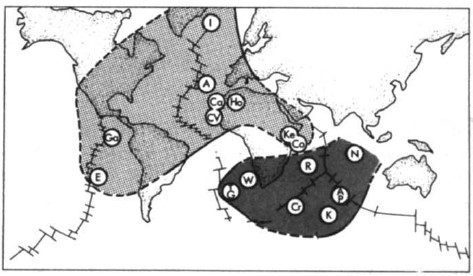

# 小笔记

## 地化小知识

+ ### Dupal异常是什么

Dupal异常
:在南半球赤道至60°S区域，如南大西洋和印度洋区，其玄武岩具有相对北大西洋和东太平洋海隆更高的
$^{87} Sr/^{86} Sr (>0.7035)$ ，
以及在相同
$^{206} Pb/^{204} Pb$
比值条件下更高的
$^{207}Pb/^{204}Pb$
和
$^{208}Pb/^{204}Pb$
比值特征

> [!NOTE]
> $^{87} Sr/^{86} Sr (>0.7035)$ ，

:::no-loc text="$^{87} Sr/^{86} Sr (>0.7035)$ ，":::

> [!WARNING]
> Dangerous certain consequences of an action

两个钱

$$^{87} Sr/^{86} Sr (>0.7035)$$

87Sr/86+Sr(>0.7035)

最初研究的示例图如下

**相关参考文献（部分）：**

[Dupré,B.and Allègre,C.J.,1983.Pb–Sr isotope variation in Indian Ocean basalts and mixing phenomena.Nature,303(5913):142-146](Dupal/10.1038%40303142a0.pdf)

[邢光福.Dupal同位素异常的概念,成因及其地质意义[J].火山地质与矿产,1997,18(4):281-281.](Dupal/Dupal同位素异常的概念、成因及其地质意义.pdf)

[张旗, 周德进, 沈丽璞. Dupal异常研究的现状与趋势[J]. 地球物理学进展, 1992, 7(4):63-71.](Dupal/Dupal异常研究的现状与趋势.pdf)

## 地物小知识

这部分还没开始写呢
